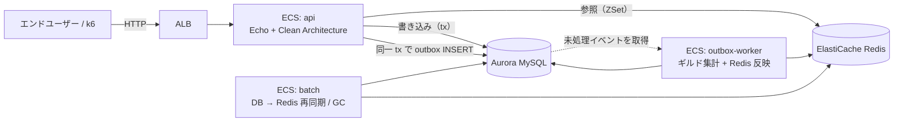

# game-api-sample

**負荷試験とチューニングを前提に組んだ、Go 製ゲームバックエンド API。**
ガチャ・スコア送信・ランキングを Clean Architecture で実装し、AWS（ECS Fargate / Aurora / ElastiCache）へ
Terraform でデプロイする。設計の判断根拠と、規約を CI の判定へ移していく過程そのものを成果物として残している。

📄 **ポートフォリオサイト（このリポジトリについて質問できます）: <https://uchidas-rogue.github.io/game-api-sample/>**

---

## 構成



書き込み（個人スコア加算・ギルド集計）と読み取り（ランキング参照）を分離し、参照負荷が書き込み DB を
圧迫しない構成にしている。ギルドへの合算は **outbox パターン**で非同期に流し、API のトランザクションを短く保つ。

インフラ構成・モジュール分割・CI/CD の安全装置は [terraform/ARCHITECTURE.md](terraform/ARCHITECTURE.md) を参照。

## 見どころ

### 1. outbox のスループットを実測して設計を変えた

負荷試験（`make load/points`、約 407 req/sec × 100 秒）で、**API のレイテンシは基準内なのに outbox-worker が
生産レートに追いつかない**ことが分かった。イベント単位のトランザクションでは1件ごとに COMMIT（fsync）が走り、
並列化しても約 200/sec で頭打ちになる。

| | 消化レート | ピーク pending |
|---|---|---|
| 改善前（イベント単位 tx・逐次） | 約 33/sec | 111,613 件 |
| 改善後（バッチ tx + フォールバック） | 約 270〜315/sec（ピーク 543） | 35〜45 件 |

COMMIT 回数を `1/batchSize` に落としたうえで、バッチが失敗したときだけイベント単位経路へ退避する二段構えにした
（恒久失敗イベント1件でバッチ全体が前進しなくなる head-of-line blocking を避けるため）。

副産物として、worker の `SELECT ... FOR UPDATE` が REPEATABLE READ で**ギャップロック**を取り、API 側の
outbox INSERT を `INSERT_INTENTION` 待ちでブロックしていた問題も見つかった（**API の p95 が 108ms → 4.6s**）。
worker は同一 tx 内の読み取り一貫性に依存しないため READ COMMITTED へ切り替えて解消している。

設計と検証観点は [docs/testing/outbox-worker.md](docs/testing/outbox-worker.md) にある。

### 2. 規約を「AI が読む助言」から「CI で落ちる判定」へ移し続けている

このリポジトリの規約は [AGENTS.md](AGENTS.md) が正本だが、**文章のままでは守られたか分からない**。
そこで機械判定できるものを順次 CI へ移している（ROADMAP「横断施策：決定論的検証基盤」Phase 0〜8）。

| 規約 | 判定 |
|---|---|
| Clean Architecture の層間 import | `depguard`（ホワイトリスト方式） |
| `slog.Any("error", err)` を使う / `echo.Echo.Pre` を使わない / テストから package 変数を書き換えない | `gocritic` の ruleguard（自前 AST ルール） |
| `var _ Iface = (*Type)(nil)` を実装型の直前に置く | `scripts/archcheck`（AST を直接読む） |
| テスト仕様表とテストコードのケース順・件数・図の終端ノードの網羅 | `scripts/doccheck`（markdown + mermaid + Go AST の突合） |
| 生成物（mockgen / sqlc / `schema.sql`）の再生成漏れ | `make gen/check` / `make db/gen/check` |
| 層別カバレッジ閾値 | `make test/cover/check` |
| 指示書どうしの SSoT 崩れ・実態との乖離 | `make docs/check` |

判定を足すときの原則は [docs/testing/principles/deterministic-verification.md](docs/testing/principles/deterministic-verification.md) に置いている。
「その検査が捕捉する既知の実例」を伴わない検査は入れない、というのが一番効いているルール。

### 3. AI エージェントと組むための構造

実装は Claude Code 主体で進めている。そのために、**規約の正本を `AGENTS.md` と `docs/` に集約し、
Claude 固有のファイル（`CLAUDE.md` / `.claude/**`）には正本を置かない**という制約を敷いた
（他のエージェントから読めないため）。この制約自体も `make docs/check` が判定する。

テストは「図 → 失敗するテスト → 実装」の順で作り、フローチャートのパスカバレッジで
Go では計測できない分岐カバレッジを代替している（[docs/testing/README.md](docs/testing/README.md)）。

## 技術スタック

| 領域 | 採用 | 補足 |
|---|---|---|
| 言語 / HTTP | Go 1.25 / Echo v4 | |
| アーキテクチャ | Clean Architecture（`driver` → `usecase` → `domain`） | `infrastructure` は `usecase` の interface を実装 |
| DB | MySQL 8.0（本番: Aurora MySQL Serverless v2） | クエリは **sqlc**、マイグレーションは **golang-migrate**。ORM は使わない |
| キャッシュ / ランキング | Redis（本番: ElastiCache） | Sorted Set と Pub/Sub |
| テスト | 標準 `testing` + testify + uber-go/mock + go-sqlmock + miniredis | |
| 負荷試験 | k6 | [loadtest/](loadtest/) |
| IaC | Terraform（ECS Fargate / arm64） | GitHub Actions ↔ AWS は OIDC AssumeRole |

## 動かす

```bash
docker compose -f deployments/docker-compose.yml up -d   # MySQL + Redis
make db/migrate/up                                        # マイグレーション
make run                                                  # API 起動（:8080）
```

```bash
curl localhost:8080/healthz
curl -XPOST localhost:8080/users/1/gacha/multi -d '{"pull_count":10}' -H 'Content-Type: application/json'
curl localhost:8080/rankings/guilds
```

| エンドポイント | 内容 |
|---|---|
| `GET /healthz` | ヘルスチェック |
| `POST /users/:userID/gacha/multi` | 複数回ガチャ（トランザクション + 行ロック） |
| `POST /users/:userID/points` | スコア加算（個人 + ギルドへ非同期合算） |
| `GET /rankings/{users,guilds}` | ランキング一覧（Redis ZSet） |
| `GET /{users,guilds}/:id/ranking` | 順位取得 |

非同期集計まで動かすなら `make run/outbox-worker` を併走させる。負荷試験の手順は [loadtest/README.md](loadtest/README.md)。
利用できるコマンドは `make help` で一覧できる。

## 品質ゲート

PR と main への push で [.github/workflows/ci.yml](.github/workflows/ci.yml) が次を順に実行する。

```bash
make lint             # golangci-lint（バージョンは .golangci-version で固定）
make docs/check       # 指示書の SSoT / 実態との乖離
make site/check       # ポートフォリオサイトの索引の再生成漏れ
make db/gen/check     # sqlc / schema.sql の drift
make gen/check        # mockgen の drift
make test/race        # race 検出 + カバレッジ計測
make test/cover/check # 層別カバレッジ閾値（値の正本は AGENTS.md §3）
```

この一覧と ci.yml が食い違っていないことは `make docs/check` が判定する
（片方だけ足すと「CI で見ていない」と読まれる嘘の一覧になるため）。

## ドキュメント

| 読みたいこと | ファイル |
|---|---|
| コーディング規約・アーキテクチャ規約（**全エージェント共通の入口**） | [AGENTS.md](AGENTS.md) |
| 3ヶ月のロードマップと、各フェーズで何を意図的にやらなかったか | [ROADMAP.md](ROADMAP.md) |
| AWS 構成・Terraform モジュール分割・CI/CD の安全装置 | [terraform/ARCHITECTURE.md](terraform/ARCHITECTURE.md) |
| テスト設計の原則と、機能ごとのフロー図・テスト仕様表 | [docs/testing/](docs/testing/) |
| 負荷試験シナリオ | [loadtest/README.md](loadtest/README.md) |
