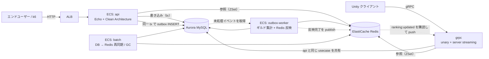

# game-api-sample

**負荷試験とチューニングを前提に組んだ、Go 製ゲームバックエンド API。**
ガチャ・スコア送信・ランキングを Clean Architecture で実装し、AWS（ECS Fargate / Aurora / ElastiCache）へ
Terraform でデプロイする。設計の判断根拠と、規約を CI の判定へ移していく過程そのものを成果物として残している。

📄 **ポートフォリオサイト（このリポジトリについて質問できます）: <https://uchidas-rogue.github.io/game-api-sample/>**

[](https://deepwiki.com/uchidas-rogue/game-api-sample)

---

## 構成



書き込み（個人スコア加算・ギルド集計）と読み取り（ランキング参照）を分離し、参照負荷が書き込み DB を
圧迫しない構成にしている。ギルドへの合算は **outbox パターン**で非同期に流し、API のトランザクションを短く保つ。

gRPC サーバ（`grpc`）は Unity クライアント向けの 2 つ目の delivery で、`api` と**同じユースケース**を
共有する。outbox worker が Redis へ反映を終えた直後の通知を購読しており、ランキングの変化を
そのままクライアントへ push できる。**ローカルと Docker まで対応しており、ECS へのデプロイは未対応**
（[ROADMAP.md](ROADMAP.md) 参照）。

インフラ構成・モジュール分割・CI/CD の安全装置は [terraform/ARCHITECTURE.md](terraform/ARCHITECTURE.md) を参照。

## この設計の出発点

本リポジトリは、筆者が実務で書いた次の2本の記事を出発点に、**別の技術スタックでゼロから作り直し、
記事の時点で残していた課題に手を入れたもの**。「見どころ」の 1 が前者、2〜3 が後者に対応する
（4 は記事には無く、作り直したあとに足した拡張）。

- [【備忘録】大規模向けリアルタイム数値反映の仕組みを考えて実装した](https://qiita.com/sho417sho/items/56437f88ebdabcd10254)
- [TDD→Clean Architecture→動的言語の制御 ── AIが安全に自走する基盤を型なしレガシーPerlで作った](https://qiita.com/sho417sho/items/a0d9ce5c46370254be52)

### リアルタイム数値反映（記事1 → 本リポジトリ）

記事1 は、シャード横断の集計が DB を圧迫する問題に対し、CQRS で読み取りを分離し、
Memcached と MySQL の集計テーブルを併用した二段キャッシュを定期バッチで更新する設計。
約5万人のアクティブユーザーで運用したと報告している。

| 記事1 の設計 | 本リポジトリでの実装・改善 |
|---|---|
| CQRS で読み取りをキャッシュへ分離 | 同じ。読み取りは Redis Sorted Set のみを見る |
| 定期バッチで全シャードを集計 | **outbox パターンでイベント駆動に変えた。** バッチは再同期と GC の保険として残す |
| 二段キャッシュ（Memcached + 集計テーブル） | Redis + MySQL。役割分担は同じ |
| レースコンディションの表示ズレは UI 側で許容 | 同じ割り切り。ただし**「空」と「未初期化」はセンチネルキーで区別**し、未初期化なら 503 を返す |
| キャッシュ揮発リスクを課題として明記 | 揮発の**検知**まで実装した（監視アラートと起動トリガの配線は未対応） |

バッチからイベント駆動へ変えた結果、新しい問題（COMMIT 回数がスループット上限を決める、
ギャップロックが API を止める）が出た。それを実測して潰した過程が「見どころ 1」。

### AI が自走する基盤（記事2 → 本リポジトリ）

記事2 の要諦は「**決定論的な解析・検証の利点を最大化することで、AI 活用も最大化できる**」。
型なし Perl でそれを成立させるために、基底クラス・Mock 自動生成・use チェッカーを自作している。
本リポジトリはこの前提をそのまま引き継ぎ、静的型のある Go で同じことをやるとどうなるかを試したもの。

| 記事2 の仕組み | 本リポジトリでの実装・改善 |
|---|---|
| `Agents.md` でアーキテクチャの順守を指示 | [AGENTS.md](AGENTS.md) を全エージェント共通の入口にし、**「正本を `.claude/**` に置かない」という制約自体を `make docs/check` で判定**する |
| use チェッカーで Domain 層の純粋性を静的検証 | Go では実行時エラーの問題が無いぶん、**層間 import の禁止を `depguard` のホワイトリストで判定**する形に置き換えた |
| 実クラスから Mock を機械生成し、乖離でテスト失敗 | `make mock/gen` + `make gen/check`（再生成して差分検知）。性質は同じ |
| テスト契約表・フローチャートで観点網羅を可視化 | 可視化で止めず、**`scripts/doccheck` が仕様表とテストコードを突合して CI で落とす** |
| （記事では扱っていない） | Go に分岐カバレッジの標準手段が無いため、**フローチャートのパスカバレッジで代替**する |

記事2 が「AI が安全に自走するには決定論的な判定を増やすこと」を示したのに対し、
本リポジトリはその判定を**どこまで増やせるか**を横断施策（ROADMAP「決定論的検証基盤」Phase 0〜8）として続けている。

## 見どころ

### 1. outbox のスループットを実測して設計を変えた

負荷試験（`make load/points`、約 407 req/sec × 100 秒）で、**API のレイテンシは基準内なのに outbox-worker が
生産レートに追いつかない**ことが分かった。イベント単位のトランザクションでは1件ごとに COMMIT（fsync）が走り、
並列化しても約 200/sec で頭打ちになる。

| | 消化レート | ピーク pending |
|---|---|---|
| 改善前（イベント単位 tx・逐次） | 約 33/sec | 111,613 件 |
| 改善後（バッチ tx + フォールバック） | 約 270〜315/sec（ピーク 543） | 35〜45 件 |

COMMIT 回数を `1/batchSize` に落としたうえで、バッチが失敗したときだけイベント単位経路へ退避する二段構えにした
（恒久失敗イベント1件でバッチ全体が前進しなくなる head-of-line blocking を避けるため）。

副産物として、worker の `SELECT ... FOR UPDATE` が REPEATABLE READ で**ギャップロック**を取り、API 側の
outbox INSERT を `INSERT_INTENTION` 待ちでブロックしていた問題も見つかった（**API の p95 が 108ms → 4.6s**）。
worker は同一 tx 内の読み取り一貫性に依存しないため READ COMMITTED へ切り替えて解消している。

設計と検証観点は [docs/testing/outbox-worker.md](docs/testing/outbox-worker.md) にある。

### 2. 規約を「AI が読む助言」から「CI で落ちる判定」へ移し続けている

このリポジトリの規約は [AGENTS.md](AGENTS.md) が正本だが、**文章のままでは守られたか分からない**。
そこで機械判定できるものを順次 CI へ移している（ROADMAP「横断施策：決定論的検証基盤」Phase 0〜8）。

| 規約 | 判定 |
|---|---|
| Clean Architecture の層間 import | `depguard`（ホワイトリスト方式） |
| `slog.Any("error", err)` を使う / `echo.Echo.Pre` を使わない / テストから package 変数を書き換えない | `gocritic` の ruleguard（自前 AST ルール） |
| `var _ Iface = (*Type)(nil)` を実装型の直前に置く | `scripts/archcheck`（AST を直接読む） |
| テスト仕様表とテストコードのケース順・件数・図の終端ノードの網羅 | `scripts/doccheck`（markdown + mermaid + Go AST の突合） |
| 生成物（mockgen / sqlc / `schema.sql`）の再生成漏れ | `make gen/check` / `make db/gen/check` |
| 層別カバレッジ閾値 | `make test/cover/check` |
| 指示書どうしの SSoT 崩れ・実態との乖離 | `make docs/check` |

判定を足すときの原則は [docs/testing/principles/deterministic-verification.md](docs/testing/principles/deterministic-verification.md) に置いている。
「その検査が捕捉する既知の実例」を伴わない検査は入れない、というのが一番効いているルール。

### 3. AI エージェントと組むための構造

実装は Claude Code 主体で進めている。そのために、**規約の正本を `AGENTS.md` と `docs/` に集約し、
Claude 固有のファイル（`CLAUDE.md` / `.claude/**`）には正本を置かない**という制約を敷いた
（他のエージェントから読めないため）。この制約自体も `make docs/check` が判定する。

テストは「図 → 失敗するテスト → 実装」の順で作り、フローチャートのパスカバレッジで
Go では計測できない分岐カバレッジを代替している（[docs/testing/README.md](docs/testing/README.md)）。

### 4. 同じユースケースを HTTP と gRPC の 2 経路で配る

Unity クライアント向けに gRPC delivery を足した。狙いは「Clean Architecture が実際に効いているか」を
2 つ目の delivery で検証すること。

- **`internal/usecase/ranking` を 1 行も変えずに済んだ。** `cmd/api` と `cmd/grpc` は
  [同じ usecase インスタンス](internal/di/container.go)を共有する。この境界は文章の申し合わせではなく
  depguard が保証していて、`driver` から `infrastructure` を import した時点で `make lint` が落ちる
- **outbox の非同期基盤がそのままリアルタイム push の土台になった。** worker が Redis ZSet へ反映を
  終えた直後に `ranking:updated` を publish し、gRPC の server streaming がそれを購読する。
  既存の `outbox:events` は反映**前**の worker 起床通知なので転用できない（購読すると反映前の
  古い値を配ることになる）という判別が、この設計でいちばん間違えやすい箇所だった
- **接続ごとに Redis を購読しない。** クライアント N 台 = Redis 接続 N 本になり、コネクション数を
  有限化した設計と矛盾する。購読は 1 本にまとめ、プロセス内のハブから配る
- **`GracefulStop()` は進行中のストリームが終わるまでブロックする。** server streaming がある以上、
  HTTP 側と同じ形で書くと SIGTERM でシャットダウンが完了しない。「配信を止める →
  タイムアウト付きで待つ → 超過したら強制切断」の三段構えにしてある
- 規約も配信形式をまたいで効かせた。インターセプタの登録順は HTTP のミドルウェア順序規約と
  同じ判定（AST テスト）で守り、`grpc.UnaryInterceptor`（単数形）による迂回は ruleguard で塞いだ

クライアント側の詰まりどころ（`Grpc.Core` の非推奨、Unity のランタイムが HTTP/2 を喋れないこと、
IL2CPP の code stripping）は [clients/unity/README.md](clients/unity/README.md) にまとめてある。

## 技術スタック

| 領域 | 採用 | 補足 |
|---|---|---|
| 言語 / HTTP | Go 1.25 / Echo v4 | |
| gRPC | grpc-go / Protocol Buffers | 契約は [proto/](proto/)、生成は **buf**（`buf lint` / `buf breaking` を CI ゲートに） |
| アーキテクチャ | Clean Architecture（`driver` → `usecase` → `domain`） | `infrastructure` は `usecase` の interface を実装 |
| DB | MySQL 8.0（本番: Aurora MySQL Serverless v2） | クエリは **sqlc**、マイグレーションは **golang-migrate**。ORM は使わない |
| キャッシュ / ランキング | Redis（本番: ElastiCache） | Sorted Set と Pub/Sub |
| テスト | 標準 `testing` + testify + uber-go/mock + go-sqlmock + miniredis | |
| 負荷試験 | k6 | [loadtest/](loadtest/) |
| IaC | Terraform（ECS Fargate / arm64） | GitHub Actions ↔ AWS は OIDC AssumeRole |

## 動かす

```bash
docker compose -f deployments/docker-compose.yml up -d   # MySQL + Redis
make db/migrate/up                                        # マイグレーション
make run                                                  # API 起動（:8080）
```

```bash
curl localhost:8080/healthz
curl -XPOST localhost:8080/users/1/gacha/multi -d '{"pull_count":10}' -H 'Content-Type: application/json'
curl localhost:8080/rankings/guilds
```

| エンドポイント | 内容 |
|---|---|
| `GET /healthz` | ヘルスチェック |
| `POST /users/:userID/gacha/multi` | 複数回ガチャ（トランザクション + 行ロック） |
| `POST /users/:userID/points` | スコア加算（個人 + ギルドへ非同期合算） |
| `GET /rankings/{users,guilds}` | ランキング一覧（Redis ZSet） |
| `GET /{users,guilds}/:id/ranking` | 順位取得 |

gRPC（Unity クライアント向け）は別プロセスで、`api` と同時に起動できる。

```bash
make run/grpc   # gRPC 起動（:9090、平文 h2c）

# サーバリフレクションは有効にしていないので .proto を渡して叩く
grpcurl -plaintext -import-path proto -proto game/ranking/v1/ranking.proto \
  -d '{"limit":10}' localhost:9090 game.ranking.v1.RankingService/GetUserRankings
```

| gRPC メソッド | 内容 |
|---|---|
| `GetUserRankings` / `GetGuildRankings` | ランキング一覧 |
| `GetUserRank` / `GetGuildRank` | 順位取得 |
| `AddUserPoints` | スコア加算 |
| `WatchUserRankings` | **ランキング更新の push（server streaming）** |

Unity からの繋ぎ方は [clients/unity/README.md](clients/unity/README.md)。
非同期集計まで動かすなら `make run/outbox-worker` を併走させる。負荷試験の手順は [loadtest/README.md](loadtest/README.md)。
利用できるコマンドは `make help` で一覧できる。

## 品質ゲート

PR と main への push で [.github/workflows/ci.yml](.github/workflows/ci.yml) が次を順に実行する。

```bash
make lint             # golangci-lint（バージョンは .golangci-version で固定）
make proto/lint       # proto の命名規約（buf lint）
make docs/check       # 指示書の SSoT / 実態との乖離
make site/check       # ポートフォリオサイトの索引の再生成漏れ
make site/test        # サイトのブラウザ側（web/app.js）を jsdom でテスト
make db/gen/check     # sqlc / schema.sql の drift
make gen/check        # mockgen の drift
make proto/gen/check  # protoc 生成物の drift
make proto/breaking   # proto の後方互換（buf breaking）
make test/race        # race 検出 + カバレッジ計測
make test/cover/check # 層別カバレッジ閾値（値の正本は AGENTS.md §3）
```

この一覧と ci.yml が食い違っていないことは `make docs/check` が判定する
（片方だけ足すと「CI で見ていない」と読まれる嘘の一覧になるため）。

## ドキュメント

| 読みたいこと | ファイル |
|---|---|
| コーディング規約・アーキテクチャ規約（**全エージェント共通の入口**） | [AGENTS.md](AGENTS.md) |
| 3ヶ月のロードマップと、各フェーズで何を意図的にやらなかったか | [ROADMAP.md](ROADMAP.md) |
| AWS 構成・Terraform モジュール分割・CI/CD の安全装置 | [terraform/ARCHITECTURE.md](terraform/ARCHITECTURE.md) |
| テスト設計の原則と、機能ごとのフロー図・テスト仕様表 | [docs/testing/](docs/testing/) |
| 負荷試験シナリオ | [loadtest/README.md](loadtest/README.md) |
| Unity から gRPC で繋ぐ手順と、その詰まりどころ | [clients/unity/README.md](clients/unity/README.md) |
| コードの構造を追う（**外部・自動生成**） | [DeepWiki](https://deepwiki.com/uchidas-rogue/game-api-sample) |

上の表のうち **DeepWiki だけは外部サービスが本リポジトリから自動生成したもの**で、正本ではない。
層ごとの解説から GitHub の該当行へリンクが張られるのでコードを追うのには向くが、内容は
**特定コミット時点のスナップショット**であり `make docs/check` の検証対象外。記述が食い違う場合は
本リポジトリの文書を優先する。

役割はサイトのチャットと補完関係にある。DeepWiki が答えるのは「**コードがどうなっているか**」で、
サイトのチャットが答えるのは「**なぜそうしたか**」（`AGENTS.md` / `docs/**` の設計判断を根拠にする）。
このリポジトリが重視しているのは後者なので、正本は文書側に置いたままにしてある。

なお、外部の AI がリポジトリを読んで一貫した構成図と層ごとの解説を組み立てられること自体が、
「AI が読める構造になっているか」の外形的な確認になっている（→ [この設計の出発点](#この設計の出発点) の記事2）。
