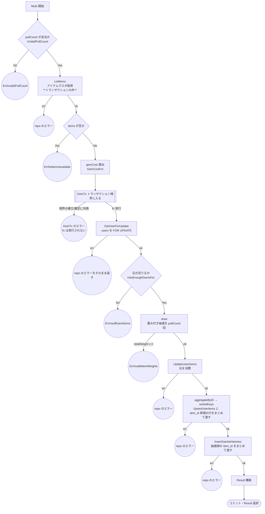
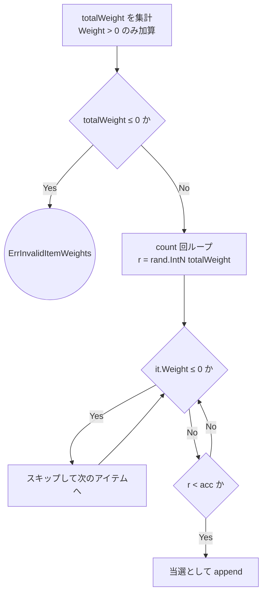

# ガチャ機能のテスト設計

対象: [internal/usecase/gacha/usecase.go](../../internal/usecase/gacha/usecase.go)
テスト: [internal/usecase/gacha/usecase_test.go](../../internal/usecase/gacha/usecase_test.go)

運用ルールは [README.md](README.md)。

`internal/domain/gacha` は「単純な計算・バリデーション」に該当するため**図を作らない**。
確率計算・石消費・境界値の正本は [internal/domain/gacha](../../internal/domain/gacha) のテストケース配列そのもの。

---

## 1. `Usecase.Multi`

10 連ガチャ（`pullCount` 回分の抽選）を単一トランザクションで実行する。

### 1-1. フローチャート

**ロック取得順序の不変条件**: `F`（users を FOR UPDATE）→ `L`（user_items を item_id 昇順）。
`L` の昇順は `sortedKeys` が保証し、デッドロック回避のための不変条件なのでテストで順序を検証する（ケース 16）。
単行ループではなく**可変行数の bulk INSERT**（`UpsertUserItems` / `InsertGachaHistories`）に集約しており、
トランザクション内の DB 往復とロック保持時間を削減している（AGENTS.md §4 の生 SQL 例外）。

**`H`（ListItems）をトランザクションの外に置く理由**: items はマスタ参照のみで更新せず、
ロック順序の対象外。トランザクションの中に置くと、users の行ロックを保持したまま
マスタ参照の往復を1回はさむことになり、ロック保持時間がそのぶん伸びる。
外に出すことで、マスタデータ不備（`E2` / `E3`）のときにトランザクションを張らず
行ロックも取らずに弾ける（マスタ不備は全リクエストが等しく踏むため、
DB を叩かずに失敗させる価値が大きい）。

読み取りが tx の外になるぶん、読んだ後にマスタが変わる余地は残る。ただし
`items` 行を削除されれば user_items / gacha_histories の FK 制約で弾かれるため、
不整合なデータが書き込まれることはない（tx 内で読んでいた頃も、FK の検査は
コミット時点の状態に対して行われるため事情は同じ）。

### 1-2. `draw` のサブフロー

`draw` は `Multi` のノード `J` の内部。分岐を持つのでケースの区別に必要。

### 1-3. テスト仕様表

パスが短い順。**表の1行 = テストコードの1ケース。**

| # | 条件 | 図のパス | 期待結果 | 検証すべき呼び出し |
| --- | --- | --- | --- | --- |
| 1 | `pullCount` が範囲外（0） | `A→B→E1` | `ErrInvalidPullCount` | **`ListItems` も `DoInTx` も呼ばれない** |
| 2 | `pullCount` が範囲外（上限超え） | `A→B→E1` | `ErrInvalidPullCount` | 同上 |
| 3 | `ListItems` がエラー | `A→B→H→E2` | repo のエラー | **`DoInTx` が呼ばれない**（行ロックを取らない） |
| 4 | `items` が空 | `A→B→H→I→E3` | `ErrNoItemsAvailable` | 同上 |
| 5 | `DoInTx` 自体がエラー | `…→I→C→D→E4` | `DoInTx` のエラーがそのまま返る | `fn` が実行されない（tx 内の repo が一切呼ばれない） |
| 6 | `GetUserForUpdate` がエラー | `…→D→F→E5` | repo のエラーがそのまま返る（変換しない） | 後続の repo 呼び出しが無い |
| 7 | 石が不足 | `…→F→G→E6` | `ErrInsufficientGems` | `UpdateUserGems` 以降が呼ばれない |
| 8 | 全アイテムの `Weight` が 0 | `…→G→J→E7`（`D1→D2→DE`） | `ErrInvalidItemWeights` | 同上 |
| 9 | `UpdateUserGems` がエラー | `…→J→K→E8` | repo のエラー | `UpsertUserItems` 以降が呼ばれない |
| 10 | `UpsertUserItems` がエラー | `…→K→L→E9` | repo のエラー | `InsertGachaHistories` が呼ばれない |
| 11 | `InsertGachaHistories` がエラー | `…→L→M→E10` | repo のエラー | — |
| 12 | 正常系: 1件目のアイテムが当選（`IntN=0`） | `…→M→N→Z`（`D4→D6→D7` 即当選） | `Result` に `pullCount` 件、石が `gemCost` 分減る | `UpsertUserItems` が集約後の個数で1回／`InsertGachaHistories` に `pullCount` 件の item_id が渡る |
| 13 | 正常系: 2件目のアイテムが当選（`IntN` = 1件目の重みと同値） | `…→M→N→Z`（`D6` が No→Yes） | 2件目の item が `Result` に入る | `UpsertUserItems` に2件目の item_id が渡る |
| 14 | 正常系: `Weight` 0 のアイテムが混在 | `…→M→N→Z`（`D4→D5` を通過） | `Weight` 0 のアイテムは1度も当選しない | 当選 item_id に `Weight` 0 のものが含まれない |
| 15 | 正常系: `pullCount` が下限（1回） | 12 と同一 | 1件だけ当選、石は1回分だけ減る | `UpsertUserItems` の個数が 1、`InsertGachaHistories` が 1 件 |

**ケース 15 を 12 と統合しない理由**: パスは同一だが、境界値を独立ケースにする3基準のうち
「出力が違う」と「片方だけが検出できる実装ミスがある」を満たす。
抽選回数を `pullCount` ではなく `MaxPullCount` でハードコードする実装ミスは、
12（`pullCount = MaxPullCount`）では検出できず 15 でのみ落ちる。

### 1-4. パスの網羅状況

図の終端ノードは `E1`〜`E10` と `Z` の **11 個**。上表はすべてを最低1件ずつ通っている。

`draw` サブフローの分岐（`D2` / `D4` / `D6`）は、それぞれケース 8 / 14 / 13 が通る。

---

## 2. ロック取得順序の不変条件

`UpsertUserItems` に **item_id の昇順**で並べた行が渡されること（`sortedKeys` が保証）。
デッドロック回避のための不変条件なので、独立したテストで検証する。

乱数の戻り値を呼び出しごとに変える必要があり、1 の表とは手続きが異なるためテーブルを分ける。

| # | 条件 | 期待結果 |
| --- | --- | --- |
| 16 | 抽選順が ID 降順（先に ID 2、次に ID 1 が当選） | `UpsertUserItems` の行は ID 1 → ID 2 の**昇順**。`InsertGachaHistories` は**抽選順**（ID 2 → ID 1） |

抽選順と ID 順が一致していると検証にならないため、フィクスチャは
「先に当たるアイテムの ID を大きく」してある。

---

## 3. `NewUsecase`

フロー図を作るほどの分岐は無いが、`rand` の nil フォールバックという分岐を持つ。

| # | 条件 | 期待結果 |
| --- | --- | --- |
| 17 | `rnd` に nil を渡す | 既定実装（`defaultRandomizer`）が使われ、`Multi` が完走する |

既定実装を使うため当選アイテムを固定できない。「どれかが当選して完走する」ことだけを確認し、
どれが当たるかは検証しない（非決定的な値をアサーションに含めない）。

### `defaultRandomizer.IntN` について

`math/rand/v2` への1行の委譲で、変換ロジックを持たない。
**直接のテストは書かない**。理由は次の2点。

- 非公開型のため外部テストパッケージから直接呼べず、テストするには `export_test.go` で
  差し替え口を公開することになる。テスト都合の口を増やすのは避ける
- ケース 17 が既定実装を経由して `Multi` を完走させるため、委譲が機能することは担保される

---

## 4. 本設計文書の作成で見つかった問題

この文書を作る過程で、既存テストとの突き合わせにより以下が判明した（`make test/cover/check` の
文カバレッジでは `usecase` 層 97.6% と表示され、**閾値 90% を満たしていたため検知されなかった**もの）。

| 種別 | 内容 | 対応 |
| --- | --- | --- |
| **パスの欠落** | ケース 1・2（`pullCount` 範囲外 → `ErrInvalidPullCount`）のテストが無かった。フローの**最初の分岐**が未検証 | 追加 |
| **パスの欠落** | ケース 14（`Weight` 0 のアイテムが混在し `D4→D5` を通る）が無かった。「全部 0」のケースしか無く、**一部だけ 0** の除外挙動が未検証 | 追加 |
| **パスの欠落** | ケース 16（ロック取得順序が item_id 昇順であること）が無かった。デッドロック回避の不変条件が未検証 | 追加 |
| **パスの欠落** | ケース 17（`NewUsecase` の `rnd == nil` フォールバック）が無かった | 追加 |
| **境界値の欠落** | ケース 15（`pullCount` 下限）が無く、`MaxPullCount` でしか正常系を検証していなかった。抽選回数のハードコードを検出できない状態 | 追加 |
| **同一パスの重複** | 「`GetUserForUpdate` がエラー」と「ユーザー不在（`ErrUserNotFound`）」は**同じパス** `A→B→C→D→F→E3` を通る。戻り値のエラーが一般エラーか domain sentinel かの違いだけで、実行される命令列は同じ | ケース 4 に統合 |
| **テーブル駆動の形** | 各ケースが `setup func(t, ctrl) (Usecase, context.Context)` を持ち、モックの組み立て手順をテーブル側に書いていた。ケースごとに同じ EXPECT 列が繰り返され、テーブル駆動の形をした「無名テストの配列」になっていた | テーブルを入力・失敗地点・期待結果の**データのみ**にし、組み立てはランナー 1 本へ集約 |

**この欠落は、いずれも文カバレッジの閾値判定をすり抜けていた**（`usecase` 層 97.6% で閾値 90% を満たしていた）。
図の終端ノードと表の突き合わせという手順が、閾値では見えない穴を可視化した実例として記録しておく。

なお、この作業の結果 `usecase` 層の文カバレッジは 97.6% → **100%** になった。
ただし目的は数値ではなくパスの網羅であり、100% は結果にすぎない。
