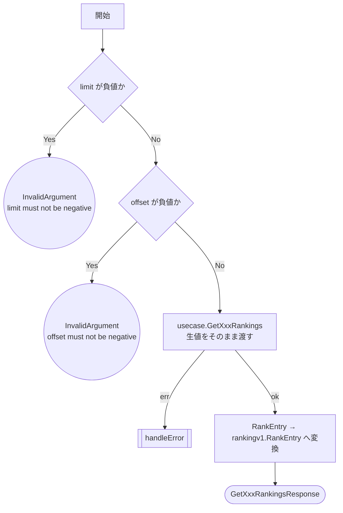
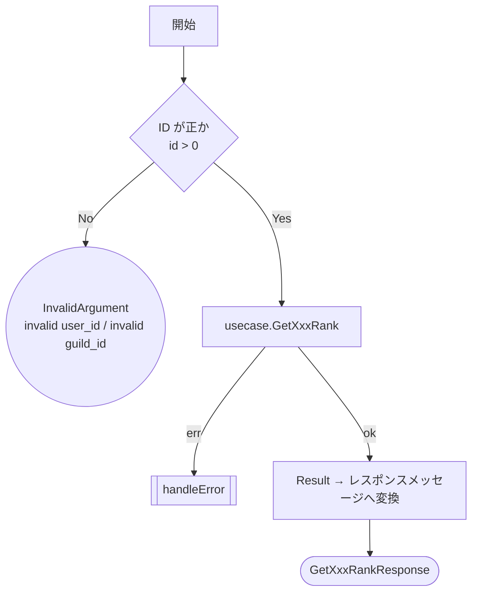
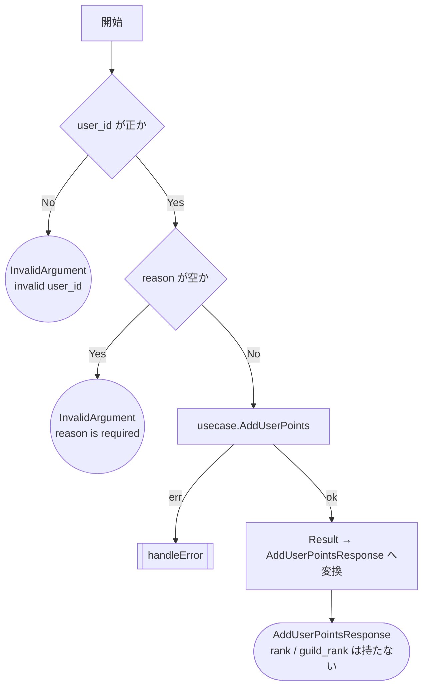
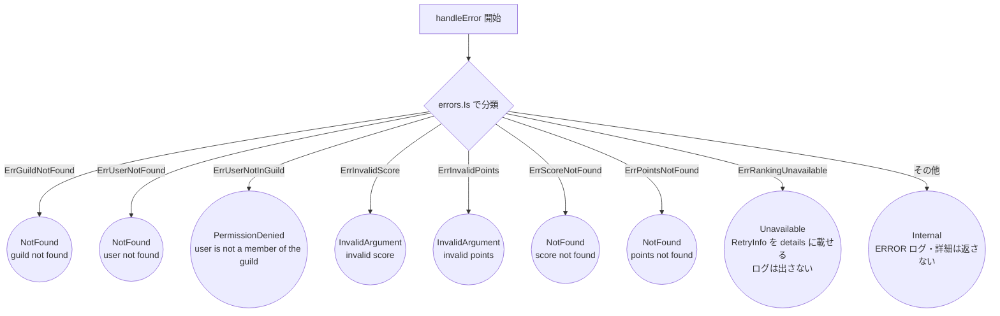
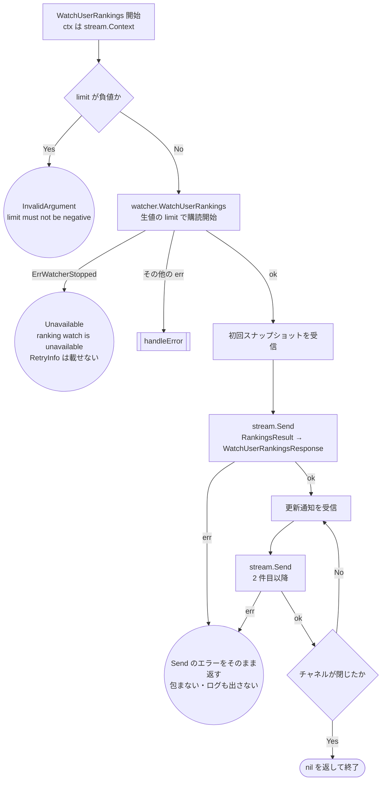
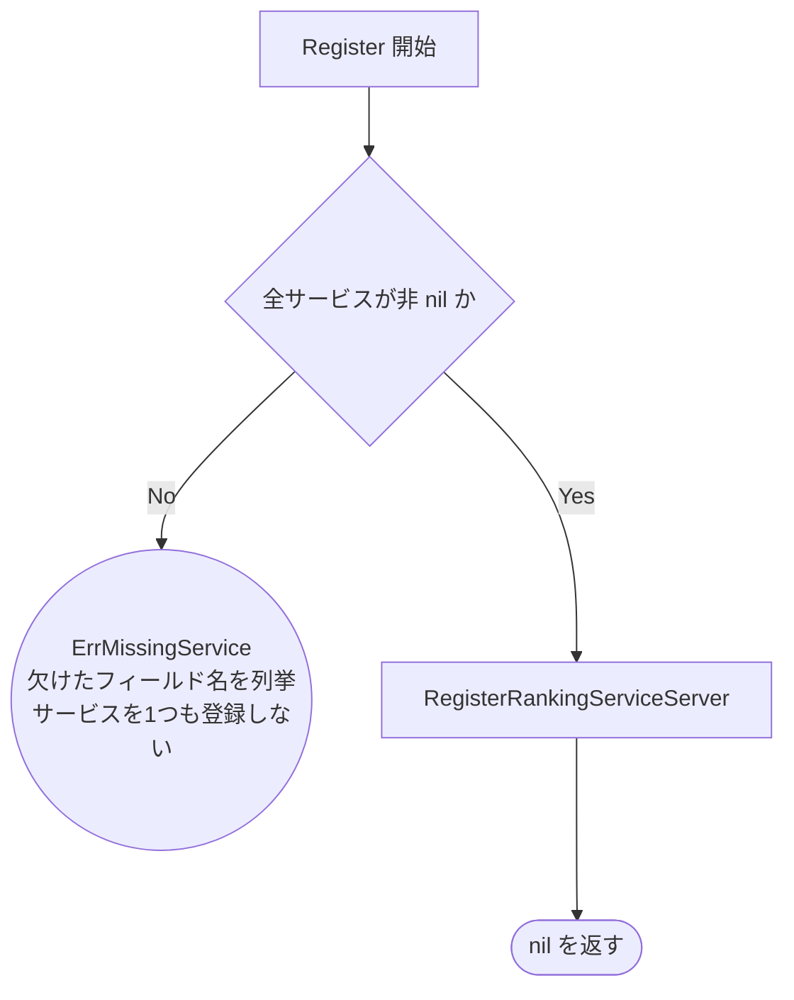

# ランキング gRPC ハンドラのテスト設計

対象: [internal/driver/grpc/ranking/handler.go](../../internal/driver/grpc/ranking/handler.go)
／[watch.go](../../internal/driver/grpc/ranking/watch.go)
／[errors.go](../../internal/driver/grpc/ranking/errors.go)
／[convert.go](../../internal/driver/grpc/ranking/convert.go)
／[server/register.go](../../internal/driver/grpc/server/register.go)
テスト: [handler_test.go](../../internal/driver/grpc/ranking/handler_test.go)
／[watch_test.go](../../internal/driver/grpc/ranking/watch_test.go)
／[errors_test.go](../../internal/driver/grpc/ranking/errors_test.go)
／[contract_test.go](../../internal/driver/grpc/ranking/contract_test.go)
／[server/register_test.go](../../internal/driver/grpc/server/register_test.go)

運用ルールは [README.md](README.md)。ユースケース側の設計は [ranking.md](ranking.md)。
**対になる HTTP delivery の設計は [http-ranking.md](http-ranking.md)** で、同じ usecase を
共有するため図の形も同じにしてある。片方だけにケースがある状態を作らない。

`driver` 層の責務は**変換とエラー経路の網羅**に限定される。
`limit` / `offset` の正規化、`points` の値域といった判定は下位層の責務なので重ねてテストしない。

HTTP 版との差分（gRPC 固有の判断）:

- **ID とページング値のパースが無い。** proto で `int64` / `int32` に型付けされており、
  数値でない入力はサーバに届く前に gRPC のデコードで落ちる。したがって
  「数値でない ID」に相当するケースは存在せず、残る判定は**値域**（`<= 0`・負値）だけ
- **`Retry-After` ヘッダの代わりに `google.rpc.RetryInfo`** を error details に載せる
  （§4）。gRPC にヘッダで再試行を伝える標準が無いため
- **ctx キャンセルはハンドラで扱わない。** gRPC ランタイムが `codes.Canceled` /
  `codes.DeadlineExceeded` を付けるため、ハンドラが重ねて判定すると二重管理になる
- **`WatchUserRankings` だけが server streaming**（§5）。1 リクエストに対して応答が
  複数回流れるため、図の終端が「レスポンスを返す」ではなく「送信ループを抜ける」になる

エラー → status code の分類は unary 5 メソッドすべてが `handleError` を共有する。
図では `[[handleError]]` として畳み、分岐の実体は **§4** に置く。

---

## 1. 一覧系: `GetUserRankings` / `GetGuildRankings`

2 メソッドは構造が同一（ユーザー版とギルド版）。**同じ図・同じケース構成を持つ**。
片方にだけケースがある状態にしない（対称性）。

### 1-1. フローチャート

**設計上の要点**: 負値だけを弾き、**既定値の適用と上限の丸めは usecase に委ねる**。
ハンドラが既定値を持つと [ranking.md](ranking.md) の `NormalizeLimit` /
`NormalizeOffset` と二重管理になる（HTTP 版 `parseNonNegativeIntQuery` と同じ設計意図）。
`limit = 0`（proto3 のスカラは未設定と 0 を区別しない）はそのまま 0 として渡す。

### 1-2. テスト仕様表（`GetUserRankings` / `GetGuildRankings` 共通）

<!-- testcases: internal/driver/grpc/ranking/handler_test.go#TestHandler_GetRankings -->

| # | 条件 | 図のパス | 期待結果 | 検証すべき呼び出し |
| --- | --- | --- | --- | --- |
| 1 | `limit` が負値 | `A→B→E1` | `InvalidArgument` `limit must not be negative` | **usecase が呼ばれない** |
| 2 | `offset` が負値 | `A→B→C→E2` | `InvalidArgument` `offset must not be negative` | 同上 |
| 3 | usecase が予期せぬエラー | `…→C→D→X→R8` | `Internal` `internal server error` | — |
| 4 | usecase が `ErrRankingUnavailable` | `…→C→D→X→R9` | `Unavailable` `ranking is unavailable` | **`RetryInfo` が details に載る** |
| 5 | 正常系: `limit` / `offset` が正規化されず渡り Result が変換される | `…→D→F→Z` | `rankings` と `total_count` が Result と一致 | usecase に**生値がそのまま**渡る（未設定 = 0 も含む） |

**ケース 5 を 2 件に展開している理由**: 「未設定（= 0）」と「明示指定」は同じコードパスだが、
0 を既定値へ差し替える実装ミスは明示指定のケースでは検出できない。
同一パスなので表は 1 行のままにし、テスト側で入力違いの 2 要素へ広げる
（[README.md](README.md) §3「1 つのマーカーは次のマーカーまでの要素すべてを覆う」）。

---

## 2. 単一順位取得: `GetUserRank` / `GetGuildRank`

こちらも 2 メソッドで構造が同一。

HTTP 版はここに「数値でない ID」のケースを持つが、gRPC には無い（proto の `int64`）。
残るのは値域判定 `id <= 0` の 1 条件だけなので、ケースも 1 件に減る。

### テスト仕様表（`GetUserRank` / `GetGuildRank` 共通）

<!-- testcases: internal/driver/grpc/ranking/handler_test.go#TestHandler_GetRank -->

| # | 条件 | 図のパス | 期待結果 | 検証すべき呼び出し |
| --- | --- | --- | --- | --- |
| 1 | ID が 0 以下 | `A→B→E1` | `InvalidArgument` `invalid user_id` / `invalid guild_id` | **usecase が呼ばれない** |
| 2 | エンティティ未存在 | `A→B→C→X→R1` / `R2` | `NotFound` `guild not found` / `user not found` | usecase に ID がそのまま渡る |
| 3 | スコア/ポイント未登録 | `…→C→X→R6` / `R7` | `NotFound` `score not found` / `points not found` | — |
| 4 | 予期せぬエラー | `…→X→R8` | `Internal` `internal server error` | — |
| 5 | usecase が `ErrRankingUnavailable` | `…→X→R9` | `Unavailable` `ranking is unavailable` | **`RetryInfo` が details に載る** |
| 6 | 正常系 | `…→C→D→Z` | 全フィールドが Result の値と一致 | — |

---

## 3. `AddUserPoints`

**設計上の要点**: 順位は worker の Redis 反映後にしか確定しないため、
このレスポンスに順位フィールドを**入れない**（[ranking.md](ranking.md) 参照）。
proto に順位フィールドを足すと常に未確定値を返すことになるので、
**メッセージが順位フィールドを持たないこと**を §6 の契約テストで固定する。

`points` の値域は検証しない。`IsValidScore` は domain の責務で、
usecase が `ErrInvalidPoints` を返した場合の**マッピング**だけがこの層の責務。
HTTP 版の「ボディを Bind できるか」に相当する分岐が無いのは、
デコード失敗を gRPC ランタイムが `codes.Internal` として先に返すため。

### テスト仕様表

<!-- testcases: internal/driver/grpc/ranking/handler_test.go#TestHandler_AddUserPoints -->

| # | 条件 | 図のパス | 期待結果 | 検証すべき呼び出し |
| --- | --- | --- | --- | --- |
| 1 | `user_id` が 0 以下 | `A→B→E1` | `InvalidArgument` `invalid user_id` | **usecase が呼ばれない** |
| 2 | `reason` が空 | `A→B→C→E2` | `InvalidArgument` `reason is required` | 同上 |
| 3 | usecase が `ErrUserNotFound` | `…→C→D→X→R2` | `NotFound` `user not found` | `user_id` / `points` / `reason` がそのまま渡る |
| 4 | usecase が `ErrUserNotInGuild` | `…→D→X→R3` | `PermissionDenied` `user is not a member of the guild` | — |
| 5 | usecase が `ErrInvalidPoints` | `…→X→R5` | `InvalidArgument` `invalid points` | — |
| 6 | usecase が予期せぬエラー | `…→X→R8` | `Internal` `internal server error` | — |
| 7 | 正常系 | `…→D→F→Z` | 5 フィールドが Result と一致 | — |

---

## 4. 共通のエラー分類: `handleError`

unary 5 メソッドすべてが共有する。図の `[[handleError]]` の実体。

**`R9` について**: Redis の ZSet が揮発したことを usecase 層が検知して返す
（[ranking.md](ranking.md) §0）。`ErrPointsNotFound`（`R7`）との違いは
**「その個人が未登録」か「ランキング全体が消えている」か**で、前者は `NotFound`、
後者は `Unavailable`。HTTP 版が `Retry-After: 30` を返すのと同じ意図で、
`google.rpc.RetryInfo` を error details に載せて再試行が有効であることを伝える。

`R8` と違い**ログを出さない**のは、この状態が再構築するまで継続するため。
リクエストごとに記録すると 1 件の障害が毎秒数千行の同一ログになり、他のエラーを埋める。
`Unavailable` を返した事実はアクセスログ（インターセプタ）に残るので、観測点は失われない。

**`RetryInfo` の付加に失敗した場合**は details 無しの `Unavailable` にフォールバックする。
`status.WithDetails` は detail の proto marshal に失敗したときだけエラーを返すため、
固定値の `RetryInfo` を渡す本実装では到達しない防御的分岐で、パス表には載せない
（無理にカバーしない / AGENTS.md §6）。エラーを握りつぶす代わりにフォールバックするのは、
details の欠落でステータス自体を落とすと「揮発中に `Internal` が返る」という
より悪い挙動になるため。

### テスト仕様表

`handleError` は分類だけを行う純粋な写像なので、5 メソッド経由で 9 分岐 × 5 を
なぞらず、関数を直接呼ぶ 1 つの表で網羅する（同じコードパスを重ねても検出力は上がらない）。
各ハンドラ側は「`handleError` に委譲していること」を §1〜§3 の代表ケースで確認する。

<!-- testcases: internal/driver/grpc/ranking/errors_test.go#TestHandleError -->

| # | 条件 | 図のパス | 期待結果 | 検証すべき呼び出し |
| --- | --- | --- | --- | --- |
| 1 | `ErrGuildNotFound` | `X→X1→R1` | `NotFound` `guild not found` | **ログを出さない** |
| 2 | `ErrUserNotFound` | `X→X1→R2` | `NotFound` `user not found` | 同上 |
| 3 | `ErrUserNotInGuild` | `X→X1→R3` | `PermissionDenied` `user is not a member of the guild` | 同上 |
| 4 | `ErrInvalidScore` | `X→X1→R4` | `InvalidArgument` `invalid score` | 同上 |
| 5 | `ErrInvalidPoints` | `X→X1→R5` | `InvalidArgument` `invalid points` | 同上 |
| 6 | `ErrScoreNotFound` | `X→X1→R6` | `NotFound` `score not found` | 同上 |
| 7 | `ErrPointsNotFound` | `X→X1→R7` | `NotFound` `points not found` | 同上 |
| 8 | `ErrRankingUnavailable` | `X→X1→R9` | `Unavailable` `ranking is unavailable` + `RetryInfo` | **ログを出さない**（障害中の同一ログ氾濫を避ける） |
| 9 | ラップされた未知のエラー | `X→X1→R8` | `Internal` `internal server error`（原因を返さない） | **ERROR ログを 1 件出す** |

**`R4`（`ErrInvalidScore`）を HTTP 版と違ってカバーしている理由**:
[http-ranking.md](http-ranking.md) §4 のとおり `ErrInvalidScore` を返す実装は無く、
ハンドラ経由では**到達不可能**。ただし本節は写像関数を直接呼ぶため、到達させるのに
不自然なモック（usecase に存在しないエラーを返させる）を要しない。分岐が 1 つだけ
検証されない非対称を残すより、写像として素直に固定するほうがよいと判断した。
`ErrInvalidScore` 自体の仕様判断（削除するか、ギルドスコア直接更新 API で使うか）は
[http-ranking.md](http-ranking.md) §4 の【要対応】が引き続き正本。

---

## 5. ストリーミング: `WatchUserRankings`

対象: [watch.go](../../internal/driver/grpc/ranking/watch.go)
／テスト: [watch_test.go](../../internal/driver/grpc/ranking/watch_test.go)

唯一の server streaming RPC。更新の検知・差分判定・遅い購読者の扱いはすべて
usecase 側のハブ（[ranking-watch.md](ranking-watch.md)）の責務で、この層が持つのは
**購読の開始と、ハブが流すチャネルを pb メッセージへ変換して送り続けること**だけ。

### 5-1. フローチャート

**ループは 1 回だけ展開して描いてある。** 実装は `WU`→`WS2` をチャネルが閉じるまで
繰り返すが、閉路のまま描くと仕様表の「図のパス」列が読めなくなるため。

### 5-2. 設計上の要点（テストで守る不変条件）

- **`stream.Context()` をそのまま渡す。** 購読の登録解除はハブの `context.AfterFunc` が
  この ctx を見て行う（[ranking-watch.md](ranking-watch.md) §0-7）。別の ctx を渡すと
  クライアントが切断しても購読者がハブに残り続ける
- **`limit` は負値だけ弾き、正規化しない**（§1 と同じ設計意図）。既定値の適用と上限の
  丸めは `NormalizeLimit` を呼ぶハブの責務。proto3 で未設定と区別できない `0` もそのまま渡す
- **`Send` は単一 goroutine からだけ呼ぶ。** `grpc.ServerStream` の `SendMsg` は並行呼び出しが
  許されていない。受信と送信を別 goroutine へ分けて「送信を並行化する」最適化をしないこと
  （テストのフェイクが Send の重なりを検出して落とす）
- **`Send` のエラーはそのまま返す**（`WE3`）。クライアント切断はストリームでは日常的に起き、
  サーバ側の異常ではない。gRPC ランタイムが status を付けて扱うので、ここで包み直すと
  code が二重に決まる。同じ理由でログも出さない
- **`ErrWatcherStopped` は `handleError` に通さない**（`WE2`）。§4 の写像は domain の
  sentinel を unary 5 メソッドで共有するためのもので、これは「常駐ハブが停止済み」という
  **ストリーム固有のライフサイクル事由**。unary からは到達しないため §4 の表に到達不能な
  行を増やさず、分岐を本節のフローに置く
- **`WE2` に `RetryInfo` を載せない。** §4 の `R9`（ZSet 揮発）が 30 秒待ちを提示するのは
  復旧が再構築バッチを伴うためで、こちらは**プロセスが停止処理に入っている**状態。
  即座に再接続すれば別インスタンスで繋がりうるので、待ち時間を指定しない方が正しい
- **初回 fetch の失敗はハブがエラーで返す**（[ranking-watch.md](ranking-watch.md) §0-5）ので、
  `ErrRankingUnavailable` は購読開始時に `WX` 経由で `R9` へ落ちる。
  ストリームが開いた後の fetch 失敗はハブが握るため、この層には来ない
- **チャネルのクローズは正常終了**（`WZ`）。ctx キャンセル（クライアント切断）でも
  ハブ停止でも起きる。ハンドラからは区別できず、区別する必要も無い

### 5-3. テスト仕様表

<!-- testcases: internal/driver/grpc/ranking/watch_test.go#TestHandler_WatchUserRankings -->

| # | 条件 | 図のパス | 期待結果 | 検証すべき呼び出し |
| --- | --- | --- | --- | --- |
| 1 | `limit` が負値 | `WA→WB→WE1` | `InvalidArgument` `limit must not be negative` | **watcher が呼ばれない**（`Send` も 0 回） |
| 2 | 購読開始が `ErrWatcherStopped` | `WA→WB→WC→WE2` | `Unavailable` `ranking watch is unavailable` | **`RetryInfo` が載らない**（`R9` と取り違えていない）・`Send` は 0 回 |
| 3 | 購読開始が予期せぬエラー | `WA→WB→WC→WX→R8` | `Internal` `internal server error` | `Send` は 0 回 |
| 4 | 購読開始が `ErrRankingUnavailable` | `…→WC→WX→R9` | `Unavailable` `ranking is unavailable` | **`RetryInfo` が details に載る**（§4 の写像に委譲している） |
| 5 | 初回の `Send` が失敗（クライアント切断） | `…→WC→WD→WS1→WE3` | Send のエラーが**包まれずそのまま**返る | `Send` は 1 回で止まる（残りを送らない） |
| 6 | 2 件目の `Send` が失敗 | `…→WS1→WU→WS2→WE3` | 同上 | `Send` は 2 回で止まる |
| 7 | 正常系: push が順に送られ、クローズで終わる | `…→WU→WS2→WK→WZ` | `nil`。push した順に `Send` される | watcher に **stream の ctx と生値の `limit`** が渡る |

**ケース 7 を 2 件に展開している理由**: 「未設定（= 0）」と「明示指定」は同じコードパスだが、
`0` を既定値へ差し替える実装ミスは明示指定のケースでは検出できない（§1 のケース 5 と同じ）。
同一パスなので表は 1 行のままにし、テスト側で入力違いの 2 要素へ広げる。

手続きが異なるため別テスト関数に切り出しているもの:

| 条件 | 図のパス | 期待結果 | テスト関数 |
| --- | --- | --- | --- |
| ハブが 1 件ずつ push する（バッファ無しチャネル） | `WS1→WU→WS2→WK→WZ` | 受信のたびに送り、クローズで `nil` を返す | `TestHandler_WatchUserRankings_逐次push_受信のたびに送る` |

表のケース 7 はチャネルへ値を詰めてから閉じる構成なので、「受け取った端から送る」ことまでは
固定できない（全件受信してから送る実装でも通る）。バッファ無しのチャネルで 1 件ずつ渡す
この関数がそれを固定する。`Send` の並行呼び出し検出（5-2）も、ハンドラを別 goroutine で
走らせるこの構成が実効的に効く場所になる。

---

## 6. proto ⇄ domain のフィールド対応

**HTTP 側の契約テスト（`testdata/contracts/*.json`）に相当するもの。**
ただし gRPC では proto ファイル自体が構造の正本なので、JSON の写しは作らない。
代わりに [contract_test.go](../../internal/driver/grpc/ranking/contract_test.go) が
**pb メッセージのフィールド集合と、対応する Go 構造体のフィールド集合を突合**する
（Go 側のフィールド名を snake_case へ変換して集合比較し、過不足で落とす）。

これは HTTP 側に無い保証で、**domain / usecase にフィールドを足して proto へ
写し忘れた**こと（およびその逆）を検出する。検出できるのはフィールド名の集合だけで、
型・意味の対応は見ない（値の妥当性は §1〜§3 の責務）。

意図的な非対称が必要になったら、ケースに**理由付きの除外セット**を足す。現時点で除外は 1 件も無い（対応表は下記のとおり完全一致）。
<!-- ssot-assert: manual '「意図的な除外が無い」ことは contract_test.go に除外の仕組みが1つも無いことで表れている。除外の不在を静的に照合する手段は無いが、非対称が生じた時点でパリティのテストが落ちるため、この記述が黙って腐ることはない' -->

<!-- testcases: internal/driver/grpc/ranking/contract_test.go#TestProtoDomainFieldParity -->

| # | pb メッセージ | 対応する Go 型 |
| --- | --- | --- |
| 1 | `RankEntry` | `domain/ranking.RankEntry` |
| 2 | `GetUserRankResponse` | `domain/ranking.UserRankResult` |
| 3 | `GetGuildRankResponse` | `domain/ranking.GuildRankResult` |
| 4 | `AddUserPointsResponse` | `domain/ranking.UserPointAddResult` |
| 5 | `AddUserPointsRequest` | `usecase/ranking.AddUserPointsInput` |
| 6 | `GetUserRankingsRequest` / `GetGuildRankingsRequest` | `usecase/ranking.GetRankingsInput` |
| 7 | `GetUserRankingsResponse` / `GetGuildRankingsResponse` / `WatchUserRankingsResponse` | `usecase/ranking.RankingsResult` |

**`GetUserRankRequest` / `GetGuildRankRequest` / `WatchUserRankingsRequest` が表に無い理由**:
対応する Go の型が無く、突合の相手が存在しないため。前 2 つは usecase が ID を素の `int64` で
受け取り、`WatchUserRankingsRequest` も `Watcher.WatchUserRankings(ctx, limit int)` が
`limit` を素の `int` で受け取る（`GetRankingsInput` は `offset` を持つので集合が一致せず、
突合の相手にはできない）。
ID と limit の受け渡しは §2・§5 の「usecase にそのまま渡る」ケースで担保する。

ケース 6・7 が複数の pb メッセージを並べているのは、いずれも**同じ Go 型**に対応するため。
表は 1 行のまま、テスト側で複数要素へ広げる。ケース 7 に `WatchUserRankingsResponse` を
含めているのは、streaming が配る 1 フレームと unary の一覧が同じ構造であることを
固定するため（取得経路によって形が変わると、クライアントが 2 通りの解釈を持つことになる）。

---

## 7. サービス登録: `server.Register`

対象: [internal/driver/grpc/server/register.go](../../internal/driver/grpc/server/register.go)。
HTTP 側の [http-router.md](http-router.md) と対になる fail-fast。

**設計上の要点**（テストで守る不変条件）:

- **nil チェックを外すと「どこが欠けているか」が分からなくなる。** 型付き nil の `*Handler` を
  そのまま `RegisterRankingServiceServer` へ渡すと、生成コードの埋め込み検査
  （`testEmbeddedByValue`）で nil 参照の panic になる（検査を無効化して実測）。起動は止まるが、
  出るのは runtime のスタックトレースだけで、組み立て漏れだとは読み取れない。しかもこの挙動は
  生成コードの実装詳細（`UnimplementedXxx` を値で埋め込む形）に依存しており、形が変われば
  「登録もサーバ起動も成功し、panic は最初の RPC まで遅延する」方へ倒れる
  （登録は interface を満たすかしか見ない）。どちらに転んでも原因が見えないので自前で検査する
- **欠けたフィールドを全部挙げる。** 1 つずつ直して再起動する往復を避けるため
- **検査に落ちたらサービスを1つも登録しない。** 部分登録された Server が呼び出し元に残ると、
  「起動を中止する」という意図と食い違う状態を作れてしまう
- 引数は `*grpc.Server` ではなく `grpc.ServiceRegistrar`。登録先を差し替えられるほうが
  テストしやすく、本番の配線（`internal/di`）も変わらない

<!-- testcases: internal/driver/grpc/server/register_test.go#TestRegister_MissingService+TestRegister_AllServices -->

| # | 条件 | 図のパス | 期待結果 | 検証すべき呼び出し |
| --- | --- | --- | --- | --- |
| 1 | `Ranking` が nil | `S1→S2→SE1` | `ErrMissingService`、文言に `Ranking` | 登録が 0 件 |
| 2 | 全て非 nil | `S1→S2→S3→SZ` | `nil` | `game.ranking.v1.RankingService` の 6 メソッドが登録される |

**ケース 1 が 1 件だけなのは、`Services` のフィールドが現時点で 1 つだからである**（[http-router.md](http-router.md) は 3 フィールド + 全欠落で 4 件）。フィールドを追加したら `validate` の `fields` と本表のケースを併せて増やすこと。この連動は静的検証で捕捉していない。
<!-- ssot-assert: manual '構造体フィールドと validate の検査項目の対応を静的判定する手段が無い。追加時は本節に従い人手で連動させる' -->

## パスの網羅状況

| 節 | 終端ノード | 状態 |
| --- | --- | --- |
| §1 | `E1` `E2` `X` `Z` | すべて通過 |
| §2 | `E1` `X` `Z` | すべて通過 |
| §3 | `E1` `E2` `X` `Z` | すべて通過 |
| §4 | `R1`〜`R9`（9 個） | すべて通過 |
| §5 | `WE1` `WE2` `WE3` `WX` `WZ` | すべて通過 |
| §7 | `SE1` `SZ` | すべて通過 |
