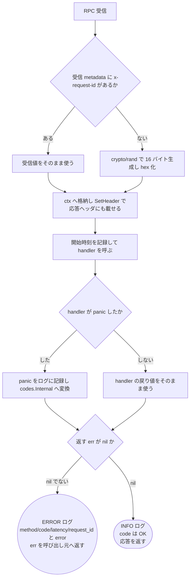
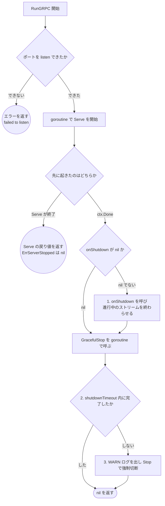

# gRPC サーバ起動とインターセプタのテスト設計

対象: [internal/infrastructure/server/grpc.go](../../internal/infrastructure/server/grpc.go) /
[internal/infrastructure/server/interceptor.go](../../internal/infrastructure/server/interceptor.go)
テスト: [internal/infrastructure/server/grpc_test.go](../../internal/infrastructure/server/grpc_test.go)

運用ルールは [README.md](README.md)。HTTP 側の対になる設計は
[internal/infrastructure/server/echo.go](../../internal/infrastructure/server/echo.go) の
`TestNew_MiddlewareOrder` 等（ミドルウェア登録順を主対象として文書化した md は現時点で無く、
<!-- ssot-assert: manual '「登録順を主対象として文書化した md が無い」は特定ファイルの不在ではなく他mdの主題を人が判定する必要があるため機械照合できない。docs/testing/ 配下に該当ドキュメントを新設したらこの記述と参照を直す' -->
テストのみで担保している）。ルーティングの nil チェックについては [http-router.md](http-router.md)
を参照。

この文書が守る対象は3つ。

1. **インターセプタの登録順** — 観測系（RequestID → アクセスログ）を最外側に固定する（AGENTS.md §2）
2. **RPC 1本の処理チェーン** — request_id の採番・アクセスログ・panic の変換
3. **graceful stop の三段構え** — SIGTERM でシャットダウンが完了しなくなる事故の回帰テスト

---

## 1. インターセプタの登録順

`grpc.ChainUnaryInterceptor(a, b, c)` は **a が最外側**で、`echo.Echo.Use` と同じ
「先に登録したものが外側」の並びになる。したがって HTTP と同じ規約をそのまま写せる。

```
UnaryRequestID  → UnaryAccessLog  → UnaryRecover
StreamRequestID → StreamAccessLog → StreamRecover
```

**recover を観測系より外側に置いてはならない。** 外側に置くと panic した RPC は
アクセスログにも request_id にも残らず、「特定の RPC だけ Internal が返る」という
症状しか運用側に見えなくなる。HTTP 側で BodyLimit をアクセスログより外に置いて
413 が観測できなくなったのと同じ失敗である（`internal/infrastructure/server/echo.go` の
`TestNew_MiddlewareOrder` を参照。文書化した md は無い）。

### 登録順を守るための二重の検査

順序は「引数の並び」なので ruleguard（式単位のマッチ）では表現できず、`NewGRPC` の
AST を直接読んで検証する（determ. §3）。一方 AST 検査は `ChainUnaryInterceptor` の
引数しか見ないため、**単数形の `grpc.UnaryInterceptor` / `grpc.StreamInterceptor` を
併用されると迂回される**（単数形と Chain 系を両方渡すと、grpc-go 側で単数形が
上書きされて片方が黙って無視される）。この入口は `scripts/ruleguard/rules.go` の
`grpcSingleInterceptor` が塞ぐ。`echo.Echo.Pre` の禁止と同じ構図。

<!-- testcases-funcs: internal/infrastructure/server/grpc_test.go -->

| # | 検証内容 | 期待結果 | 対応テスト |
| --- | --- | --- | --- |
| 1 | unary の登録順 | 先頭2つが `UnaryRequestID` → `UnaryAccessLog` | `TestNewGRPC_UnaryInterceptorOrder` |
| 2 | stream の登録順 | 先頭2つが `StreamRequestID` → `StreamAccessLog` | `TestNewGRPC_StreamInterceptorOrder` |
| 3 | unary と stream の並びが一致 | `Unary` / `Stream` の接頭辞を除いた並びが同一 | `TestNewGRPC_InterceptorOrderMatchesAcrossKinds` |
| 4 | 単数形インターセプタの不使用 | `NewGRPC` に `UnaryInterceptor` / `StreamInterceptor` の呼び出しが 0 件 | `TestNewGRPC_UnaryInterceptorOrder` / `TestNewGRPC_StreamInterceptorOrder` |

ケース 3 が要るのは、unary だけを直して stream を直し忘れる（あるいはその逆）事故が
片側の検査では通ってしまうため。並びが「同じであること」自体を固定する。

---

## 2. RPC 1本の処理チェーン

図はインターセプタ3本を通した RPC 1本ぶんの流れ。unary と stream で実装は別関数だが
分岐は同型なので、1つの図を共有する。



**設計上の要点**（テストで守る不変条件）:

- **panic の変換は最内側**。recover が handler のすぐ外にいるので、変換後の
  `codes.Internal` はアクセスログから観測できる。この「panic がアクセスログに
  ERROR として残る」という観測可能性が、登録順を守っていることの振る舞い側の裏付けになる
- **request_id は受信値を尊重する**。クライアント（Unity）や API Gateway が採番した
  ID をサーバが上書きすると、クライアント側のログと突き合わせられなくなる
- **採番した ID は応答ヘッダにも載せる**。障害報告に添える ID をクライアントが
  取得できるようにするため（HTTP の `X-Request-Id` レスポンスヘッダに相当）
- **ctx への格納には非公開のキー型を使う**。文字列キーは他パッケージと衝突しうる
- 外部ライブラリ（go-grpc-middleware 等）は入れない。recover は 15 行程度で、
  そのために本体依存を増やす価値がない

### テスト仕様表

パスが短い順（本図はすべて同じ長さ）。同じ長さなので エラー → 正常系 の順に並べ、
**unary（1〜4）と stream（5〜8）でブロックを分ける**。unary と stream は別の実装で、
片方だけ壊れる（実際 stream 側は `ServerStream` のラップを忘れると ctx が伝わらない）ため、
同一パスでもケースを統合しない（[README.md](README.md) §3 の例外。理由は
[http-router.md](http-router.md) のケース 1〜4 と同じ）。

<!-- testcases: internal/infrastructure/server/grpc_test.go#TestGRPCInterceptors_Unary+TestGRPCInterceptors_Stream -->

| # | 条件 | 図のパス | 期待結果 | 検証すべき呼び出し |
| --- | --- | --- | --- | --- |
| 1 | unary: handler が panic | `A→B→D→E→F→G→P→I→E1` | `codes.Internal` | panic ログ（ERROR）とアクセスログ（ERROR / `code=Internal`）の両方が出る |
| 2 | unary: handler が status エラー | `A→B→D→E→F→G→H→I→E1` | 返した code がそのまま | アクセスログが ERROR、`code` は handler が返したもの |
| 3 | unary: x-request-id を受信 | `A→B→C→E→F→G→H→I→Z` | `codes.OK` | 受信 ID が応答ヘッダとアクセスログの `request_id` に一致する |
| 4 | unary: x-request-id 無し | `A→B→D→E→F→G→H→I→Z` | `codes.OK` | 32 桁 hex が採番され、応答ヘッダとアクセスログで一致する |
| 5 | stream: handler が panic | `A→B→D→E→F→G→P→I→E1` | `codes.Internal` | ケース 1 と同じ |
| 6 | stream: handler が status エラー | `A→B→D→E→F→G→H→I→E1` | 返した code がそのまま | ケース 2 と同じ |
| 7 | stream: x-request-id を受信 | `A→B→C→E→F→G→H→I→Z` | `codes.OK` | 受信 ID がハンドラの ctx・応答ヘッダ・アクセスログで一致する |
| 8 | stream: x-request-id 無し | `A→B→D→E→F→G→H→I→Z` | `codes.OK` | ケース 4 と同じ |

ケース 1 と 5 は panic の値の型を変えてある（1 は `error`、5 は文字列）。recover 側は
値が `error` かどうかで包み方を変える（`%w` / `%v`）ので、同じパスの 2 ケースで
両方の分岐を通す。ケースを増やさずに済ませるための割り当てで、パス自体は同じ。

いずれも bufconn（`google.golang.org/grpc/test/bufconn`）で実サーバに通す。
インターセプタを直接呼ぶ単体テストにしないのは、stream の ctx 伝播（`ServerStream` の
ラップ）と `SetHeader` の送信が、grpc-go のランタイムを通さないと検証できないため。

`.proto` の生成型は使わない。`internal/infrastructure` のテストから
`internal/driver`（生成物の置き場）を import するのは層の依存規約に反するので、
テスト内で最小のバイト列コーデックと `grpc.ServiceDesc` を組み立てる。

---

## 3. graceful stop の三段構え

`grpc.Server.GracefulStop()` は**進行中のストリームが終わるまでブロックする**。
本サービスには `WatchUserRankings`（server streaming）があり、クライアントが
切断するまでストリームは終わらない。`echo.go` の `Run` と同型に書くと
**SIGTERM を受けてもシャットダウンが永久に完了しない**。



**設計上の要点**:

- **(1) `onShutdown` を先に呼ぶ**。配信側（ランキング配信ハブ）に「もう送るな」と伝えて
  進行中のストリームを終わらせない限り、(2) の `GracefulStop` は返らない。
  `onShutdown` は Wave 2 で `cmd/grpc` がハブの ctx キャンセルを渡す
- **`onShutdown` は nil 可**。ストリームを持たない構成でも `RunGRPC` を使えるようにする
  ための意図的に省略可能なフックで、logger の nil チェック禁止（AGENTS.md §2）とは別物。
  logger は「渡し忘れ」を許さないための必須引数、`onShutdown` は「不要」を表現できる引数
- **(3) 強制切断しても error を返さない**。ストリームを掴んだままのクライアントが
  1つでもいると毎回のデプロイで異常終了扱いになり、本当の異常と区別できなくなる。
  強制切断した事実は WARN ログで観測する
- `Serve` が `grpc.ErrServerStopped` を返すのは停止要求の結果なので、エラー扱いしない

### テスト仕様表

パスが短い順。

<!-- testcases: internal/infrastructure/server/grpc_test.go#TestRunGRPC_ListenError+TestRunGRPC_ServeStopped+TestRunGRPC_Shutdown -->

| # | 条件 | 図のパス | 期待結果 | 検証すべき呼び出し |
| --- | --- | --- | --- | --- |
| 1 | 使用中のポートを渡す | `S→SL→SE1` | `failed to listen` を含むエラー | Serve に到達しない |
| 2 | ctx より先に `srv.Stop()` が呼ばれる | `S→SL→SR→SW→SE2` | `nil`（`ErrServerStopped` はエラー扱いしない） | — |
| 3 | ストリーム無し・`onShutdown` が nil | `S→SL→SR→SW→SO→SG→ST→SZ` | `nil` | 強制切断の WARN が出ない |
| 4 | ストリームあり・`onShutdown` が配信を止める | `S→SL→SR→SW→SO→SH→SG→ST→SZ` | `nil` | `onShutdown` が 1 回呼ばれ、強制切断の WARN は出ない |
| 5 | ストリームあり・`onShutdown` が配信を止めない | `S→SL→SR→SW→SO→SH→SG→ST→SF→SZ` | `nil` | 強制切断の WARN が出て、`RunGRPC` が返る |

**ケース 5 が本設計の要**。ここが落ちる実装（`GracefulStop` を同期に呼ぶ形）は
SIGTERM を受けてもプロセスが終わらず、デプロイが止まる。テストは `shutdownTimeout` の
経過を待つぶん他のケースより時間がかかるが、代替手段が無いので受け入れる。

ケース 5 の判定に経過時間の閾値は使わない（実装の定数をテストへ写すと二重管理になり、
CI の負荷次第で揺れる）。「強制切断の WARN が出たこと」と「`RunGRPC` が返ったこと」で見る。

---

## 4. 層固有の運用値

`echo.go` と同じく、この層でしか使わない値は `server` パッケージの `const` に置く
（AGENTS.md §2）。環境ごとに変える必要が出たら `configs` へ移す。

| 値 | 意図 |
| --- | --- |
| `grpcShutdownTimeout` | 三段構えの (2) で `GracefulStop` を待つ上限。超過で `Stop`。名前が `shutdownTimeout` でないのは、同じパッケージの HTTP 側が既に使っているため |
| `maxRecvMsgSize` | 受信メッセージの上限。HTTP の `bodyLimit`（64K）と桁を揃える |
| `keepaliveTime` / `keepaliveTimeout` | サーバから送る PING の間隔と応答待ち。モバイル回線の NAT はアイドル接続を数分で切るため、既定（2 時間）のままだと streaming が黙って死ぬ |
| `keepaliveMinTime` | クライアントの PING を許容する最短間隔。`PermitWithoutStream: true` と組にする。これが無いとクライアント側 keepalive が `ENHANCE_YOUR_CALM` で切断される |

keepalive の値そのものはテストで固定しない（値の妥当性は実機・負荷試験の領域で、
定数をテストへ写すと二重管理になる）。設定の有無が壊れると streaming が
「しばらく経つと無言で止まる」形で表面化するため、Unity クライアント側の
keepalive 設定と対で見直すこと。

## 5. 保守トリガ

- インターセプタを追加・削除したら、§1 の並びと §2 の図・表を併せて更新する。
  観測系より外側に何かを足す変更は、まず AGENTS.md §2 の規約の見直しから行う
- `onShutdown` に渡す対象（配信ハブ）が増えたら、§3 の (1) の説明を更新する。
  「onShutdown を呼べばストリームが終わる」という前提が崩れると、ケース 4 が
  ケース 5 の経路へ落ちてシャットダウンが毎回 `shutdownTimeout` 待ちになる
