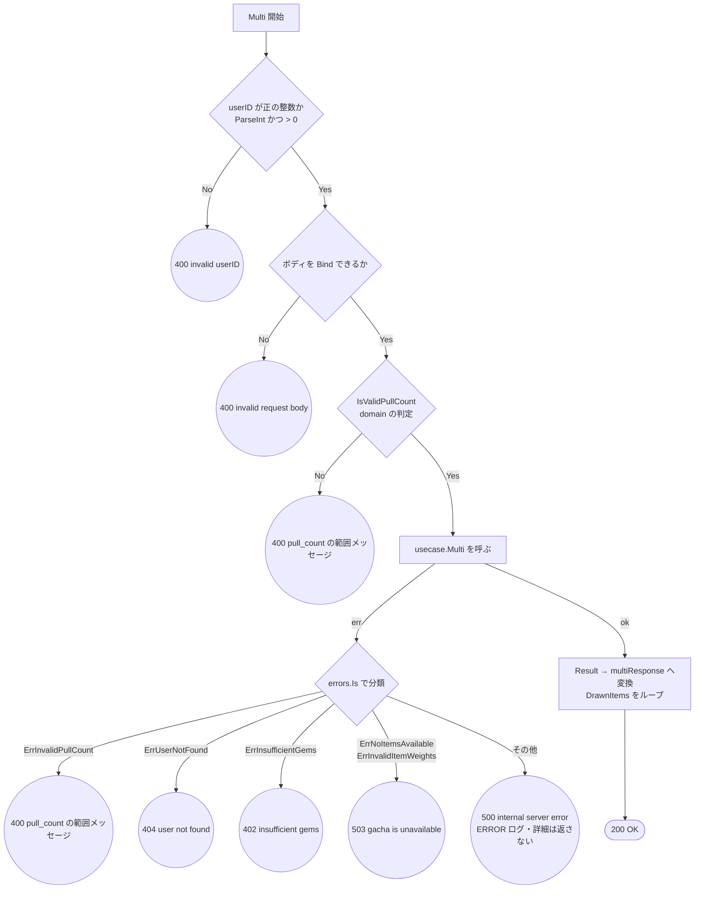

# ガチャ HTTP ハンドラのテスト設計

対象: [internal/driver/http/gacha/handler.go](../../internal/driver/http/gacha/handler.go)
テスト: [internal/driver/http/gacha/handler_test.go](../../internal/driver/http/gacha/handler_test.go)
／[contract_test.go](../../internal/driver/http/gacha/contract_test.go)

運用ルールは [README.md](README.md)。ユースケース側の設計は [gacha.md](gacha.md)。

`driver` 層の責務は**変換とエラー経路の網羅**に限定される。
下位層（domain / usecase）が担保済みの判定を重ねてテストしない。

---

## 1. `Handler.Multi`（`POST /users/:userID/gacha/multi`）

### 1-1. フローチャート

**設計上の要点**（テストで守る不変条件）:

- 入力バリデーションで弾いた場合は **usecase を呼ばない**（`E1` / `E2` / `E3`）
- `E8` は**エラーの詳細をレスポンスに載せない**（情報漏えい防止）。詳細はログにだけ出す
- `D` と `G` の `ErrInvalidPullCount` は**同じメッセージ**を返す。
  ハンドラ側の事前検証と usecase 側の検証が二重にあり、どちらから来ても
  クライアントから見た応答は同一であること

### 1-2. テスト仕様表

パスが短い順。**表の1行 = テストコードの1ケース。**

| # | 条件 | 図のパス | 期待結果 | 検証すべき呼び出し |
| --- | --- | --- | --- | --- |
| 1 | `userID` が数値でない | `A→B→E1` | 400 `invalid userID` | **usecase が呼ばれない** |
| 2 | `userID` が 0 以下 | `A→B→E1` | 400 `invalid userID` | 同上 |
| 3 | ボディが不正な JSON | `A→B→C→E2` | 400 `invalid request body` | 同上 |
| 4 | `pull_count` が範囲外 | `A→B→C→D→E3` | 400 `pull_count must be between 1 and 10` | 同上 |
| 5 | usecase が `ErrInvalidPullCount` | `…→D→F→G→E4` | 400 `pull_count must be between 1 and 10` | — |
| 6 | usecase が `ErrUserNotFound` | `…→F→G→E5` | 404 `user not found` | — |
| 7 | usecase が `ErrInsufficientGems` | `…→G→E6` | 402 `insufficient gems` | — |
| 8 | usecase が `ErrNoItemsAvailable` | `…→G→E7` | 503 `gacha is unavailable` | — |
| 9 | usecase が `ErrInvalidItemWeights` | `…→G→E7` | 503 `gacha is unavailable` | — |
| 10 | usecase が予期せぬエラー | `…→G→E8` | 500 `internal server error`。**元のエラー文言を含まない** | — |
| 11 | 正常系 | `…→F→H→Z` | 200。`user_id` / `remaining_gems` / `drawn_items` が Result の値と一致 | `Multi` に `userID` と `pull_count` がそのまま渡る |

**ケース 1 と 2 を統合しない理由**: パスは同一だが、判定は `err != nil || userID <= 0` の
2 条件からなる。`userID <= 0` の側を落とす実装ミスはケース 1 では検出できず 2 でのみ落ちる
（境界値を独立ケースにする3基準のうち「片方だけが検出できる実装ミスがある」に該当）。

**ケース 8 と 9 を統合しない理由**: 終端ノードは同じ `E7` だが、`errors.Is` の判定対象が違う。
片方の `case` を落とす実装ミスはもう片方では検出できない。

**ケース 4 を 1 件に絞る理由**: `pull_count` の `0` / 上限超過 / 負数はすべて同一パス `A→B→C→D→E3`。
ハンドラは `IsValidPullCount` に丸投げしているだけなので、境界の正しさは
[internal/domain/gacha](../../internal/domain/gacha) のケース配列が正本。ここで重ねない。

### 1-3. パスの網羅状況

終端ノードは `E1`〜`E8` と `Z` の **9 個**。上表はすべてを最低1件ずつ通っている。

---

## 2. レスポンス契約

レスポンスの**構造**（json タグ）の正本は
[testdata/contracts/](../../internal/driver/http/testdata/contracts/) の JSON ファイル。
[contract_test.go](../../internal/driver/http/gacha/contract_test.go) が
`internal/testutil/apicontract` で構造のみを検証する。

| # | 対象 | 契約ファイル |
| --- | --- | --- |
| 12 | 200 のレスポンス構造 | `gacha_multi.json` |
| 13 | エラーレスポンス構造 | `error.json` |

**値の妥当性はここで見ない**（1 の表の責務）。見るのはキー名の追加・削除・リネームだけ。
構造が同じなら代表 1 パターンでよいので、エラー系の契約検証は 1 件で足りる。

---

## 3. 本設計文書の作成で見つかった問題

`driver` 層の文カバレッジは 95.8% で**閾値 90% を満たしていたため検知されなかった**もの。

| 種別 | 内容 | 対応 |
| --- | --- | --- |
| **パスの欠落** | ケース 5（usecase が `ErrInvalidPullCount` を返す → 400）が無く、`errors.Is` の**先頭の case が一度も実行されていなかった**。ハンドラ側の事前検証があるため現状は到達しにくいが、二重防御の片方が未検証だった | 追加 |
| **同一パスの重複** | `pull_count` の `0` / `11` / `-1` の 3 ケースはすべて同一パス。境界の正しさは domain の `IsValidPullCount` が 6 ケースで網羅済み | 表のケース 4（1 件）へ統合 |
| **同一パスの重複** | 「正常系: `pull_count=1` でも成功」は正常系と同一パス。ハンドラは `pull_count` を usecase へ透過するだけで、回数による分岐を持たない（回数の境界は [gacha.md](gacha.md) のケース 15 の責務） | 表のケース 11 へ統合 |
| **検証の欠落** | ケース 10 が「500 が返ること」しか見ておらず、**元のエラー文言が漏れていないこと**を確認していなかった。情報漏えい防止がこの分岐の存在理由なので、そこを見ないと分岐の意味が検証されない | `assert.NotContains` を追加 |
| **テーブル駆動の形** | 各ケースが `setupMock func(m *MockUsecase)` を持ち、モックの組み立て手順をテーブル側に書いていた | テーブルをデータのみにし、組み立てはランナーへ集約 |
