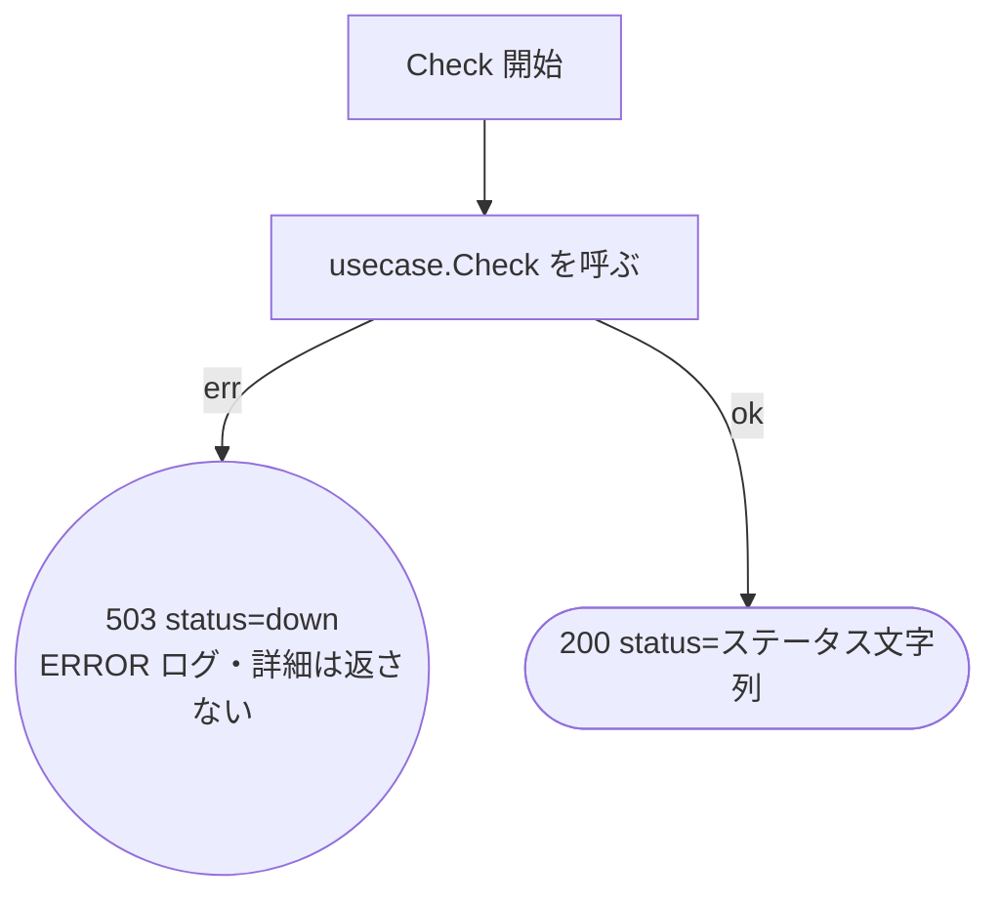

# ヘルスチェック HTTP ハンドラのテスト設計

対象: [internal/driver/http/health/handler.go](../../internal/driver/http/health/handler.go)
テスト: [internal/driver/http/health/handler_test.go](../../internal/driver/http/health/handler_test.go)
／[contract_test.go](../../internal/driver/http/health/contract_test.go)

運用ルールは [README.md](README.md)。

`driver` 層の責務は**変換とエラー経路の網羅**に限定される。
ステータス値そのものの意味は [internal/domain/health](../../internal/domain/health) の責務。

---

## 1. `Handler.Check`（`GET /healthz`）

### 1-1. フローチャート

**設計上の要点**（テストで守る不変条件）:

- `E1` は**エラーの詳細をレスポンスに載せない**。詳細はログにだけ出す。
  [http-gacha.md](http-gacha.md) の `E8`・ranking ハンドラの `default` と同じ方針で、
  ハンドラ間で非対称にしない。`/healthz` は認証なしで外部公開され、
  依存リソースの疎通確認を追加すれば接続先やエラー文言がそのまま外へ出るため、
  他のエンドポイントより漏えいの影響が大きい
- `E1` の値は domain の `StatusDown` を使う。ハンドラに状態を表す文字列リテラルを置かない
- 応答の JSON キーは正常系・異常系で共通の `status`。ALB のヘルスチェックは
  ステータスコードしか見ないが、キーを変えると解釈側（k6 シナリオ等）へ波及するため維持する
  <!-- ssot-assert: present-grep 'healthz' terraform/modules/compute_ecs/main.tf -->
- ハンドラは `error` を返さない（`c.JSON` の結果のみ）。
  エラーを返すと Echo の既定ハンドラが応答を組み立て、上の契約から外れるため

### 1-2. テスト仕様表

パスが短い順。**表の1行 = テストコードの1ケース。**

| # | 条件 | 図のパス | 期待結果 | 検証すべき呼び出し |
| --- | --- | --- | --- | --- |
| 1 | usecase がエラー | `A→B→E1` | 503 `{"status":"down"}`。**元のエラー文言を含まない** | ERROR ログに元のエラーが出る |
| 2 | 正常系 | `A→B→Z` | 200 `{"status":"ok"}` | `Check` が1回呼ばれる |

**ケースがこの 2 件で足りる理由**: ハンドラは usecase の戻り値を透過するだけで、
ステータス値による分岐を持たない。`degraded` などの値のバリエーションは
[status_test.go](../../internal/domain/health/status_test.go) が正本。

### 1-3. パスの網羅状況

終端ノードは `E1` と `Z` の **2 個**。上表はすべてを1件ずつ通っている。

---

## 2. レスポンス契約

レスポンスの**構造**（json タグ）の正本は
[testdata/contracts/health.json](../../internal/driver/http/testdata/contracts/health.json)。

| # | 対象 | 契約ファイル |
| --- | --- | --- |
| 3 | 200 / 503 のレスポンス構造 | `health.json` |

正常系と異常系で**構造が同一**（`status` 1 キー）なので契約ファイルは 1 つ。
値の妥当性は 1 の表の責務。

---

## 3. 本設計文書の作成で見つかった問題

`driver` 層の文カバレッジは閾値を満たしており、**いずれも数値では検知できない**ものだった。

| 種別 | 内容 | 対応 |
| --- | --- | --- |
| **情報漏えい** | 異常系が `err.Error()` をそのままレスポンスに載せていた。他の 2 ハンドラは固定文言に統一しており、ここだけ非対称だった | `StatusDown` を返し、詳細はログへ |
| **観測点の欠落** | ハンドラが logger を持たず、エラーを握り潰していた。`c.JSON` で 503 を返して `nil` を返すため、Echo のアクセスログにも `error` 属性が付かない（アクセスログが error を拾うのはハンドラが `error` を返したときだけ） | `NewHandler` に logger を追加 |
| **検証の欠落** | 異常系のテストが「エラー文言がそのまま返る」ことを**期待値として固定**していた。漏えいを仕様として肯定していた状態 | 期待値を反転し、`assert.NotContains` で漏れていないことを検証 |
| **契約の欠落** | このエンドポイントだけ `testdata/contracts/` に契約ファイルが無く、AGENTS.md §3「レスポンス構造は契約ファイルを正本とする」から外れていた | `health.json` と契約テストを追加 |
| **テストの様式** | testify を使わず `t.Errorf` で比較しており、AGENTS.md §3「アサーションは testify」から外れていた。logger も `slogtest` 経由でなかった | 他ハンドラと同じ様式へ揃えた |
