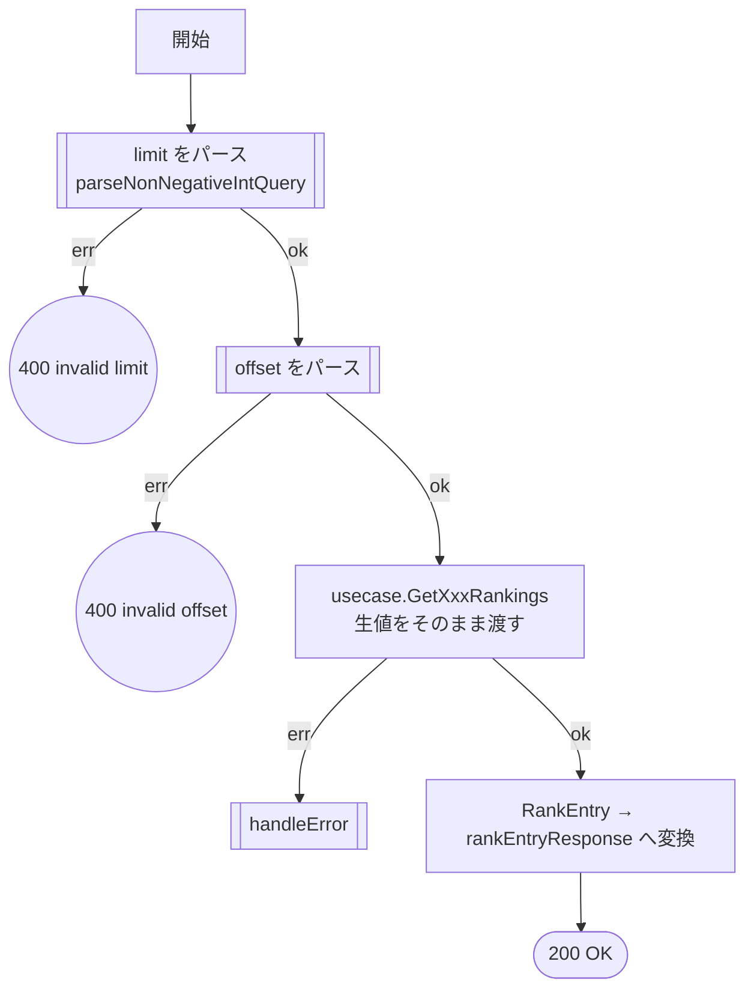
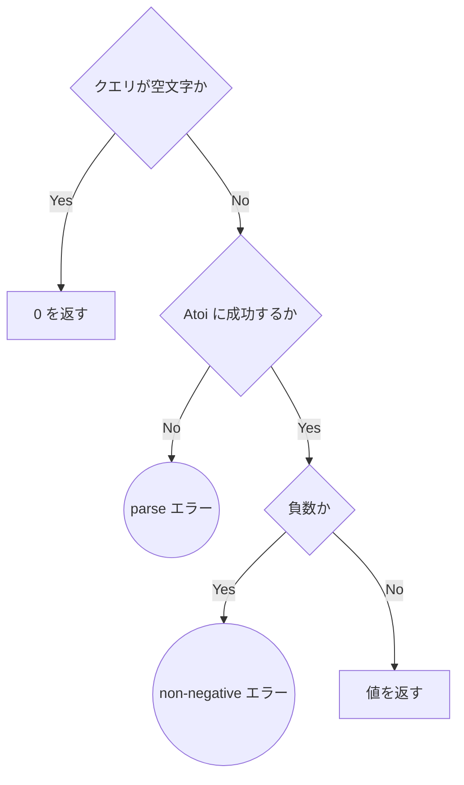
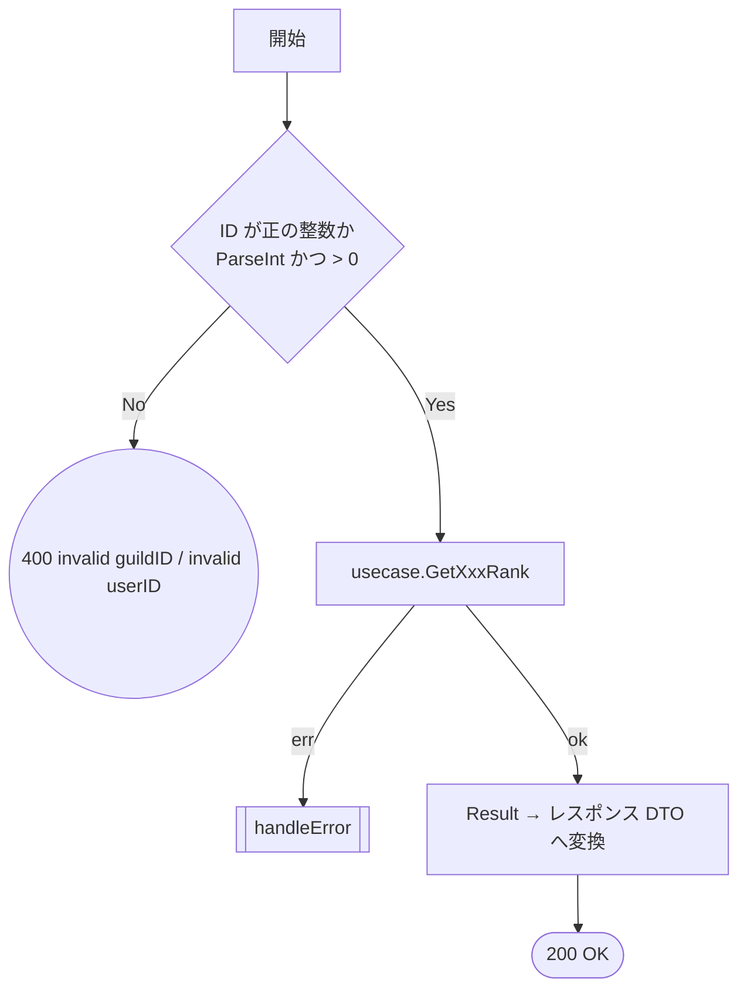
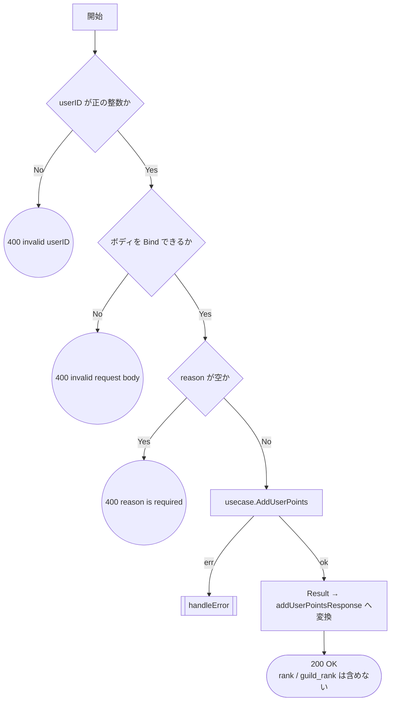
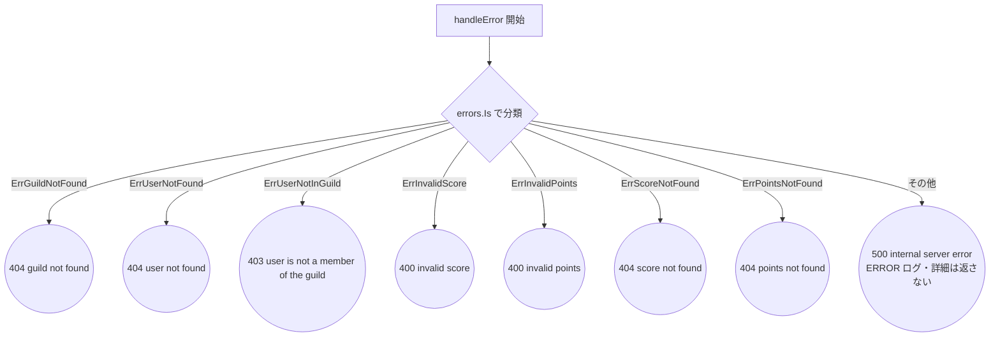

# ランキング HTTP ハンドラのテスト設計

対象: [internal/driver/http/ranking/handler.go](../../internal/driver/http/ranking/handler.go)
テスト: [internal/driver/http/ranking/handler_test.go](../../internal/driver/http/ranking/handler_test.go)
／[contract_test.go](../../internal/driver/http/ranking/contract_test.go)

運用ルールは [README.md](README.md)。ユースケース側の設計は [ranking.md](ranking.md)。

`driver` 層の責務は**変換とエラー経路の網羅**に限定される。
`limit` / `offset` の正規化、`Points` の値域といった判定は下位層の責務なので重ねてテストしない。

エラー → ステータスの分類は 5 ハンドラすべてが `handleError` を共有する。
図では `[[handleError]]` として畳み、分岐の実体は **§4** に置く。

---

## 1. 一覧系: `GetGuildRankings` / `GetUserRankings`

2 メソッドは構造が同一（ギルド版とユーザー版）。**同じ図・同じケース構成を持つ**。
片方にだけケースがある状態にしない（対称性）。

### 1-1. フローチャート

`parseNonNegativeIntQuery` のサブフロー（`B` / `C` の内部）:

**設計上の要点**: 未指定（空文字）は `0` を返し、**既定値の適用は usecase に委ねる**。
ハンドラが既定値を持つと、[ranking.md](ranking.md) の `NormalizeLimit` と二重管理になる。

### 1-2. テスト仕様表（`GetGuildRankings` / `GetUserRankings` 共通）

| # | 条件 | 図のパス | 期待結果 | 検証すべき呼び出し |
| --- | --- | --- | --- | --- |
| 1 | `limit` が数値でない | `A→B→E1`（`P3→PE1`） | 400 `invalid limit` | **usecase が呼ばれない** |
| 2 | `limit` が負数 | `A→B→E1`（`P4→PE2`） | 400 `invalid limit` | 同上 |
| 3 | `offset` が数値でない | `A→B→C→E2`（`P3→PE1`） | 400 `invalid offset` | 同上 |
| 4 | `offset` が負数 | `A→B→C→E2`（`P4→PE2`） | 400 `invalid offset` | 同上 |
| 5 | usecase が予期せぬエラー | `…→C→D→X→R8` | 500 `internal server error` | — |
| 6 | 正常系: クエリ未指定 | `…→D→F→Z`（`P1→P2`） | 200 | **usecase に `Limit=0` / `Offset=0` が渡る**（正規化しない） |
| 7 | 正常系: `limit` / `offset` 指定 | `…→D→F→Z`（`P1→P3→P4→P5`） | 200。`rankings` と `total_count` が Result と一致 | usecase に指定値がそのまま渡る |

**ケース 1〜4 を 2 件に減らさない理由**: サブフローの失敗分岐は 2 つ（`PE1` / `PE2`）だが、
`parseNonNegativeIntQuery` は `limit` と `offset` で**2 回別々に呼ばれる**。
どちらのキーでどちらの分岐に落ちても正しいメッセージが返ることは、
2×2 を通さないと非対称な穴が残る（片方だけにケースがある状態を作らない）。

---

## 2. 単一順位取得: `GetGuildRank` / `GetUserRank`

こちらも 2 メソッドで構造が同一。

### テスト仕様表（`GetGuildRank` / `GetUserRank` 共通）

| # | 条件 | 図のパス | 期待結果 | 検証すべき呼び出し |
| --- | --- | --- | --- | --- |
| 1 | ID が数値でない | `A→B→E1` | 400 `invalid guildID` / `invalid userID` | **usecase が呼ばれない** |
| 2 | ID が 0 以下 | `A→B→E1` | 同上 | 同上 |
| 3 | エンティティ未存在 | `A→B→C→X→R1` / `R2` | 404 `guild not found` / `user not found` | usecase に ID がそのまま渡る |
| 4 | スコア/ポイント未登録 | `…→C→X→R6` / `R7` | 404 `score not found` / `points not found` | — |
| 5 | 予期せぬエラー | `…→X→R8` | 500 `internal server error` | — |
| 6 | 正常系 | `…→C→D→Z` | 200。全フィールドが Result の値と一致 | — |

**ケース 1 と 2 を統合しない理由**: パスは同一だが、判定は `err != nil || id <= 0` の 2 条件。
`id <= 0` 側を落とす実装ミスはケース 1 では検出できない。

---

## 3. `AddUserPoints`（`POST /users/:userID/points`）

**設計上の要点**: 順位は worker の Redis 反映後にしか確定しないため、
このレスポンスに `rank` / `guild_rank` を**入れない**（[ranking.md](ranking.md) 参照）。
入れてしまうと常に未確定値を返すことになるので、**含まれないこと**をテストで固定する。

`points` の値域は検証しない。`IsValidScore` は domain の責務で、
usecase が `ErrInvalidPoints` を返した場合の**マッピング**だけがこの層の責務。

### テスト仕様表

| # | 条件 | 図のパス | 期待結果 | 検証すべき呼び出し |
| --- | --- | --- | --- | --- |
| 1 | `userID` が数値でない | `A→B→E1` | 400 `invalid userID` | **usecase が呼ばれない** |
| 2 | `userID` が 0 以下 | `A→B→E1` | 同上 | 同上 |
| 3 | ボディが不正な JSON | `A→B→C→E2` | 400 `invalid request body` | 同上 |
| 4 | `reason` が空 | `A→B→C→D→E3` | 400 `reason is required` | 同上 |
| 5 | usecase が `ErrUserNotFound` | `…→D→F→X→R2` | 404 `user not found` | `userID` / `points` / `reason` がそのまま渡る |
| 6 | usecase が `ErrUserNotInGuild` | `…→F→X→R3` | 403 `user is not a member of the guild` | — |
| 7 | usecase が `ErrInvalidPoints` | `…→X→R5` | 400 `invalid points` | — |
| 8 | usecase が予期せぬエラー | `…→X→R8` | 500 `internal server error` | — |
| 9 | 正常系 | `…→F→G→Z` | 200。7 フィールドが Result と一致し、**`rank` / `guild_rank` を含まない** | — |

---

## 4. 共通のエラー分類: `handleError`

5 ハンドラすべてが共有する。図の `[[handleError]]` の実体。

各終端をどのケースが通すかの対応。**空欄を作らないことがこの表の目的**。

| 終端 | 判定対象 | 通すケース |
| --- | --- | --- |
| `R1` | `ErrGuildNotFound` | §2 ケース 3（guild） |
| `R2` | `ErrUserNotFound` | §2 ケース 3（user）／§3 ケース 5 |
| `R3` | `ErrUserNotInGuild` | §3 ケース 6 |
| `R4` | `ErrInvalidScore` | **未対応**（下記） |
| `R5` | `ErrInvalidPoints` | §3 ケース 7 |
| `R6` | `ErrScoreNotFound` | §2 ケース 4（guild） |
| `R7` | `ErrPointsNotFound` | §2 ケース 4（user） |
| `R8` | その他 | §1 ケース 5／§2 ケース 5／§3 ケース 8 |

### 【要対応】`R4`（`ErrInvalidScore`）は到達不可能

`rankingdomain.ErrInvalidScore` は [domain/ranking/errors.go](../../internal/domain/ranking/errors.go) に
定義されているが、**返している実装が 1 つも無い**（参照しているのは `handleError` だけ）。
ポイント加算の値域違反は `ErrInvalidPoints` を返す。

到達不可能なので**テストで無理にカバーしない**（AGENTS.md §6「デッドコードをテストで無理にカバーしない」）。
`ErrInvalidScore` ごと削除するか、ギルドスコア直接更新の API を足すときに使うかを
**仕様として決める必要がある**（優先度: 低）。決まるまで本表に `未対応` として残す。

---

## 5. レスポンス契約

レスポンスの**構造**（json タグ）の正本は
[testdata/contracts/](../../internal/driver/http/testdata/contracts/) の JSON ファイル。
[contract_test.go](../../internal/driver/http/ranking/contract_test.go) が
`internal/testutil/apicontract` で構造のみを検証する。

| # | 対象 | 契約ファイル |
| --- | --- | --- |
| 1 | ギルドランキング一覧 | `ranking_rankings.json` |
| 2 | ユーザーランキング一覧 | `ranking_rankings.json`（構造は共通） |
| 3 | ギルド順位 | `ranking_guild_rank.json` |
| 4 | ユーザー順位 | `ranking_user_rank.json` |
| 5 | ポイント加算 | `ranking_add_user_points.json` |
| 6 | エラーレスポンス | `error.json` |

**値の妥当性はここで見ない**（§1〜§3 の責務）。見るのはキー名の追加・削除・リネームだけ。

---

## 6. 本設計文書の作成で見つかった問題

`driver` 層の文カバレッジは 97.4% で**閾値 90% を満たしていたため検知されなかった**もの。

| 種別 | 内容 | 対応 |
| --- | --- | --- |
| **パスの欠落** | `parseNonNegativeIntQuery` の「`Atoi` 失敗」分岐（`PE1`）が未検証だった。負数のケースしか無く、`?limit=abc` のような入力が**一度も通っていなかった** | §1 のケース 1・3 を追加 |
| **対称性の欠如** | `GetGuildRank` に「予期せぬエラー → 500」のケースが無かった。同一構造の `GetUserRank` にはあり、**片方だけにケースがある**状態 | §2 のケース 5 を両方に適用 |
| **対称性の欠如** | `GetUserRankings` に「クエリ未指定」のケースが無かった。`GetGuildRankings` にだけあった | §1 のケース 6 を両方に適用 |
| **デッドコード** | `handleError` の `ErrInvalidScore` 分岐は到達不可能（§4 参照） | テストは足さず `未対応` として記録。仕様判断待ち |
| **テーブル駆動の形** | 5 つのテーブルすべてが `setupMock func(m *MockUsecase)` を持ち、モックの組み立て手順をテーブル側に書いていた | テーブルをデータのみにし、組み立てはランナーへ集約。構造が同一な 2 メソッドは同じテーブルを両方に流し、非対称が構造的に起きないようにする |
