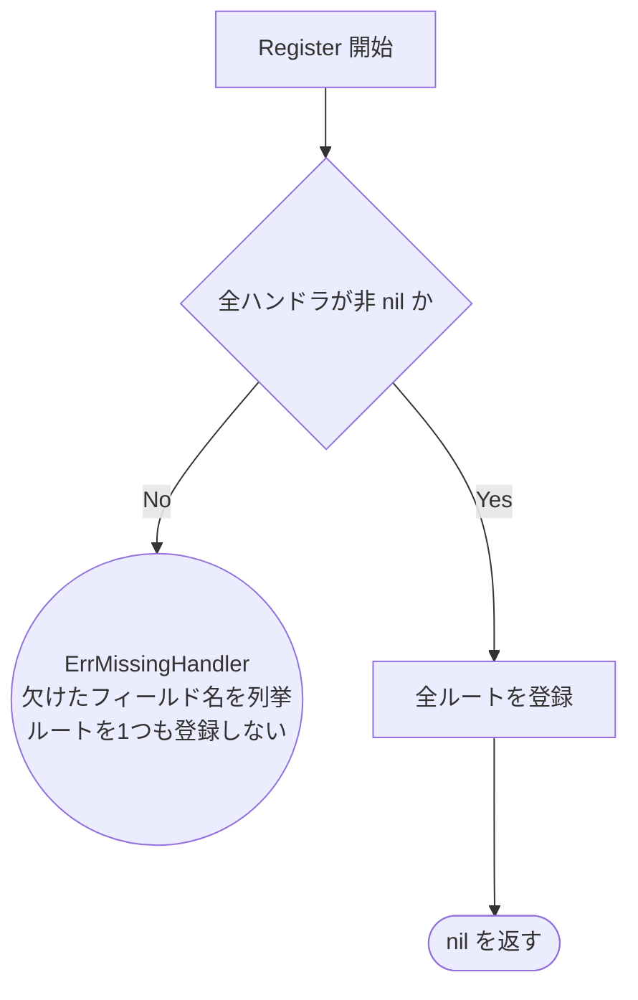

# ルーティング登録のテスト設計

対象: [internal/driver/http/router/router.go](../../internal/driver/http/router/router.go)
テスト: [internal/driver/http/router/router_test.go](../../internal/driver/http/router/router_test.go)

運用ルールは [README.md](README.md)。

`Register` はコンポジションルート（[internal/di](../../internal/di)）が組み立てた
`Handlers` を受け取り、Echo にルートを登録する。分岐は「組み立て漏れの検査」1 つだけ。

## フローチャート

**設計上の要点**（テストで守る不変条件）:

- **nil チェックを外すだけでは fail-fast にならない。** `h.Gacha.Multi` は
  メソッド値の生成であり、レシーバが nil でもこの時点ではデリファレンスされない。
  検査が無いと `Register` もサーバ起動も成功し、panic は最初のリクエストまで遅延したうえ
  `middleware.Recover()` が 500 に丸める。運用側からは「特定のエンドポイントだけ 500」
  としか見えず、原因が設定ミスだと分からない。明示的な検査が唯一の防波堤
- **nil を許して登録をスキップしない。** 以前は Gacha / Ranking だけをスキップし
  Health はしない非対称な状態だった。スキップすると該当エンドポイントが 404 になるだけで、
  起動後も表面化しない
- **欠けたフィールドを全部挙げる。** 1 つずつ直して再起動する往復を避けるため。
  列挙順は構造体のフィールド順で固定する（メッセージを安定させる）
- **検査に落ちたらルートを1つも登録しない。** 部分登録した Echo が呼び出し元に残ると、
  「起動を中止する」という意図と食い違う状態を作れてしまう
- 呼び出し元（[cmd/api/main.go](../../cmd/api/main.go)）は他の起動時失敗と同じく
  `log.Error` + `os.Exit(1)` で落とす

## テスト仕様表

パスが短い順。**表の1行 = テストコードの1ケース。**

<!-- testcases: internal/driver/http/router/router_test.go#TestRegister_MissingHandler+TestRegister_AllHandlers -->

| # | 条件 | 図のパス | 期待結果 | 検証すべき呼び出し |
| --- | --- | --- | --- | --- |
| 1 | `Health` が nil | `A→B→E1` | `ErrMissingHandler`、文言に `Health` | ルートが 0 件 |
| 2 | `Gacha` が nil | `A→B→E1` | `ErrMissingHandler`、文言に `Gacha` | 同上 |
| 3 | `Ranking` が nil | `A→B→E1` | `ErrMissingHandler`、文言に `Ranking` | 同上 |
| 4 | 全て nil | `A→B→E1` | 文言に `Health, Gacha, Ranking` | 同上 |
| 5 | 全て非 nil | `A→B→C→Z` | `nil` | 7 ルートすべてが登録される |

**ケース 1〜4 を統合しない理由**: 同一パスだが、検査の対象はフィールドごとに別の式。
1 フィールドを検査から書き落としても、そのフィールドのケースだけが落ちる
（[README.md](README.md) §3「分岐の通過が1つでも違えば別ケース」ではなく、
同一パスでも**片方だけが検出できる実装ミスがある**ことによる例外）。
ケース 4 は列挙順の固定を検証する役割も兼ねる。

## パスの網羅状況

終端ノードは `E1` と `Z` の **2 個**。上表はすべてを通っている。

## 保守トリガ

`Handlers` にフィールドを追加したら、`validate` の `fields` と上表のケースを併せて追加する。
この連動は静的検証で捕捉していない（フィールド追加と検査追加の対応を判定する手段が無い）。
<!-- ssot-assert: manual '構造体フィールドと validate の検査項目の対応を静的判定する手段が無い。追加時は本節に従い人手で連動させる' -->
