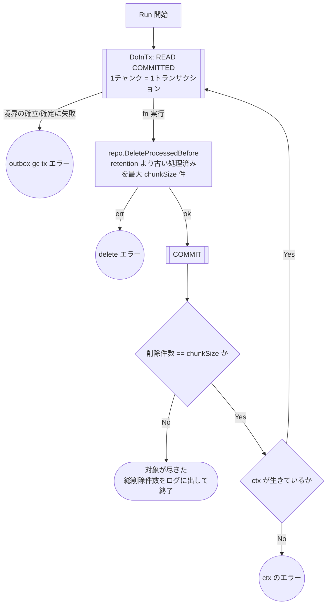

# Outbox GC バッチのテスト設計

対象: [internal/driver/batch/outbox_gc.go](../../internal/driver/batch/outbox_gc.go)
テスト: [internal/driver/batch/outbox_gc_test.go](../../internal/driver/batch/outbox_gc_test.go)

運用ルールは [README.md](README.md)。worker 側の設計は [outbox-worker.md](outbox-worker.md)。

処理済みの `outbox_events` を保持期間経過後に削除する常設バッチ。
worker は `processed_at` を立てるだけで行を消さないため、これが無いとテーブルが単調増加する。
負荷試験の実測（約 400 events/sec）では 1 日あたり約 3,400 万行が積み上がる。

## 起動経路

| 環境 | 起動 | 実体 |
| --- | --- | --- |
| ローカル | 手動 | `make db/outbox/gc`（`go run ./cmd/batch -gc-outbox`） |
| AWS | 定期 | EventBridge Scheduler → ECS RunTask（既定 03:00 JST 毎日） |

AWS 側は `outbox-gc` 専用の TaskDefinition に `command = ["-gc-outbox"]` を焼き込んである
（`terraform/modules/compute_ecs`）。スケジュール側で `containerOverrides` を渡さないのは、
フラグ文字列が JSON に埋もれると typo が実行時の異常終了でしか分からないため。
スケジュールの間隔・有効化は `outbox_gc_schedule_expression` / `outbox_gc_enabled` で変えられる。

保持期間は `OUTBOX_RETENTION`（`configs`、既定 72h）が正本で terraform では設定しない。
イメージタグの解決順序には注意点があるので
[terraform/ARCHITECTURE.md](../../terraform/ARCHITECTURE.md) の「イメージタグの扱い」を参照。

## フローチャート



**設計上の要点**（テストで守る不変条件）:

- **1 チャンク = 1 トランザクション**にする。1 文で全削除すると undo ログとロック保持が
  肥大し、同じテーブルへの INSERT（リクエスト経路の outbox 記録）を阻害する。
  チャンクサイズは driver 層の定数（環境ごとに変える必要が出たら `configs` へ移す）
- 境界は **READ COMMITTED** で開始する（下記「分離レベル」）
- 基準時刻は **SQL 側の `NOW(6)`** で取る。アプリ側で現在時刻を取得すると AGENTS.md §2 の
  Clock DI 規約に抵触するため、repository には「時刻」ではなく**保持期間**を渡す
  （規約の実態照合は AGENTS.md §2 の `ssot-assert` が担当。ここでは重複させない）
- **未処理（`processed_at IS NULL`）は削除しない**。恒久失敗イベントの始末は
  max retry / DLQ の責務（[outbox-worker.md](outbox-worker.md) §4）であり、
  GC が消すとイベントが黙って失われる
- 終了条件は `削除件数 < chunkSize`。0 件でなくても、その回で対象が尽きたことを意味する
- 途中で失敗したら**その時点で打ち切ってエラーを返す**。GC は次回の実行で続きを消せるため、
  [ranking-sync-batch.md](ranking-sync-batch.md) のように「残りを試行してから報告」する必要がない
  （あちらは復旧が目的なので、届く分を届けることに意味がある）

## 分離レベル

各チャンクの境界は **READ COMMITTED** で開始する。一覧は
[transaction-boundary.md](transaction-boundary.md) の「分離レベルの使い分け」が正本。

`idx_outbox_events_pending` は `(processed_at, id)` で、InnoDB は NULL を先頭に並べる。

```
[ (NULL,1) (NULL,2) … (NULL,最大id) ] | [ (t1,x) (t2,y) … ]
                                      ↑ 新規 INSERT の着地点
```

新規 INSERT は `processed_at = NULL` かつ id 最大なので NULL ブロックの末尾、つまり
**最初の非 NULL レコードの直前のギャップ**に入る。一方 GC の `processed_at IS NOT NULL`
条件はその非 NULL レコードから走査を始めるため、既定の REPEATABLE READ では最初の
next-key ロック（レコード + 直前のギャップ）が同じ隙間を掴み、API 側の
`InsertOutboxEvent` を `INSERT_INTENTION` 待ちでブロックする。worker の `ListPending` が
未処理範囲の**末尾**で掴むのと同じギャップを、GC は**先頭**側から掴む形になる
（[outbox-worker.md](outbox-worker.md) の実測: API p95 108ms → 4.6s）。

GC は同一トランザクション内の読み取り一貫性に依存しないため RC で問題ない。
テストは全チャンクの `DoInTx` に渡る `TxOption` を `shared.NewTxOptions` で解決して
検証している（仕様表の 1 行ではなく、全ケース共通の不変条件として扱う）。

## テスト仕様表

パスが短い順。**表の1行 = テストコードの1ケース。**

<!-- testcases: internal/driver/batch/outbox_gc_test.go#TestOutboxGC_Run -->

| # | 条件 | 図のパス | 期待結果 | 検証すべき呼び出し |
| --- | --- | --- | --- | --- |
| 1 | `DoInTx` 自体が失敗 | `A→B→E1` | エラーを返す | 削除が呼ばれない |
| 2 | 削除が失敗 | `A→B→C→E2` | エラーを返す | 2 チャンク目が呼ばれない |
| 3 | 対象なし（0 件） | `…→C→D→F→Z` | 正常終了 | 削除が **1 回だけ** 呼ばれる |
| 4 | 端数で終わる（0 < 件数 < chunkSize） | `…→F→Z` | 正常終了 | 同上 |
| 5 | チャンク満杯 → 次で端数 | `…→F→G→B→…→F→Z` | 正常終了 | 削除が **2 回** 呼ばれる |
| 6 | チャンク満杯 → ctx キャンセル | `…→F→G→E3` | `context.Canceled` を返す | 次のチャンクへ**進まない** |

**ケース 3 と 4 を統合しない理由**: パスは同一だが、終了条件を
`削除件数 > 0 で継続` のように書き間違えると、ケース 4（端数）だけが無限ループになり
ケース 3（0 件）では落ちない。http-gacha.md のケース 1・2 と同じ「片方だけが検出できる
実装ミスがある」に該当する。

**ケース 6 について**: `ctx` が死んでいれば実際には次の `DoInTx`（BeginTx）が失敗するため、
この判定は防御的なもの。ただし [worker.go](../../internal/driver/worker/outbox/worker.go) の
ドレインループが同じ形の歯止めを持っており、そちらと構造を揃えている。

## パスの網羅状況

終端ノードは `E1`・`E2`・`E3`・`Z` の **4 個**。上表はすべてを最低 1 件ずつ通っている。
`Z` は 3 通りの入り方（0 件・端数・複数チャンク後）をケース 3・4・5 で個別に通している。
