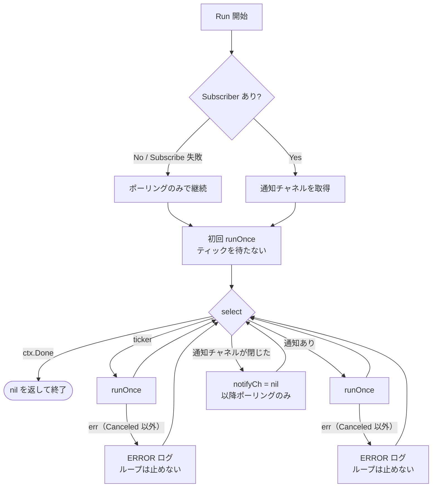
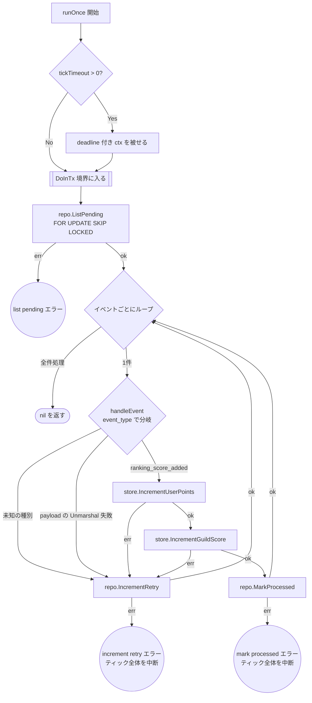

# outbox worker のテスト設計

対象: [internal/driver/worker/outbox/worker.go](../../internal/driver/worker/outbox/worker.go)
テスト: [internal/driver/worker/outbox/worker_test.go](../../internal/driver/worker/outbox/worker_test.go)

運用ルールは [README.md](README.md)。

MySQL の outbox テーブルに積まれたイベントを読み、Redis へ反映するワーカー。
`AddUserPoints`（[ranking.md](ranking.md)）が積んだイベントの消費側にあたる。

## 1. `Run`（ループ）

**設計上の要点**: `runOnce` の失敗は**ログのみでループを継続する**。
一過性の DB/Redis 障害で worker プロセスが落ちてはならない。
ticker 経路と通知経路には**独立したエラーログの分岐がある**ので、両方を通す必要がある。

| # | 条件 | 期待結果 | 対応テスト |
| --- | --- | --- | --- |
| 1 | `Subscribe` が失敗 | ポーリングのみで継続する | `TestWorker_Run_Subscribe_failure` |
| 2 | 通知でティックが起きる | `runOnce` が走る | `TestWorker_Run_notify_triggered` |
| 3 | 通知チャネルが閉じる | 以降ポーリングのみで継続する | `TestWorker_Run_notify_channel_closed` |
| 4 | ticker でティックが起きる | `runOnce` が走る | `TestWorker_Run_ticker_driven` |
| 5 | **ticker 経由の `runOnce` が失敗** | エラーを返さずループ継続 | `TestWorker_Run_ティック処理の失敗はループを止めない/ticker 経由で runOnce が失敗しても継続する` |
| 6 | **通知経由の `runOnce` が失敗** | エラーを返さずループ継続 | `TestWorker_Run_ティック処理の失敗はループを止めない/通知経由で runOnce が失敗しても継続する` |
| 7 | `ctx` がキャンセルされる | `nil` を返して終了 | 各テストの `stopAndWait` |

## 2. `runOnce`（1ティックぶんの処理）

**設計上の要点**:

- `handleEvent` の失敗は `IncrementRetry` して**次のイベントへ進む**（1件で打ち切らない）
- 一方 `IncrementRetry` / `MarkProcessed` 自体の失敗は**ティック全体を中断する**（DB が壊れている）
- `tickTimeout` により、DB/Redis のブロッキングでループがハングしない

### テスト仕様表

| # | 条件 | 図のパス | 期待結果 | 検証すべき呼び出し |
| --- | --- | --- | --- | --- |
| 1 | `ListPending` がエラー | `A→B→C→E1` | ティックを中断 | `IncrementRetry` も `MarkProcessed` も呼ばれない |
| 2 | `ListPending` が空 | `A→B→C→D→Z` | 正常終了 | Redis も `MarkProcessed` も呼ばれない |
| 3 | 未知の `event_type` | `…→D→E→G→Z` | 次のイベントへ進む | `IncrementRetry` が呼ばれる／Redis に到達しない |
| 4 | **payload が不正で Unmarshal 失敗** | `…→D→E→G→Z` | 次のイベントへ進む | 同上 |
| 5 | `IncrementUserPoints` が失敗 | `…→E→F1→G→Z` | 次のイベントへ進む | `IncrementRetry` が呼ばれる／`IncrementGuildScore` に到達しない |
| 6 | `IncrementUserPoints` 成功 + `IncrementGuildScore` 失敗 | `…→F1→F2→G→Z` | 次のイベントへ進む | `IncrementRetry` が呼ばれる／`MarkProcessed` に到達しない |
| 7 | 正常系 | `…→F2→H→Z` | `MarkProcessed` される | Redis に個人・ギルド両方が反映される |

`E2` / `E3`（`IncrementRetry` / `MarkProcessed` 自体の失敗）は、手続きが異なるため
別テスト関数で検証している（`TestWorker_runOnce_IncrementRetry_error` / `TestWorker_runOnce_MarkProcessed_error`）。
`tickTimeout` の適用は `TestWorker_runOnce_appliesTickTimeout`。

## 3. 本設計文書の作成で見つかった問題

| 種別 | 内容 | 対応 |
| --- | --- | --- |
| **パスの欠落** | **payload が不正で `Unmarshal` に失敗する経路**（表のケース 4）が未検証だった。`handleEvent` の `return err` が一度も実行されていない | 追加 |
| **パスの欠落** | ticker 経由・通知経由それぞれの「`runOnce` が失敗したときにログのみで継続する」分岐（`Run` の表のケース 5・6）が未検証だった。既存の ticker / notify のテストは**成功パスしか通していなかった** | 追加 |
| **テーブル駆動の形** | dispatch テーブルの各ケースが `setup func(t, ctrl) *workeroutbox.Worker` を持ち、モックの組み立て手順をテーブル側に書いていた | テーブルをデータのみにし、組み立てはランナーへ集約 |

### 【要対応】ポイズンメッセージ

ケース 4 で明らかになったとおり、**payload が壊れたイベントは `IncrementRetry` され続ける**。
現状 max retry の上限も DLQ（Dead Letter Queue）も無いため、
`FOR UPDATE SKIP LOCKED` で毎回拾われては失敗し、outbox に永久に残り続ける。

これは**テストで検証できる範囲の外にある設計上の課題**なので、
テストを足すのではなく仕様として対応を決める必要がある（優先度: 高）。
