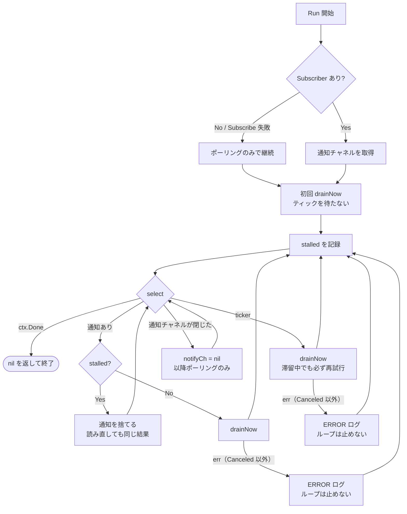
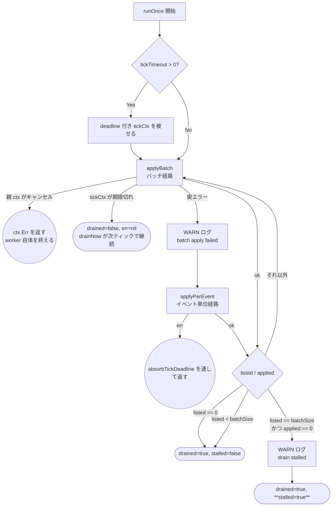
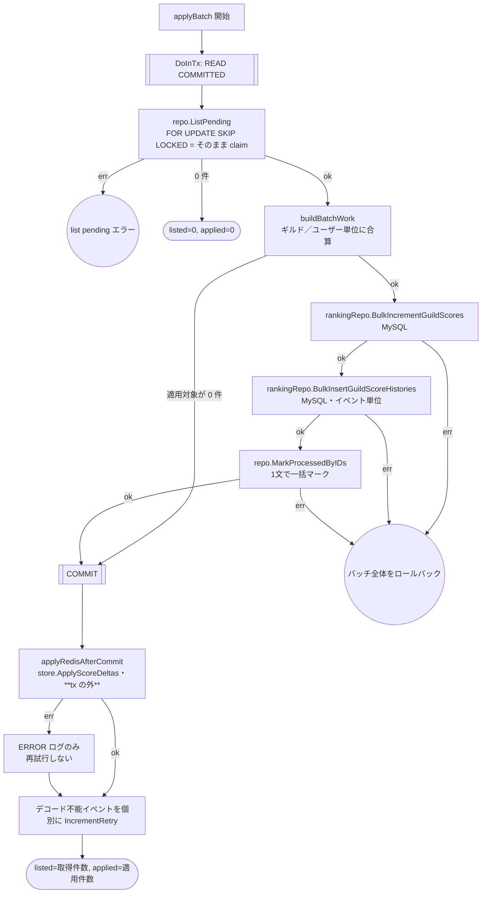
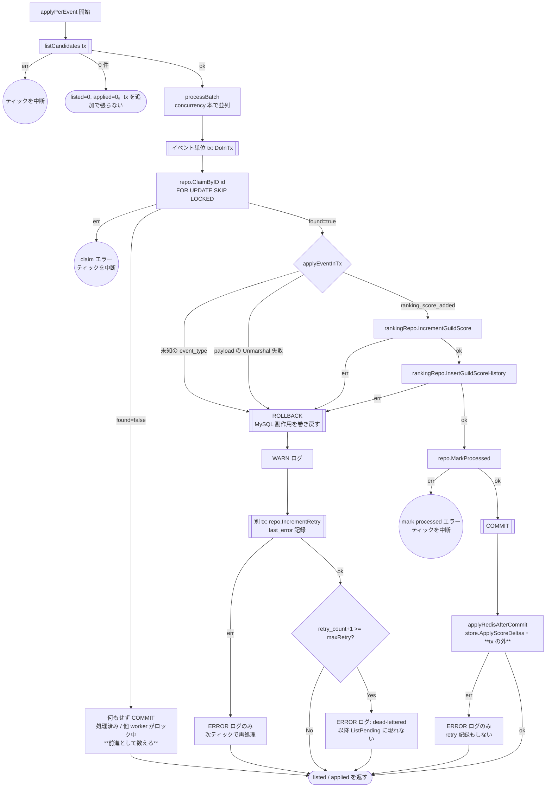

# outbox worker のテスト設計

対象: [internal/driver/worker/outbox/worker.go](../../internal/driver/worker/outbox/worker.go)
テスト: [internal/driver/worker/outbox/worker_test.go](../../internal/driver/worker/outbox/worker_test.go)

運用ルールは [README.md](README.md)。

MySQL の outbox テーブルに積まれたイベントを読み、**MySQL のギルド集計**（`guild_scores` 加算・
`guild_score_histories` 挿入）と **Redis 反映**を実行するワーカー。
`AddUserPoints`（[ranking.md](ranking.md)）が積んだイベントの消費側にあたる。

処理経路は**2つ**ある。通常は**バッチ経路**（`applyBatch`）、その適用が失敗したときだけ
**イベント単位経路**（`applyPerEvent`）へ退避する。イベント単位 tx では1件ごとに COMMIT(fsync)
が発生してスループット上限を決めてしまうため（実測 約27 events/sec、並列化しても約200/sec に対し
生産は約407/sec）、通常時はバッチでまとめて1回の COMMIT にする。

本 worker のトランザクションはすべて **READ COMMITTED** で開始する。既定の REPEATABLE READ では
`ListPending` の `SELECT ... FOR UPDATE` がギャップロックを取り、API 側の outbox INSERT が
`INSERT_INTENTION` 待ちでブロックされる（実測で API の p95 が 108ms → 4.6s に悪化）。
`SKIP LOCKED` はレコードロックを飛ばすだけでギャップロックは回避しない。
一方 `RankingSyncer`（[ranking-sync-batch.md](ranking-sync-batch.md)）はスナップショット
一貫性が必要なため、意図的に既定のままにしてある。

## 0. 全経路にまたがる不変条件

個々の図に何度も現れるため、先に理由をまとめておく。

### 0-1. Redis 反映は COMMIT の**後**（`applyRedisAfterCommit`）

Redis は MySQL のトランザクションの外側にある。tx の**中**で加算すると
「Redis 加算済み → `MarkProcessedByIDs` か COMMIT が失敗 → MySQL だけ巻き戻る」が起こり、
イベントが未マークのまま再取得されて **Redis だけ二重に加算**される。しかも再試行のたびに
積み増されるため、ずれは1回ぶんに留まらず累積する。

そこで MySQL 側（加算・履歴・処理済みマーク）を COMMIT で確定させてから Redis を反映する。
これにより誤差は次の性質を持つ側へ倒る。

| | tx 内で反映（旧） | COMMIT 後に反映（現） |
| --- | --- | --- |
| 失敗時のずれ | 二重加算（過剰） | 欠落（過小） |
| ずれの上限 | リトライのたびに累積 | 高々1バッチぶん・累積しない |

COMMIT 後の Redis 失敗は**再試行しない**。MySQL は確定済みでロールバックできず、再適用すると
今度こそ二重加算になるためで、ERROR ログのみに留める。欠落の復旧は `RankingSyncer`
（[ranking-sync-batch.md](ranking-sync-batch.md)）の焼き直しに委ねる。

副次的な効果として、Redis の往復が MySQL の tx から外れるぶんロック保持時間が短くなる。

### 0-2. ドレインの枯渇判定は「前進件数」で見る

`runOnce` は候補が枯れるまで `ListPending` を繰り返す（ドレイン）。この打ち切り条件を
**取得件数**（`ListPending` が返した件数）だけで見てはならない。

`ListPendingOutboxEvents` は `ORDER BY id ASC` で拾うため、失敗イベントは
**上限（§0-4）に到達するまで**何度でも取得される。取得件数だけで判定すると、
失敗イベントが `batchSize` 件以上先頭に滞留したときに毎回ちょうど `batchSize` 件が返り続け、
**ドレインが永久に終わらない**（`tickTimeout` で打ち切られても `drainNow` がスリープなしで
再入するため、`ListPending` と `IncrementRetry` を連打するビジーループになる）。

max retry 上限（§0-4）を入れた後も本判定は必要。上限は**恒久失敗が窓を占め続けること**を
有限回で終わらせるだけで、上限到達までの再取得と、一時的な失敗（MySQL/Redis 障害）で
`applied == 0` になる状況は残るため。

そこで各経路は `listed`（取得件数）と `applied`（処理済みマークまで到達した件数）を
別々に返し、`runOnce` は次の条件で判定する。

| 条件 | 判定 | 理由 |
| --- | --- | --- |
| `listed == 0` | 枯渇 | 候補なし |
| `listed < batchSize` | 枯渇 | 窓に空きがある = 残りがない |
| `listed == batchSize && applied == 0` | **滞留**（`stalled`）。ドレインを打ち切る | 窓が恒久失敗で埋まっており、読み直しても必ず同じ結果になる |
| それ以外 | ドレイン継続 | 前進している |

`stalled` を `listed == batchSize` に限定するのが要点。`listed < batchSize`（poison が数件だけ）で
滞留扱いすると、新規イベントは窓に入るのに処理されず `pollInterval` 待ちになってしまう。
窓が満杯のときだけ「新規イベントは id 順で窓の外にあり、読み直しても無駄」が保証される。

### 0-3. 滞留中は通知駆動のドレインを抑止する（`Run`）

打ち切っただけでは足りない。`OutboxSubscriber` はバッファ1のチャネルへノンブロッキング送信する
実装で、API の書き込みが続く限り `Run` の `select` にはほぼ常に通知が入っている。滞留状態で
通知を受けるたびに再入すると、結局スリープなしで同じ窓を読み直し続けることになる。

そのため `Run` は直近のドレインが滞留で終わったかを保持し、**滞留中は通知を捨てて ticker まで待つ**。
滞留中は新規イベントも窓の外にあって処理できないため、通知を捨てても失うものはない。
ticker では必ず再試行するので、poison が上限に到達して窓から外れれば `pollInterval` 以内に復帰する。

> **時間ベースのバックオフを採らない理由**: `.golangci.yml` の forbidigo が `time.Now` を禁止しており、Clock インターフェースは未実装。
> <!-- ssot-assert: absent-grep 'time\.Now\(\)' internal cmd configs --include=*.go --exclude=*_test.go -->
> バックオフのために Clock を新設すると usecase の interface 追加と infrastructure 実装が
> 必要になり、変更の範囲が本質から外れる。既存の ticker を再開トリガに使えば
> 新しい依存を作らずに済む。

本節が止めるのは「滞留しているあいだ DB を叩き続けること」だけで、head-of-line blocking
そのものを解くのは次節の max retry 上限。両者は役割が違うので、上限を入れた後も本節の抑止は残す。

### 0-4. 恒久失敗は `retry_count` 上限で窓から外す（max retry / DLQ）

`ListPendingOutboxEvents` と `ClaimPendingOutboxEventByID` は `retry_count < maxRetry` を
条件に含める。上限に達したイベントは以降 worker から見えなくなり、DLQ に置いたのと同じ扱いになる。

これが無いと、payload が壊れたイベント（poison）は `IncrementRetry` されるだけで
`processed_at IS NULL` のまま何度でも拾われ、次の2つが起きる。

| 症状 | 内容 |
| --- | --- |
| head-of-line blocking | poison が `batchSize` 件以上先頭を占めると、後続の正常なイベントが**永久に**処理されない |
| retry 記録の再実行 | ドレインのたびに poison 件数ぶんの `IncrementRetry` tx が発行される |

**上限は `ClaimByID` にも掛ける。** 候補取得と claim のあいだに別 worker が上限へ到達させた場合、
`found=false` になって `processOne` が前進として数える（滞留を作らない）。

**打ち切りの観測は「閾値に到達した瞬間の ERROR ログ」1点に絞る**（`outbox event dead-lettered`）。
`recordRetry` が `IncrementRetry` の tx に**成功した後**、`retry_count+1 >= maxRetry` なら出す。
成功後に判定するのは、記録できなかったイベントは `retry_count` が据え置きのまま次ティックで
再処理され、まだ打ち切られていないため。以降そのイベントは `ListPending` に現れないので
同じログが繰り返し出ることもない。

滞留件数を数える COUNT クエリは**置かない**。`processed_at IS NULL` の行を index 走査するため、
バックログが大きいときのコストが読めない（実測で 8,959 件の滞留が発生した経緯がある）。

**トレードオフ**: `retry_count` は失敗の種類を区別しないため、MySQL/Redis の障害が続くと
健全なイベントも回数を消費して打ち切られうる。時間ベースのバックオフで緩和できない事情は
§0-3 と同じ（Clock を新設せずに済ませたい）なので、既定値（`OUTBOX_MAX_RETRY`）を
大きめに取ったうえで、復旧は
`UPDATE outbox_events SET retry_count = 0 WHERE id IN (...)` の運用手順に委ねる。

## 1. `Run`（ループ）

**設計上の要点**:

- `drainNow` の失敗は**ログのみでループを継続する**。一過性の DB/Redis 障害で
  worker プロセスが落ちてはならない。ticker 経路・通知経路の双方が同じ扱いになることを
  両方のテストで通す（実装は共通ヘルパー `drainAndLog` に集約してあるが、
  呼び分けの分岐は経路ごとに独立しているため両方通す必要がある）
- 各トリガは `runOnce` を1回ではなく **`drainNow`（枯れるまで自走）** で呼ぶ。`runOnce` は
  `tickTimeout` で打ち切られるため1回で枯れるとは限らず、打ち切り時点で次のトリガを待つと
  通知が途切れたタイミングでバックログの消化が `pollInterval`（既定10分）停止する
  （実測で 8,959 件が 440 秒間まったく処理されない状態が発生した）
- **滞留中（`stalled`）は通知を捨て、ticker でのみ再試行する**（§0-3）。
  エラーで終わった場合は `stalled` を立てない（次の通知で普通に再試行してよい）

| # | 条件 | 図のパス | 期待結果 | 対応テスト |
| --- | --- | --- | --- | --- |
| 1 | `Subscribe` が失敗 | `B→C` | ポーリングのみで継続する | `TestWorker_Run_Subscribe_failure` |
| 2 | 通知チャネルが閉じる | `L→X` | 以降ポーリングのみで継続する | `TestWorker_Run_notify_channel_closed` |
| 3 | 通知でティックが起きる | `L→NQ→N` | `drainNow` が走る | `TestWorker_Run_notify_triggered` |
| 4 | ticker でティックが起きる | `L→T` | `drainNow` が走る | `TestWorker_Run_ticker_driven` |
| 5 | ticker 経由の `drainNow` が失敗 | `T→TE` | エラーを返さずループ継続 | `TestWorker_Run_ティック処理の失敗はループを止めない/ticker 経由で runOnce が失敗しても継続する` |
| 6 | 通知経由の `drainNow` が失敗 | `N→NE` | エラーを返さずループ継続 | `TestWorker_Run_ティック処理の失敗はループを止めない/通知経由で runOnce が失敗しても継続する` |
| 7 | **滞留後に通知が来る** | `L→NQ→ND` | 通知を捨てる。`ListPending` を再発行しない | `TestWorker_Run_滞留中は通知を捨てticker で再開する` |
| 8 | ティック期限切れ後も枯れるまで自走する | `T→S→L` | `pollInterval` を待たずに次のティックへ入る | `TestWorker_drainNow_ティック期限切れ後も自走する` |
| 9 | `ctx` がキャンセルされる | `L→Z` | `nil` を返して終了 | 各テストの `stopAndWait` |

## 2. `runOnce`（1ティックぶんの処理）

`runOnce` はバッチ経路を回し、失敗したときだけイベント単位経路へ退避する。
どちらの経路も `(listed, applied)` を返し、判定は §0-2 の表に従う。

**設計上の要点**（テストで守る不変条件）:

- `applyBatch` の実エラーを**握りつぶさず、かつフォールバックの手前で return しない**。
  以前の実装は `absorbTickDeadline` の戻り値を先に返しており、実エラーでも
  `applyPerEvent` に到達しなかった（バッチ内に恒久失敗イベントがあるとそのバッチが
  永久に前進しない head-of-line blocking が発生していた）
- ティック期限切れは**エラーではなく打ち切り**。`drained=false` で復帰し `drainNow` が続ける。
  per-event / per-batch tx のため打ち切りによる取りこぼしは生じない
- **判定に使うのは `applied`（前進件数）であって `listed`（取得件数）ではない**（§0-2）。
  `listed` だけで判定する実装に戻すと、全件デコード不能なバッチでドレインが終わらなくなる

| # | 条件 | 図のパス | 期待結果 | テスト |
| --- | --- | --- | --- | --- |
| 1 | `ListPending` がエラー | `B→E1` 相当 | ティックを中断（MySQL/Redis に到達しない） | `TestWorker_runOnce_ListPendingエラー` |
| 2 | `tickTimeout` の適用 | `A2→A3` | deadline 付き ctx が渡る | `TestWorker_runOnce_appliesTickTimeout` |
| 3 | **窓が全件デコード不能で埋まる** | `C→SW→ZS` | 1巡で打ち切る（`ListPending` は1回だけ） | `TestWorker_runOnce_全件前進しなければドレインを打ち切る` |
| 4 | 候補が `batchSize` ちょうど続く | `C→B` のループ | 枯れるまで繰り返す | `TestWorker_runOnce_候補が枯れるまでドレインする` |
| 5 | バッチ適用が失敗 | `B→W→P` | フォールバックで同じイベントが前進する | `TestWorker_runOnce_バッチ失敗時はフォールバックへ切り替わり処理が前進する` |

### 2-1. バッチ経路（`applyBatch`・通常時）

**設計上の要点**（テストで守る不変条件）:

- **スコアは合算するが履歴は合算しない**。加算は可換なのでギルド／ユーザー単位にまとめて
  DB 往復を減らせるが、履歴は「誰がいつ何点入れたか」を残す必要がある
- **MySQL は tx 内・Redis は COMMIT 後**（§0-1）。tx 内のどのステップで失敗しても
  `ApplyScoreDeltas` に到達しないことが二重加算を防ぐ要。**逆に Redis の失敗では
  ロールバックもフォールバックもしない**（MySQL は確定済みで、再適用は二重加算になる）
- **デコード不能イベントはバッチに混ぜない**。未知の `event_type` / 壊れた payload は
  決定的な失敗なので、適用対象から外して**コミット後に**個別で retry 記録する。
  バッチ tx に混ぜると巻き添えでロールバックされる
- `ListPending` の `FOR UPDATE SKIP LOCKED` がそのまま claim として働くため、
  この経路では `ClaimByID` を発行しない

| # | 条件 | 図のパス | 期待結果 | テスト |
| --- | --- | --- | --- | --- |
| 1 | `ListPending` が空 | `B2→BZ` | 即座に終了。tx は1回だけ | `TestWorker_applyBatch_pending無しは即座に終了する` |
| 2 | 全件デコード不能 | `B3→BC→RT` | MySQL も Redis も呼ばれない。`applied=0` | `TestWorker_applyBatch_全件デコード不能ならMySQLもRedisも呼ばれない` |
| 3 | 除外イベントの `IncrementRetry` が失敗 | `RT` | ログのみ。エラーを伝播しない | `TestWorker_applyBatch_IncrementRetry失敗はログのみ` |
| 4 | **COMMIT 後の Redis 反映が失敗** | `R→RE→RT` | ERROR ログのみ。エラーを返さずフォールバックもしない | `TestWorker_applyBatch_COMMIT後のRedis失敗はログのみでフォールバックしない` |
| 5 | `M1` / `M2` / `MK` の各失敗 | `→BE2` | 全副作用が巻き戻り、**Redis に到達せず**フォールバック経路へ切り替わる | `TestWorker_applyBatch_各ステップの失敗でRedisに到達せずフォールバックする`（3 サブテスト） |
| 6 | デコード不能イベントが混在 | `B3→…→BC→R→RT` | 正常なイベントだけ適用され、壊れたものは個別 retry | `TestWorker_applyBatch_デコード不能イベントは除外され個別にIncrementRetryされる` |
| 7 | 正常系の適用順序 | `M1→M2→MK→BC→R` | MySQL 2本 → マーク → COMMIT → Redis の順（`gomock.InOrder`） | `TestWorker_applyBatch_適用順序_MySQL2本_MarkProcessedByIDs_COMMIT後にRedis` |
| 8 | 同一ギルド／ユーザーの複数イベント | 同上 | スコアは合算、履歴はイベント件数ぶん、`MarkProcessedByIDs` に全 ID | `TestWorker_applyBatch_同一ギルドは合算され履歴はイベント単位で作られる` |

### 2-2. イベント単位経路（`applyPerEvent`・バッチ失敗時のフォールバック）

`listCandidates` で候補を取り、`concurrency` 本の goroutine で1件ずつ独立した tx に流す。

**設計上の要点**（テストで守る不変条件）:

- **この経路の存在意義は head-of-line blocking の回避**。バッチは1件でも失敗すると全体が
  ロールバックされるため、恒久失敗イベントが混ざるとそのバッチが永久に前進しない。
  1件ずつ独立した tx にすれば失敗イベントを隔離して残りを前進させられる
- **MySQL は tx 内・Redis は COMMIT 後**（§0-1）。バッチ経路と同じ理由で、Redis 反映は
  `MarkProcessed` の COMMIT が確定してから1回だけ行い、失敗しても retry 記録に回さない
- `applyEventInTx` の失敗は**別 tx** で `IncrementRetry` する。同一 tx だと ROLLBACK で
  retry 記録も巻き戻る
- `IncrementRetry` 自体の失敗は**ログのみ**（次ティックで再処理される）。一方
  `ClaimByID` / `MarkProcessed` の失敗は**ティックを中断する**（DB が壊れている）
- **`applied` に数えるのは「`MarkProcessed` が成功した」か「`found=false`」のときだけ**。
  `applyEventInTx` が失敗したイベントは前進していないので数えない（§0-2 の判定に使う）
- **dead-letter のログは `IncrementRetry` が成功した後にだけ出す**（§0-4）。記録に失敗した
  イベントは `retry_count` が据え置きのまま次ティックで再処理されるので、まだ打ち切られていない

#### テスト仕様表

`TestWorker_applyPerEvent_フォールバック経路_正常系_異常系` のテーブルと 1 対 1 で対応する。
`listed` / `applied` は `ApplyPerEventForTest` の戻り値。

| # | 条件 | 図のパス | 期待結果 | 検証すべき呼び出し |
| --- | --- | --- | --- | --- |
| 1 | 候補なし | `LC→PZ0` | `listed=0, applied=0` | イベント単位 tx を張らない |
| 2 | `ClaimByID` が `found=false` | `P2→PS→PZ` | `listed=1, applied=1`（前進扱い） | `applyEventInTx` / `MarkProcessed` / `IncrementRetry` のいずれも呼ばれない |
| 3 | 未知の `event_type` | `H→RB→RT` | `listed=1, applied=0` | `last_error` に `ErrUnknownEventType` の文言が残る |
| 4 | payload が不正で Unmarshal 失敗 | `H→RB→RT` | 同上 | MySQL / Redis の副作用が一切呼ばれない |
| 5 | `IncrementRetry` が失敗 | `RT→RTE` | **エラーを伝播させない**（ログのみ） | — |
| 6 | MySQL `IncrementGuildScore` が失敗 | `M1→RB→RT` | `listed=1, applied=0` | `InsertGuildScoreHistory` 以降に到達しない |
| 7 | MySQL `InsertGuildScoreHistory` が失敗 | `M2→RB→RT` | 同上 | `MarkProcessed` / Redis に到達しない |
| 8 | **COMMIT 後の Redis 反映が失敗** | `R→RE→PZ` | `listed=1, applied=1`。ログのみ | `IncrementRetry` が呼ばれない（再適用しない） |
| 9 | 正常系 | `…→M1→M2→MK→CM→R` | `listed=1, applied=1` | MySQL 2件 → `MarkProcessed` → Redis の**順序**（`gomock.InOrder`） |
| 10 | 先頭イベントが恒久失敗 | 1件目 `→RB→RT`、2件目 `→MK→CM→R` | `listed=2, applied=1` | 先頭で `IncrementRetry`／後続で `MarkProcessed` |

手続きが異なるため別テスト関数に切り出しているもの:

| 条件 | 図のパス | 期待結果 | テスト関数 |
| --- | --- | --- | --- |
| `listCandidates` の `ListPending` がエラー | `LC→PE0` | ティックを中断 | `TestWorker_applyPerEvent_フォールバック経路_ListPendingエラー` |
| `ClaimByID` がエラー | `P2→PE1` | ティックを中断。`IncrementRetry` は呼ばれない | `TestWorker_applyPerEvent_フォールバック経路_ClaimByIDエラー` |
| `MarkProcessed` がエラー | `MK→PE2` | ティックを中断 | `TestWorker_applyPerEvent_フォールバック経路_MarkProcessedエラー` |
| `concurrency` 本での並列処理 | `PB` | 候補が並列に処理される | `TestWorker_applyPerEvent_フォールバック経路_並列処理` |
| 全件が claim 不可 | `P2→PS` | 何も適用されない | `TestWorker_applyPerEvent_フォールバック経路_claim不可はスキップ` |
| retry 加算後に上限へ到達 | `RT→DL→DLE` | dead-letter の ERROR ログが **1 回**出る | `TestWorker_recordRetry_上限到達でdeadLetterログを出す` |
| retry 加算後も上限未満 | `RT→DL→PZ` | dead-letter ログを**出さない** | 同上（サブテスト） |
| `IncrementRetry` が失敗（回数は上限相当） | `RT→RTE` | dead-letter ログを**出さない**（記録できていない） | 同上（サブテスト） |

**`maxRetry` が渡ることの検証**: `ListPending` / `ClaimByID` の各 `EXPECT` が `maxRetry` を
引数に含めるため、渡し忘れは既存ケースが軒並み落ちる。新しいパスを増やさないので
専用ケースは作らない（[README.md](README.md) の「同一パスを通るケースは統合する」）。

**`DoInTx` の呼び出し回数について**: テストは wall-clock sleep ではなく `DoInTx` の
呼び出しシグナルを数えて同期点にしている（`invokeDoInTxAndSignal` + `waitForCalls`）。
バッチ経路は1ティック1回、フォールバックに落ちると
「バッチ適用 1 + `listCandidates` 1 + 候補数 + retry 記録の回数」になり、
期待回数が仕様表の「どこまで進むか」と対応する。
`applyRedisAfterCommit` は tx の外なので `DoInTx` の回数を増やさない。

## 3. 本設計文書の作成で見つかった問題

| 種別 | 内容 | 対応 |
| --- | --- | --- |
| **パスの欠落** | **payload が不正で `Unmarshal` に失敗する経路**（§2-2 の表のケース 4）が未検証だった。`applyEventInTx`（当時は `handleEvent`）の `return err` が一度も実行されていない | 追加 |
| **パスの欠落** | ticker 経由・通知経由それぞれの「`runOnce` が失敗したときにログのみで継続する」分岐（§1 の表のケース 5・6）が未検証だった。既存の ticker / notify のテストは**成功パスしか通していなかった** | 追加 |
| **不変条件の誤り** | Redis 反映を tx 内に置いていたため、`MarkProcessedByIDs` / COMMIT の失敗で **Redis だけ二重加算**される窓があった（§0-1）。旧実装（イベント単位）にも同じ窓があったが、バッチ化で一度に最大 `batchSize` 件へ影響が拡大していた | COMMIT 後へ移動 |
| **回帰** | ドレインの枯渇判定を**取得件数**で行っていたため、全件デコード不能なバッチでループが終わらなかった（§0-2）。1ティック1回だった旧実装には無く、ドレイン導入で生じた回帰 | 前進件数での判定 + 滞留時の通知抑止 |
| **テーブル駆動の形** | dispatch テーブルの各ケースが `setup func(t, ctrl) *workeroutbox.Worker` を持ち、モックの組み立て手順をテーブル側に書いていた | 一度データのみのテーブルへ寄せたが、ギルド集計の非同期化とバッチ経路の追加で1ケースあたりの組み立てが分岐込みで長くなり、`setup` 形式へ戻している。**データのみのテーブルに戻すのは別タスク**（[README.md](README.md) の縮約の罠に該当するため、縮約でカバレッジが落ちないことを確認してから行う） |

## 4. 未対応（本実装の範囲外）

### 処理済みレコードの削除 — GC バッチへ分離

worker は `processed_at` を立てるだけで行を消さない。保持期間を過ぎた処理済み行の削除は
GC バッチ（`cmd/batch -gc-outbox`）の責務で、設計は [outbox-gc.md](outbox-gc.md) にある。
worker 側の設計には影響しないため、本ファイルではこれ以上扱わない。

### dead-letter された行の掃除

`retry_count` が上限に達した行は `processed_at IS NULL` のままなので、GC バッチの対象外
（GC は未処理行を消さない。[outbox-gc.md](outbox-gc.md)）。テーブルには残り続ける。

自動削除しないのは意図的で、消すとイベントが黙って失われるため。件数が問題になる規模で
運用する場合は、内容を確認したうえで手動で削除するか、別テーブルへ退避する運用を用意する。

### Redis 欠落の自動復旧

§0-1 のとおり COMMIT 後の Redis 失敗はイベントを再処理せず ERROR ログのみに留めるため、
その差分は `RankingSyncer` を実行するまで残る。`RankingSyncer` は現状バッチの手動起動であり、
Redis 揮発・欠落の**検知と自動再構築は未実装**（`SyncAll` の呼び出し元は `cmd/batch` の手動実行のみ）。
<!-- ssot-assert: manual '「欠落を検知して自動で再構築する仕組みが無い」ことは、特定の呼び出しの有無では判定できない（cmd/batch からの手動実行は存在する）。スケジューラ導入時に人手で更新する' -->
