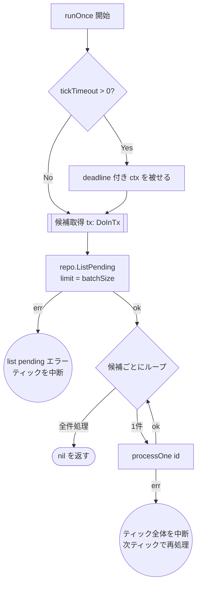
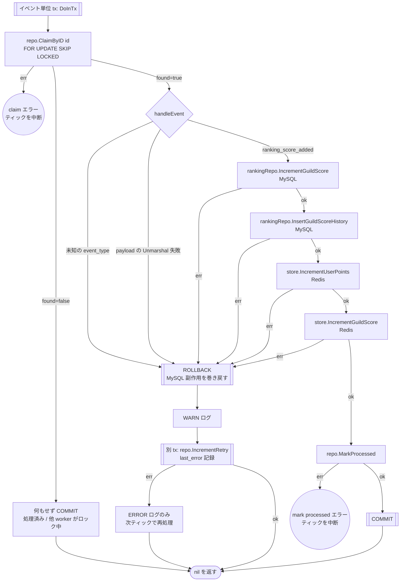

# outbox worker のテスト設計

対象: [internal/driver/worker/outbox/worker.go](../../internal/driver/worker/outbox/worker.go)
テスト: [internal/driver/worker/outbox/worker_test.go](../../internal/driver/worker/outbox/worker_test.go)

運用ルールは [README.md](README.md)。

MySQL の outbox テーブルに積まれたイベントを読み、**MySQL のギルド集計**（`guild_scores` 加算・
`guild_score_histories` 挿入）と **Redis 反映**を実行するワーカー。
`AddUserPoints`（[ranking.md](ranking.md)）が積んだイベントの消費側にあたる。

ギルド集計を同期リクエストから本ワーカーへ移設したため、1ティックの処理は
「候補取得 tx」＋「候補ごとのイベント単位 tx」という**2段構え**になっている。

## 1. `Run`（ループ）

**設計上の要点**: `runOnce` の失敗は**ログのみでループを継続する**。
一過性の DB/Redis 障害で worker プロセスが落ちてはならない。
ticker 経路と通知経路には**独立したエラーログの分岐がある**ので、両方を通す必要がある。

| # | 条件 | 期待結果 | 対応テスト |
| --- | --- | --- | --- |
| 1 | `Subscribe` が失敗 | ポーリングのみで継続する | `TestWorker_Run_Subscribe_failure` |
| 2 | 通知でティックが起きる | `runOnce` が走る | `TestWorker_Run_notify_triggered` |
| 3 | 通知チャネルが閉じる | 以降ポーリングのみで継続する | `TestWorker_Run_notify_channel_closed` |
| 4 | ticker でティックが起きる | `runOnce` が走る | `TestWorker_Run_ticker_driven` |
| 5 | **ticker 経由の `runOnce` が失敗** | エラーを返さずループ継続 | `TestWorker_Run_ティック処理の失敗はループを止めない/ticker 経由で runOnce が失敗しても継続する` |
| 6 | **通知経由の `runOnce` が失敗** | エラーを返さずループ継続 | `TestWorker_Run_ティック処理の失敗はループを止めない/通知経由で runOnce が失敗しても継続する` |
| 7 | `ctx` がキャンセルされる | `nil` を返して終了 | 各テストの `stopAndWait` |

## 2. `runOnce` / `processOne`（1ティックぶんの処理）

1ティックはまず**候補取得 tx** で `ListPending` を行い、得た候補を**1件ずつ独立した
イベント単位 tx**（`processOne`）で処理する。

**設計上の要点**（テストで守る不変条件）:

- **イベント単位 tx**。`handleEvent` が MySQL を加算した後に Redis 反映が失敗しても、
  その加算は ROLLBACK され未マークのまま残る。バッチ単位 tx だと Redis 失敗イベントの
  MySQL 加算が同バッチの他イベントと共にコミットされ、再試行で二重加算になりうる
- **MySQL 先・Redis 後**。source of truth を先に確定し、非トランザクショナルな
  キャッシュ反映を最後に置く
- **候補を id 指定で claim する**。先頭イベントが恒久失敗しても後続の候補は処理される
  （head-of-line blocking 回避）。最小 id 固定 claim だと poison イベントが後続を止める
- `handleEvent` の失敗は**別 tx** で `IncrementRetry` する。同一 tx だと ROLLBACK で
  retry 記録も巻き戻る
- `IncrementRetry` 自体の失敗は**ログのみ**（次ティックで再処理される）。一方
  `ClaimByID` / `MarkProcessed` の失敗は**ティック全体を中断する**（DB が壊れている）
- `tickTimeout` により、DB/Redis のブロッキングでループがハングしない

### テスト仕様表

`TestWorker_processOne_正常系_異常系` のテーブルと 1 対 1 で対応する。

| # | 条件 | 図のパス | 期待結果 | 検証すべき呼び出し |
| --- | --- | --- | --- | --- |
| 1 | 正常系 | `…→M1→M2→R1→R2→MK→CM` | `MarkProcessed` される | MySQL 2件 → Redis 2件 の**順序**（`gomock.InOrder`） |
| 2 | 先頭イベントが恒久失敗 | 1件目 `→RB→RT`、2件目 `→MK→CM` | 後続の候補が処理される | 先頭で `IncrementRetry`／後続で `MarkProcessed` |
| 3 | `ClaimByID` が `found=false` | `P2→PS→PZ` | 何もせず skip | `handleEvent` / `MarkProcessed` / `IncrementRetry` のいずれも呼ばれない |
| 4 | MySQL `IncrementGuildScore` が失敗 | `M1→RB→RT` | retry 記録 | `InsertGuildScoreHistory` 以降に到達しない |
| 5 | MySQL `InsertGuildScoreHistory` が失敗 | `M2→RB→RT` | retry 記録 | Redis に到達しない |
| 6 | Redis `IncrementUserPoints` が失敗 | `R1→RB→RT` | retry 記録（MySQL 加算は ROLLBACK） | `store.IncrementGuildScore` に到達しない |
| 7 | Redis `IncrementGuildScore` が失敗 | `R2→RB→RT` | 同上 | `MarkProcessed` に到達しない |
| 8 | **payload が不正で Unmarshal 失敗** | `H→RB→RT` | retry 記録 | MySQL / Redis の副作用が一切呼ばれない |
| 9 | 未知の `event_type` | `H→RB→RT` | retry 記録（`ErrUnknownEventType`） | 同上 |
| 10 | `ListPending` が空 | `C→D→Z` | 即座に終了 | `ClaimByID` が呼ばれない（`DoInTx` は1回だけ） |

手続きが他と異なるため別テスト関数に切り出しているもの:

| 条件 | 図のパス | 期待結果 | テスト関数 |
| --- | --- | --- | --- |
| `ListPending` がエラー | `C→E1` | ティックを中断 | `TestWorker_runOnce_ListPendingエラー` |
| `ClaimByID` がエラー | `P2→PE1` | ティックを中断。`IncrementRetry` は呼ばれない | `TestWorker_runOnce_ClaimByIDエラー` |
| `MarkProcessed` がエラー | `MK→PE2` | ティックを中断。後続候補の `ClaimByID` は呼ばれない | `TestWorker_runOnce_MarkProcessedエラー` |
| `IncrementRetry` がエラー | `RT→RTE` | **エラーを伝播させない**（ログのみ） | `TestWorker_runOnce_IncrementRetry失敗はログのみ` |
| `ListPending` の limit = `batchSize` | `C` | 候補件数ぶんだけ `processOne` が走る | `TestWorker_runOnce_batchSizeで打ち切り` |
| `tickTimeout` の適用 | `A2→A3` | deadline 付き ctx が渡る | `TestWorker_runOnce_appliesTickTimeout` |

**`DoInTx` の呼び出し回数について**: 1ティックの tx 回数は
「候補取得 1 + 候補数 + retry 記録の回数」で決まる。テストは wall-clock sleep ではなく
`DoInTx` の呼び出しシグナルを数えて同期点にしており（`invokeDoInTxAndSignal` +
`waitForCalls`）、期待回数が仕様表の「どこまで進むか」と対応している。

## 3. 本設計文書の作成で見つかった問題

| 種別 | 内容 | 対応 |
| --- | --- | --- |
| **パスの欠落** | **payload が不正で `Unmarshal` に失敗する経路**（§2 の表のケース 8）が未検証だった。`handleEvent` の `return err` が一度も実行されていない | 追加 |
| **パスの欠落** | ticker 経由・通知経由それぞれの「`runOnce` が失敗したときにログのみで継続する」分岐（`Run` の表のケース 5・6）が未検証だった。既存の ticker / notify のテストは**成功パスしか通していなかった** | 追加 |
| **テーブル駆動の形** | dispatch テーブルの各ケースが `setup func(t, ctrl) *workeroutbox.Worker` を持ち、モックの組み立て手順をテーブル側に書いていた | 一度データのみのテーブルへ寄せたが、ギルド集計の非同期化で1ケースあたりの組み立てが「候補取得 tx → claim → MySQL 2件 → Redis 2件 → mark / retry」と分岐込みで長くなり、`setup` 形式へ戻している。**データのみのテーブルに戻すのは別タスク**（[README.md](README.md) の縮約の罠に該当するため、縮約でカバレッジが落ちないことを確認してから行う） |

### 【要対応】ポイズンメッセージ

§2 の表のケース 8 で明らかになったとおり、**payload が壊れたイベントは `IncrementRetry` され続ける**。
現状 max retry の上限も DLQ（Dead Letter Queue）も無いため、
`FOR UPDATE SKIP LOCKED` で毎回拾われては失敗し、outbox に永久に残り続ける。
イベント単位 tx と id 指定 claim により**後続イベントは巻き添えにならなくなった**（表のケース 2）が、
壊れたイベント自身が消えるわけではない。

これは**テストで検証できる範囲の外にある設計上の課題**なので、
テストを足すのではなく仕様として対応を決める必要がある（優先度: 高）。
