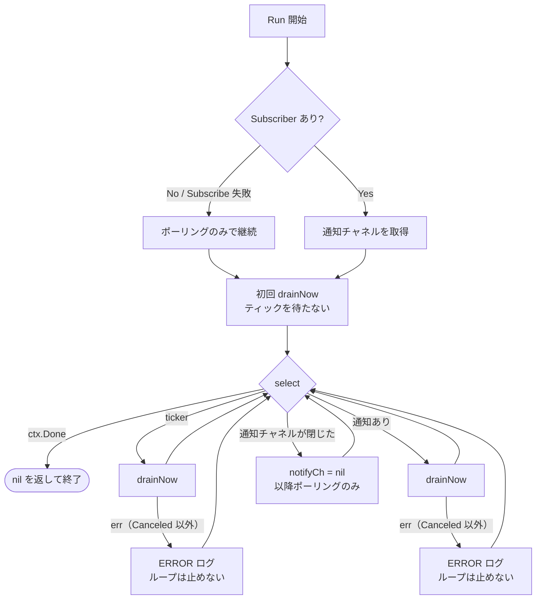
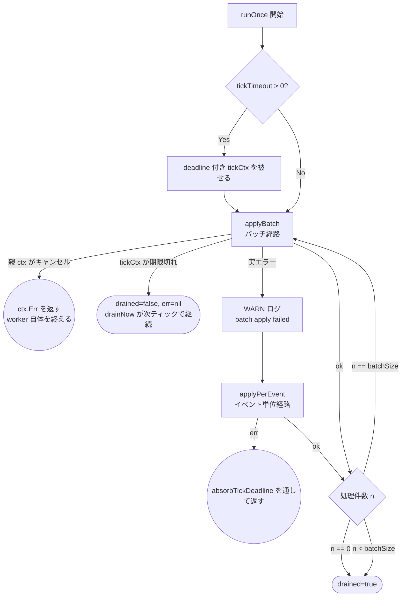
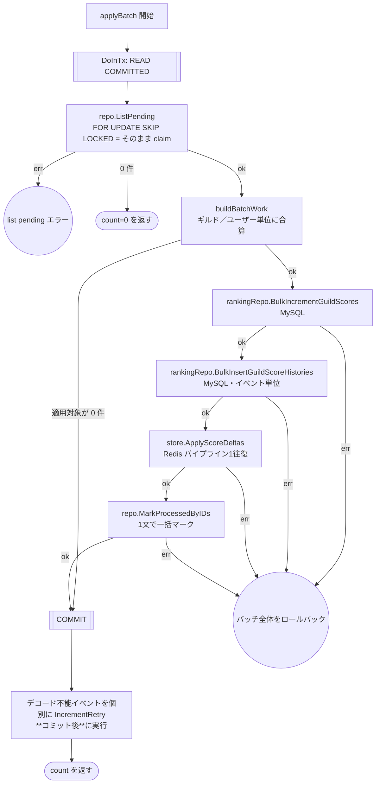
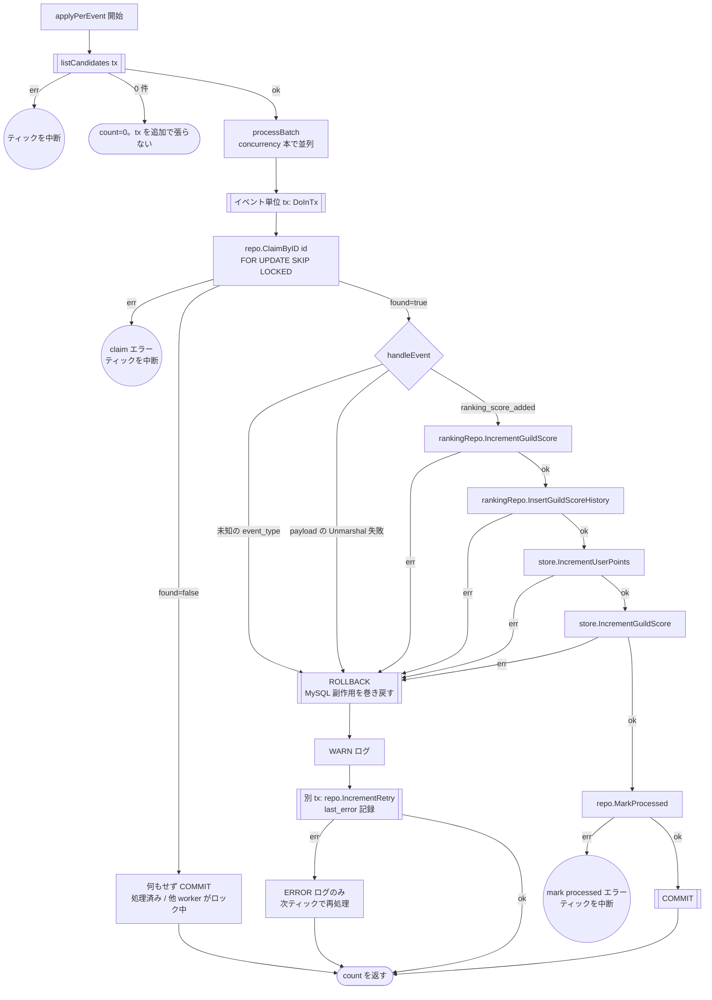

# outbox worker のテスト設計

対象: [internal/driver/worker/outbox/worker.go](../../internal/driver/worker/outbox/worker.go)
テスト: [internal/driver/worker/outbox/worker_test.go](../../internal/driver/worker/outbox/worker_test.go)

運用ルールは [README.md](README.md)。

MySQL の outbox テーブルに積まれたイベントを読み、**MySQL のギルド集計**（`guild_scores` 加算・
`guild_score_histories` 挿入）と **Redis 反映**を実行するワーカー。
`AddUserPoints`（[ranking.md](ranking.md)）が積んだイベントの消費側にあたる。

処理経路は**2つ**ある。通常は**バッチ経路**（`applyBatch`）、その適用が失敗したときだけ
**イベント単位経路**（`applyPerEvent`）へ退避する。イベント単位 tx では1件ごとに COMMIT(fsync)
が発生してスループット上限を決めてしまうため（実測 約27 events/sec、並列化しても約200/sec に対し
生産は約407/sec）、通常時はバッチでまとめて1回の COMMIT にする。

本 worker のトランザクションはすべて **READ COMMITTED** で開始する。既定の REPEATABLE READ では
`ListPending` の `SELECT ... FOR UPDATE` がギャップロックを取り、API 側の outbox INSERT が
`INSERT_INTENTION` 待ちでブロックされる（実測で API の p95 が 108ms → 4.6s に悪化）。
`SKIP LOCKED` はレコードロックを飛ばすだけでギャップロックは回避しない。
一方 `RankingSyncer`（[ranking-sync-batch.md](ranking-sync-batch.md)）はスナップショット
一貫性が必要なため、意図的に既定のままにしてある。

## 1. `Run`（ループ）

**設計上の要点**:

- `drainNow` の失敗は**ログのみでループを継続する**。一過性の DB/Redis 障害で
  worker プロセスが落ちてはならない。ticker 経路と通知経路には**独立したエラーログの分岐がある**
  ので、両方を通す必要がある
- 各トリガは `runOnce` を1回ではなく **`drainNow`（枯れるまで自走）** で呼ぶ。`runOnce` は
  `tickTimeout` で打ち切られるため1回で枯れるとは限らず、打ち切り時点で次のトリガを待つと
  通知が途切れたタイミングでバックログの消化が `pollInterval`（既定10分）停止する
  （実測で 8,959 件が 440 秒間まったく処理されない状態が発生した）

| # | 条件 | 期待結果 | 対応テスト |
| --- | --- | --- | --- |
| 1 | `Subscribe` が失敗 | ポーリングのみで継続する | `TestWorker_Run_Subscribe_failure` |
| 2 | 通知でティックが起きる | `runOnce` が走る | `TestWorker_Run_notify_triggered` |
| 3 | 通知チャネルが閉じる | 以降ポーリングのみで継続する | `TestWorker_Run_notify_channel_closed` |
| 4 | ticker でティックが起きる | `runOnce` が走る | `TestWorker_Run_ticker_driven` |
| 5 | **ticker 経由の `runOnce` が失敗** | エラーを返さずループ継続 | `TestWorker_Run_ティック処理の失敗はループを止めない/ticker 経由で runOnce が失敗しても継続する` |
| 6 | **通知経由の `runOnce` が失敗** | エラーを返さずループ継続 | `TestWorker_Run_ティック処理の失敗はループを止めない/通知経由で runOnce が失敗しても継続する` |
| 7 | `ctx` がキャンセルされる | `nil` を返して終了 | 各テストの `stopAndWait` |
| 8 | **ティック期限切れ後も枯れるまで自走する** | `pollInterval` を待たずに次のティックへ入る | `TestWorker_drainNow_ティック期限切れ後も自走する` |

## 2. `runOnce`（1ティックぶんの処理）

`runOnce` はバッチ経路を回し、失敗したときだけイベント単位経路へ退避する。
どちらも `batchSize` 件ずつ処理し、取得件数が `batchSize` 未満になれば「枯れた」と判定する。

**設計上の要点**（テストで守る不変条件）:

- `applyBatch` の実エラーを**握りつぶさず、かつフォールバックの手前で return しない**。
  以前の実装は `absorbTickDeadline` の戻り値を先に返しており、実エラーでも
  `applyPerEvent` に到達しなかった（バッチ内に恒久失敗イベントがあるとそのバッチが
  永久に前進しない head-of-line blocking が発生していた）
- ティック期限切れは**エラーではなく打ち切り**。`drained=false` で復帰し `drainNow` が続ける。
  per-event / per-batch tx のため打ち切りによる取りこぼしは生じない
- `n == batchSize` の間はドレインを続ける。`batchSize` 未満で初めて枯渇と判定する

| # | 条件 | 図のパス | 期待結果 | テスト |
| --- | --- | --- | --- | --- |
| 1 | `ListPending` がエラー | `B→E1` 相当 | ティックを中断（MySQL/Redis に到達しない） | `TestWorker_runOnce_ListPendingエラー` |
| 2 | 候補が `batchSize` ちょうど続く | `C→B` のループ | 枯れるまで繰り返す | `TestWorker_runOnce_候補が枯れるまでドレインする` |
| 3 | バッチ適用が失敗 | `B→W→P` | フォールバックで同じイベントが前進する | `TestWorker_runOnce_バッチ失敗時はフォールバックへ切り替わり処理が前進する` |
| 4 | `tickTimeout` の適用 | `A2→A3` | deadline 付き ctx が渡る | `TestWorker_runOnce_appliesTickTimeout` |

### 2-1. バッチ経路（`applyBatch`・通常時）

**設計上の要点**（テストで守る不変条件）:

- **スコアは合算するが履歴は合算しない**。加算は可換なのでギルド／ユーザー単位にまとめて
  DB 往復を減らせるが、履歴は「誰がいつ何点入れたか」を残す必要がある
- **MySQL 先・Redis 後**。Redis 失敗時にバッチ tx がロールバックされ MySQL も巻き戻り、
  未マークのまま次ティックで再適用される（exactly-once）
- **デコード不能イベントはバッチに混ぜない**。未知の `event_type` / 壊れた payload は
  決定的な失敗なので、適用対象から外して**コミット後に**個別で retry 記録する。
  バッチ tx に混ぜると巻き添えでロールバックされる
- `ListPending` の `FOR UPDATE SKIP LOCKED` がそのまま claim として働くため、
  この経路では `ClaimByID` を発行しない

| # | 条件 | 図のパス | 期待結果 | テスト |
| --- | --- | --- | --- | --- |
| 1 | 同一ギルド／ユーザーの複数イベント | `B3→M1→…→BC` | スコアは合算、履歴はイベント件数ぶん、`MarkProcessedByIDs` に全 ID | `TestWorker_applyBatch_同一ギルドは合算され履歴はイベント単位で作られる` |
| 2 | 正常系の適用順序 | `M1→M2→R→MK` | MySQL 2本 → Redis → マークの順（`gomock.InOrder`） | `TestWorker_applyBatch_適用順序_MySQL2本_Redis_MarkProcessedByIDs` |
| 3 | デコード不能イベントが混在 | `B3→…→BC→RT` | 正常なイベントだけ適用され、壊れたものは個別 retry | `TestWorker_applyBatch_デコード不能イベントは除外され個別にIncrementRetryされる` |
| 4 | 全件デコード不能 | `B3→BC→RT` | MySQL も Redis も呼ばれない | `TestWorker_applyBatch_全件デコード不能ならMySQLもRedisも呼ばれない` |
| 5 | 除外イベントの `IncrementRetry` が失敗 | `RT` | ログのみ。エラーを伝播しない | `TestWorker_applyBatch_IncrementRetry失敗はログのみ` |
| 6 | `ListPending` が空 | `B2→BZ` | 即座に終了。tx は1回だけ | `TestWorker_applyBatch_pending無しは即座に終了する` |
| 7 | `M1` / `M2` / `R` / `MK` の各失敗 | `→BE2` | 全副作用が巻き戻り、フォールバック経路へ切り替わる | `TestWorker_applyBatch_各ステップの失敗でフォールバック経路に切り替わる`（4 サブテスト） |

### 2-2. イベント単位経路（`applyPerEvent`・バッチ失敗時のフォールバック）

`listCandidates` で候補を取り、`concurrency` 本の goroutine で1件ずつ独立した tx に流す。

**設計上の要点**（テストで守る不変条件）:

- **この経路の存在意義は head-of-line blocking の回避**。バッチは1件でも失敗すると全体が
  ロールバックされるため、恒久失敗イベントが混ざるとそのバッチが永久に前進しない。
  1件ずつ独立した tx にすれば失敗イベントを隔離して残りを前進させられる
- **MySQL 先・Redis 後**（バッチ経路と同じ理由）
- `handleEvent` の失敗は**別 tx** で `IncrementRetry` する。同一 tx だと ROLLBACK で
  retry 記録も巻き戻る
- `IncrementRetry` 自体の失敗は**ログのみ**（次ティックで再処理される）。一方
  `ClaimByID` / `MarkProcessed` の失敗は**ティックを中断する**（DB が壊れている）

#### テスト仕様表

`TestWorker_applyPerEvent_フォールバック経路_正常系_異常系` のテーブルと 1 対 1 で対応する。

| # | 条件 | 図のパス | 期待結果 | 検証すべき呼び出し |
| --- | --- | --- | --- | --- |
| 1 | 正常系 | `…→M1→M2→R1→R2→MK→CM` | `MarkProcessed` される | MySQL 2件 → Redis 2件 の**順序**（`gomock.InOrder`） |
| 2 | 先頭イベントが恒久失敗 | 1件目 `→RB→RT`、2件目 `→MK→CM` | 後続の候補が処理される | 先頭で `IncrementRetry`／後続で `MarkProcessed` |
| 3 | `ClaimByID` が `found=false` | `P2→PS→PZ` | 何もせず skip | `handleEvent` / `MarkProcessed` / `IncrementRetry` のいずれも呼ばれない |
| 4 | 候補なし | `LC→PZ0` | 0 件を返す | イベント単位 tx を張らない |
| 5 | MySQL `IncrementGuildScore` が失敗 | `M1→RB→RT` | retry 記録 | `InsertGuildScoreHistory` 以降に到達しない |
| 6 | MySQL `InsertGuildScoreHistory` が失敗 | `M2→RB→RT` | retry 記録 | Redis に到達しない |
| 7 | Redis `IncrementUserPoints` が失敗 | `R1→RB→RT` | retry 記録（MySQL 加算は ROLLBACK） | `store.IncrementGuildScore` に到達しない |
| 8 | Redis `IncrementGuildScore` が失敗 | `R2→RB→RT` | 同上 | `MarkProcessed` に到達しない |
| 9 | 未知の `event_type` | `H→RB→RT` | retry 記録 | `last_error` に `ErrUnknownEventType` の文言が残る |
| 10 | **payload が不正で Unmarshal 失敗** | `H→RB→RT` | retry 記録 | MySQL / Redis の副作用が一切呼ばれない |
| 11 | `IncrementRetry` が失敗 | `RT→RTE` | **エラーを伝播させない**（ログのみ） | — |

手続きが異なるため別テスト関数に切り出しているもの:

| 条件 | 図のパス | 期待結果 | テスト関数 |
| --- | --- | --- | --- |
| `listCandidates` の `ListPending` がエラー | `LC→PE0` | ティックを中断 | `TestWorker_applyPerEvent_フォールバック経路_ListPendingエラー` |
| `ClaimByID` がエラー | `P2→PE1` | ティックを中断。`IncrementRetry` は呼ばれない | `TestWorker_applyPerEvent_フォールバック経路_ClaimByIDエラー` |
| `MarkProcessed` がエラー | `MK→PE2` | ティックを中断 | `TestWorker_applyPerEvent_フォールバック経路_MarkProcessedエラー` |
| `concurrency` 本での並列処理 | `PB` | 候補が並列に処理される | `TestWorker_applyPerEvent_フォールバック経路_並列処理` |
| 全件が claim 不可 | `P2→PS` | 何も適用されない | `TestWorker_applyPerEvent_フォールバック経路_claim不可はスキップ` |

**`DoInTx` の呼び出し回数について**: テストは wall-clock sleep ではなく `DoInTx` の
呼び出しシグナルを数えて同期点にしている（`invokeDoInTxAndSignal` + `waitForCalls`）。
バッチ経路は1ティック1回、フォールバックに落ちると
「バッチ適用 1 + `listCandidates` 1 + 候補数 + retry 記録の回数」になり、
期待回数が仕様表の「どこまで進むか」と対応する。

## 3. 本設計文書の作成で見つかった問題

| 種別 | 内容 | 対応 |
| --- | --- | --- |
| **パスの欠落** | **payload が不正で `Unmarshal` に失敗する経路**（§2-2 の表のケース 10）が未検証だった。`handleEvent` の `return err` が一度も実行されていない | 追加 |
| **パスの欠落** | ticker 経由・通知経由それぞれの「`runOnce` が失敗したときにログのみで継続する」分岐（`Run` の表のケース 5・6）が未検証だった。既存の ticker / notify のテストは**成功パスしか通していなかった** | 追加 |
| **テーブル駆動の形** | dispatch テーブルの各ケースが `setup func(t, ctrl) *workeroutbox.Worker` を持ち、モックの組み立て手順をテーブル側に書いていた | 一度データのみのテーブルへ寄せたが、ギルド集計の非同期化とバッチ経路の追加で1ケースあたりの組み立てが分岐込みで長くなり、`setup` 形式へ戻している。**データのみのテーブルに戻すのは別タスク**（[README.md](README.md) の縮約の罠に該当するため、縮約でカバレッジが落ちないことを確認してから行う） |

### 【要対応】ポイズンメッセージ

§2-2 の表のケース 10 で明らかになったとおり、**payload が壊れたイベントは `IncrementRetry` され続ける**。
現状 max retry の上限も DLQ（Dead Letter Queue）も無いため、
`FOR UPDATE SKIP LOCKED` で毎回拾われては失敗し、outbox に永久に残り続ける。
バッチ経路では決定的な失敗として適用対象から除外され、フォールバック経路でも id 指定 claim により
**後続イベントは巻き添えにならない**（§2-2 の表のケース 2）が、壊れたイベント自身が消えるわけではない。

これは**テストで検証できる範囲の外にある設計上の課題**なので、
テストを足すのではなく仕様として対応を決める必要がある（優先度: 高）。
