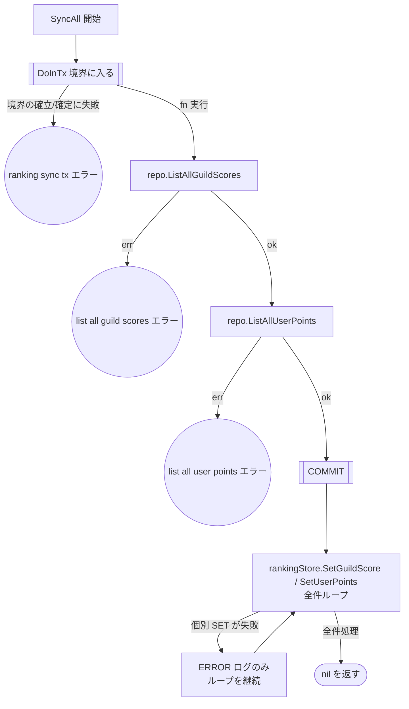

# ランキング同期バッチのテスト設計

対象: [internal/driver/batch/ranking_sync.go](../../internal/driver/batch/ranking_sync.go)
テスト: [internal/driver/batch/ranking_sync_test.go](../../internal/driver/batch/ranking_sync_test.go)

運用ルールは [README.md](README.md)。

MySQL のスナップショット（`guild_scores` / `user_points`）を Redis ZSet へ全件反映する
**揃え直し（rebuild）専用**バッチ。Redis 揮発時の復旧に用いる。

`guild_scores` は outbox-worker がイベントを exactly-once に適用して維持するため、
本バッチは outbox イベントの processed マークには**一切関与しない**。

## フローチャート

**設計上の要点**（テストで守る不変条件）:

- 読み取りは**単一トランザクション**（REPEATABLE READ）で行う。`guild_scores` と
  `user_points` のスナップショットが互いに整合している必要があるため
- outbox には**触れない**。processed マークは outbox-worker の責務であり、本バッチが
  マークすると worker が未適用のイベントを取りこぼす
- Redis 反映は **COMMIT 後**。個別 SET の失敗はログのみで**処理を継続し、エラーを返さない**
  （次回の同期で回復する）
- worker 稼働中に実行すると、スナップショット取得後に worker が反映した数件が SET で
  上書きされ Redis 側で一時的に欠落しうる。MySQL は常に正しいので次回の再構築で自己修復する。
  原則として揮発復旧など書き込みが静穏な状況で実行する

## テスト仕様表

| # | 条件 | 図のパス | 期待結果 | 検証すべき呼び出し |
| --- | --- | --- | --- | --- |
| 1 | `DoInTx` 自体が失敗 | `A→B→E1` | エラーを返す | 内部処理も Redis SET も呼ばれない |
| 2 | `ListAllGuildScores` が失敗 | `A→B→C→E2` | エラーを返す | Redis SET が呼ばれない |
| 3 | `ListAllUserPoints` が失敗 | `…→C→D→E3` | エラーを返す | 同上 |
| 4 | 正常系: 空テーブル | `…→D→E→F→Z` | 正常終了 | Redis SET が1件も呼ばれない |
| 5 | 正常系: スナップショットが反映される | `…→E→F→Z` | 正常終了 | `SetGuildScore` / `SetUserPoints` が全件ぶん呼ばれる |
| 6 | Redis SET の一部が失敗 | `…→F→G→F→Z` | **エラーを返さない** | 1件目が失敗しても**残り全件の SET が呼ばれる** |

**エラーの伝搬について**: 1〜3 はいずれも `errors.Is` で原因のエラーを辿れること
（ラップが原因をすり替えないこと）をランナーで一律に検証している。

## 本設計文書の作成で見つかった問題

既存テストは上表のパスをすべて通っていた（**パスの欠落は無し**）。

一方でテーブル駆動の形に問題があった。

| 種別 | 内容 | 対応 |
| --- | --- | --- |
| **テーブル駆動の形** | 各ケースが `setup func(t, ctrl) *batch.RankingSyncer` を持ち、モックの組み立て手順をテーブル側に書いていた | テーブルをデータのみにし、組み立てはランナーへ集約 |
| **検証の欠落** | エラーケースで `require.Error` しか見ておらず、**どのエラーが返るか**を確認していなかった（`errors.Is` での検証は別テスト関数に1件だけ切り出されていた） | ランナーで全エラーケースに `assert.ErrorIs` を適用し、切り出されていた関数を統合 |
| **デッドコード** | `expectDoInTxNotCalled` というコメントだけのヘルパー宣言（「現状未使用」と明記されていた）が残っていた | 削除 |
