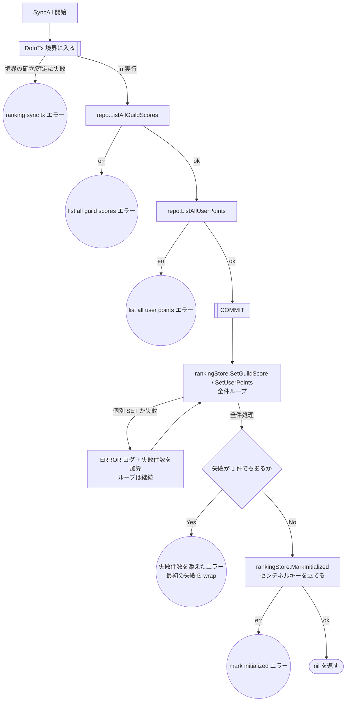

# ランキング同期バッチのテスト設計

対象: [internal/driver/batch/ranking_sync.go](../../internal/driver/batch/ranking_sync.go)
テスト: [internal/driver/batch/ranking_sync_test.go](../../internal/driver/batch/ranking_sync_test.go)

運用ルールは [README.md](README.md)。

MySQL のスナップショット（`guild_scores` / `user_points`）を Redis ZSet へ全件反映する
**揃え直し（rebuild）専用**バッチ。Redis 揮発時の復旧に用いる。

`guild_scores` は outbox-worker がイベントを exactly-once に適用して維持するため、
本バッチは outbox イベントの processed マークには**一切関与しない**。

## フローチャート

**設計上の要点**（テストで守る不変条件）:

- 読み取りは**単一トランザクション**（REPEATABLE READ）で行う。`guild_scores` と
  `user_points` のスナップショットが互いに整合している必要があるため
- outbox には**触れない**。processed マークは outbox-worker の責務であり、本バッチが
  マークすると worker が未適用のイベントを取りこぼす
- Redis 反映は **COMMIT 後**。個別 SET の失敗で**ループを止めない**（届く分は届ける）が、
  1 件でも失敗したら最後に**エラーを返す**。本バッチは Redis 揮発からの復旧手段であり、
  「復旧できていないのに正常終了する」と `cmd/batch` が exit 0 を返し、運用側が
  Redis が空のままであることに気づけない。**部分失敗で打ち切らないこと**と
  **失敗を終了ステータスに乗せること**は両立させる
  <!-- ssot-assert: present-grep 'os.Exit\(1\)' cmd/batch/main.go -->
- 返すエラーには失敗件数を添え、**最初の失敗を wrap** する（`errors.Is` で原因を辿れるように）
- センチネルキー（[ranking.md](ranking.md) §0）を立てるのは **全件成功したときだけ**。
  部分的にしか復旧していない状態でキーを立てると、読み取り経路が 503 をやめて
  **欠けたランキングを 200 で返し始める**。図で `MarkInitialized` を `H -- No` の
  枝にのみ置いているのはこのため
- 本バッチは**ランキング読み取りを再開させる唯一の手段**でもある。`MarkInitialized` が
  失敗したら Redis のデータが揃っていても 503 が続くので、エラーとして返して
  `cmd/batch` を非ゼロ終了させる（成功扱いにすると、運用側は復旧したつもりで放置する）
- worker 稼働中に実行すると、スナップショット取得後に worker が反映した数件が SET で
  上書きされ Redis 側で一時的に欠落しうる。MySQL は常に正しいので次回の再構築で自己修復する。
  原則として揮発復旧など書き込みが静穏な状況で実行する

## テスト仕様表

<!-- testcases: internal/driver/batch/ranking_sync_test.go#TestRankingSyncer_SyncAll -->

| # | 条件 | 図のパス | 期待結果 | 検証すべき呼び出し |
| --- | --- | --- | --- | --- |
| 1 | `DoInTx` 自体が失敗 | `A→B→E1` | エラーを返す | 内部処理も Redis SET も呼ばれない |
| 2 | `ListAllGuildScores` が失敗 | `A→B→C→E2` | エラーを返す | Redis SET が呼ばれない |
| 3 | `ListAllUserPoints` が失敗 | `…→C→D→E3` | エラーを返す | 同上 |
| 4 | `MarkInitialized` が失敗 | `…→D→E→F→H→I→E5` | **エラーを返す** | SET は全件呼ばれている |
| 5 | 正常系: 空テーブル | `…→D→E→F→H→I→Z` | 正常終了 | Redis SET が1件も呼ばれない。**`MarkInitialized` は呼ばれる** |
| 6 | 正常系: スナップショットが反映される | `…→E→F→H→I→Z` | 正常終了 | `SetGuildScore` / `SetUserPoints` が全件ぶん呼ばれる |
| 7 | Redis SET の一部が失敗 | `…→F→G→F→H→E4` | **エラーを返す** | 1件目が失敗しても**残り全件の SET が呼ばれる**（打ち切らない）。**`MarkInitialized` が呼ばれない** |

**エラーの伝搬について**: 1〜4 と 7 はいずれも `errors.Is` で原因のエラーを辿れること
（ラップが原因をすり替えないこと）をランナーで一律に検証している。

**「全件失敗」のケースが無い理由**: 一部失敗と全件失敗は同じパス（`…→F→G→F→H→E4`）を通る。
失敗件数が 1 か N かで振る舞いは変わらないため、[README §3](README.md) の統合ルールに従い
ケース 7 に一本化している。

## 本設計文書の作成で見つかった問題

既存テストは上表のパスをすべて通っていた（**パスの欠落は無し**）。

一方でテーブル駆動の形に問題があった。

| 種別 | 内容 | 対応 |
| --- | --- | --- |
| **テーブル駆動の形** | 各ケースが `setup func(t, ctrl) *batch.RankingSyncer` を持ち、モックの組み立て手順をテーブル側に書いていた | テーブルをデータのみにし、組み立てはランナーへ集約 |
| **検証の欠落** | エラーケースで `require.Error` しか見ておらず、**どのエラーが返るか**を確認していなかった（`errors.Is` での検証は別テスト関数に1件だけ切り出されていた） | ランナーで全エラーケースに `assert.ErrorIs` を適用し、切り出されていた関数を統合 |
| **デッドコード** | `expectDoInTxNotCalled` というコメントだけのヘルパー宣言（「現状未使用」と明記されていた）が残っていた | 削除 |
