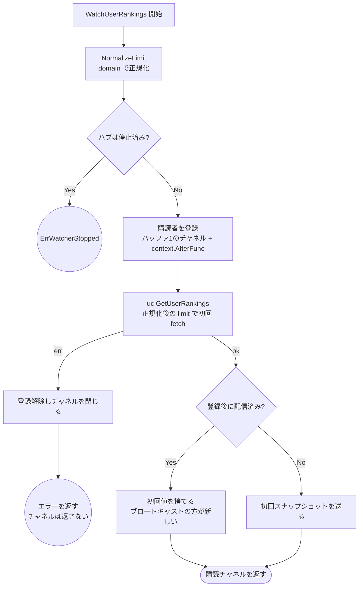
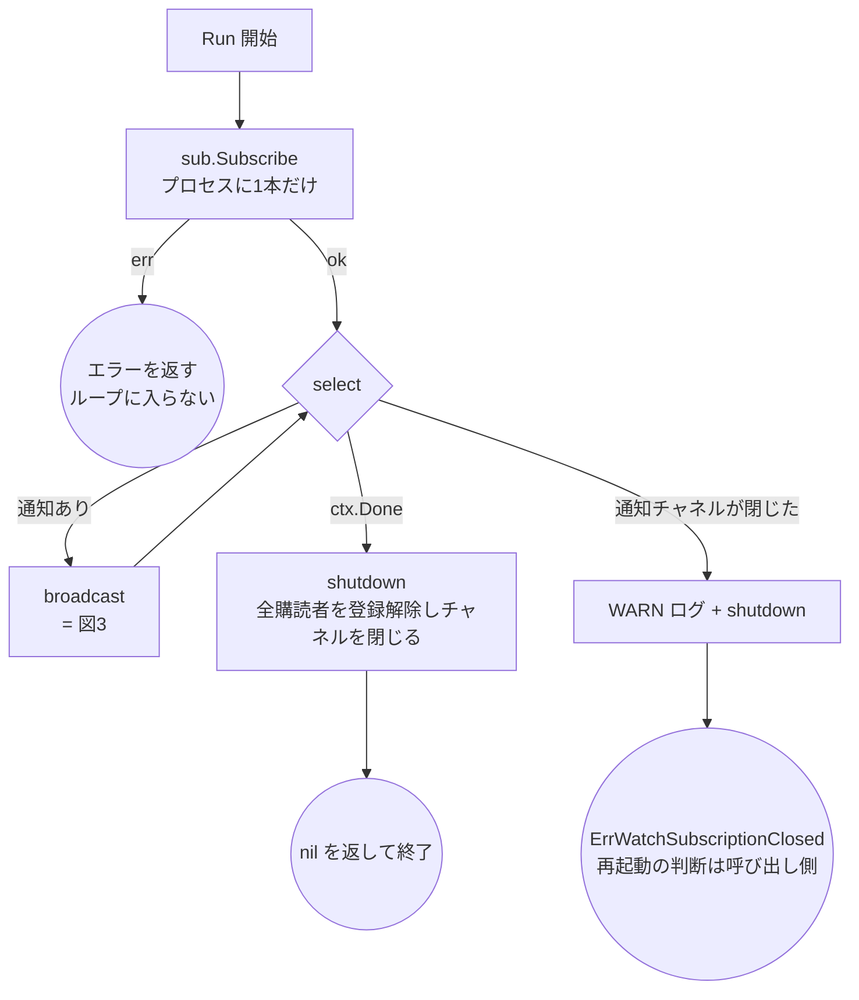
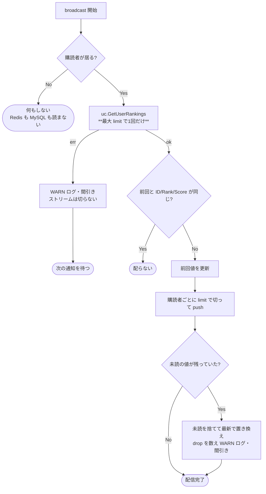

# ランキング更新通知（Watch）のテスト設計

対象: [internal/usecase/ranking/watcher.go](../../internal/usecase/ranking/watcher.go)
（interface 定義は [watch.go](../../internal/usecase/ranking/watch.go)）
テスト: [internal/usecase/ranking/watcher_test.go](../../internal/usecase/ranking/watcher_test.go)

運用ルールは [README.md](README.md)。

ランキング ZSet が更新されたことをクライアントへ push するための配管。
更新の起点は outbox-worker（[outbox-worker.md](outbox-worker.md) §2-1）で、
`ApplyScoreDeltas` が成功した直後にだけ `ranking:updated` へ publish する。
`RankingWatcher` はそれを**プロセスにつき1本だけ**購読し、ランキングを再取得して
全購読者へ配るハブ（ファンアウト）である。

```
outbox-worker: バッチ tx で MySQL 適用 → COMMIT → ZSet へ ApplyScoreDeltas
  → ranking:updated へ publish（ApplyScoreDeltas 成功時のみ）
        ↓  Redis Pub/Sub（購読は プロセスに1本）
RankingWatcher.Run: 通知 → uc.GetUserRankings（最大 limit で1回）→ 変化があれば全購読者へ配る
        ↓  購読者ごとの chan RankingsResult（バッファ1・最新値で上書き）
gRPC server streaming（Wave 2）
```

---

## 0. 設計判断（なぜこの形か / 何を意図的にやらなかったか）

### 0-1. `outbox:events` を転用せず新しいチャネルを作る

既存の `outbox:events`（[outbox-worker.md](outbox-worker.md) §1）は **ZSet 反映の「前」**に飛ぶ
worker 起床通知である。これを購読すると「反映前のランキングを読んで古い値を配る」レースが
常態化する。`ranking:updated` は `ApplyScoreDeltas` の**成功後**にだけ publish するので、
通知を受けて読めば必ず反映済みの値が読める。

`ApplyScoreDeltas` が失敗したときに publish しないのも同じ理由。MySQL は確定済みでも
Redis のキャッシュは遅れている（[outbox-worker.md](outbox-worker.md) §0-1）ので、
そこで「更新された」と push すると push が嘘になる。次のバッチの成功時に追いつく。

### 0-2. Redis の購読はプロセスに1本だけ張る（ファンアウトはハブ側）

接続ごとに `SUBSCRIBE` を張ると Unity クライアント N 台 = Redis 接続 N 本になり、
`DB_MAX_OPEN_CONNS` 等で接続数を有限化した設計と矛盾する。
`Run(ctx)` の中で `Subscribe` を1本だけ張り、通知 1 件につき

1. 購読者の**最大 limit で1回だけ** `uc.GetUserRankings` を呼ぶ（購読者ごとに fetch すると
   Redis 読み取りが N 倍になる。ランキングは全員が同じものを見るので1回で足りる）
2. 前回配った内容と変化が無ければ何もしない
3. 変化があれば各購読者の limit で切って配る

`Usecase` を再利用するのは、名前解決（MySQL）と初期化チェック（`IsInitialized`）を
自前で書き直さないため。同一層内の依存なので depguard 上も問題ない。

### 0-3. 差分判定は `(ID, Rank, Score)` の列だけで行う

`Name` は MySQL 由来でランキング更新とは無関係に変わりうる（改名）。比較に含めると
順位が何も動いていないのに全購読者へ配ることになる。逆に改名だけが起きた場合、
次に順位が動くまで古い名前が残るが、これは許容する（表示名の即時性は要件ではない）。

`TotalCount` も比較しない。参加者が増えただけで全購読者へ配るのを避けるため。

### 0-4. 遅いクライアントは **drop する（切断しない）**

購読者ごとに「バッファ1のチャネル + 最新値で上書き」を持たせる。未読の値が残っていたら
**捨てて最新で置き換える**。

素朴な「バッファ1に `select default` で送り、埋まっていたら捨てる」は**誤り**である。
それだと古い値が残って最新が捨てられ、ランキングとしては逆効果になる（最新だけが意味を持つ）。
outbox の `Subscriber` が「埋まっていたら捨てる」でよいのは、あれが値を運ばない
**シグナル**で新旧の区別が無いため。ここは事情が違う。

**切断しない理由**: 切ると Unity 側が再接続ループに入り、遅いクライアントほど接続と初回
fetch の負荷を上げる（自己増幅する）。詰まっているあいだ最新値だけを見せて、追いついたら
そのまま続ける方が安い。

drop のログは**間引く**（§0-6）。

### 0-5. ループ中の fetch エラーはログして継続する（ストリームを切らない）

当初案は「`ErrRankingUnavailable`（ZSet 揮発）なら `Unavailable` で切る」だったが**やめた**。
揮発は Redis 全体の障害なので、切ると**全クライアントが同時に切断 → 同時に再接続**して
雪崩になる。復旧は `RankingSyncer` の焼き直し（[ranking-sync-batch.md](ranking-sync-batch.md)）に
任せ、ストリームは開けたまま次の通知を待つ。§0-4 の「切らない」と同じ理由。

**初回だけは例外**で、`WatchUserRankings` の初回 fetch が失敗したらチャネルを返さず
エラーを返す。まだクライアントに何も見せていない段階なので、ここは 503 を返して
リトライさせた方が正しい（ストリームを開いてから沈黙するより観測しやすい）。

### 0-6. デバウンス（ticker でのまとめ配信）は入れない

publish 頻度は worker のバッチ単位で決まる（実測 407 events/sec ÷ `batchSize` 500 で
毎秒1回前後）。まとめる必要が無い一方、ticker を入れるとテストが時間依存になり
Flaky 防止規約（AGENTS.md §3）に抵触する。§0-3 の差分判定と §0-4 の drop で、
配信量は「実際に変化した回数」と「クライアントが読める速度」の両方で既に抑えられている。

同じ理由で**ログの間引きも時間ベースにしない**。`time.Now()` を直接呼ばない規約
（AGENTS.md §2）もあり、件数ベース（1件目とその後 `watchLogSampleInterval` 件ごと）にする。
間引き自体は必須で、`ErrRankingUnavailable` のときに素直に出すと
「1件の障害が毎秒数千行の同一ログになり他のエラーを埋める」ことになる。

### 0-7. 購読者ごとに goroutine を常駐させない

ctx キャンセルでの登録解除は `context.AfterFunc` で行う。購読者ごとに
`select { case <-ctx.Done() }` の goroutine を張ると、接続数ぶんの goroutine が
純粋な待ちで常駐する。`AfterFunc` は ctx が終わったときにだけ実行される。

チャネルのクローズは登録解除と同じ経路（`remove`）に集約し、
`Run` の ctx が終わったときは `shutdown` が全購読者に対して同じことをする。
**返したチャネルは必ず閉じる**（クライアント側の受信ループが漏れないため）。

---

## 1. `WatchUserRankings`（購読の登録と初回スナップショット）



**設計上の要点**（テストで守る不変条件）:

- **登録が先、fetch が後**。逆にすると fetch と登録の隙間に来た更新を取りこぼす
- **初回値で新しい値を上書きしない**（`H→I`）。登録直後にブロードキャストが先着した場合、
  初回 fetch の結果はそれより古い。素直に送ると「更新されたのに古いランキングが最後に残る」
- 初回 fetch の失敗では**チャネルを返さない**（§0-5）。登録は必ず巻き戻す

<!-- testcases-funcs: internal/usecase/ranking/watcher_test.go -->

| # | 条件 | 図のパス | 期待結果 | テスト |
| --- | --- | --- | --- | --- |
| 1 | ハブが停止済み | `B→E1` | `ErrWatcherStopped`。fetch もしない | `TestRankingWatcher_WatchUserRankings_停止済みハブ_ErrWatcherStoppedを返す` |
| 2 | 初回 fetch が失敗 | `F→G→E2` | チャネルを返さない。登録も残さない | `TestRankingWatcher_WatchUserRankings_初回fetch失敗_チャネルを返さない` |
| 3 | 登録直後に更新が先着 | `F→H→I→K` | 初回値は捨て、ブロードキャストの値だけが届く | `TestRankingWatcher_WatchUserRankings_登録直後に更新が先着_古い初回値で上書きしない` |
| 4 | 正常系（`limit` は正規化される） | `F→H→J→K` | 現在値が1件だけ届く。fetch は正規化後の limit で1回 | `TestRankingWatcher_WatchUserRankings_正常系_初回スナップショットを1件受け取る` |

## 2. `Run`（ハブの常駐ループ）



**設計上の要点**（テストで守る不変条件）:

- **どの終わり方でも全購読者のチャネルを閉じる**。閉じ忘れるとクライアント側の受信ループが
  永久に残る（goroutine リーク）
- 通知チャネルのクローズは**エラーで返す**。この経路には outbox worker のような
  ポーリングのフォールバックが無く、黙って止まると「繋がっているのに永久に更新が来ない
  ストリーム」になる。呼び出し側が再起動を選べるようにする
- 停止後の `WatchUserRankings` は `ErrWatcherStopped`（§1 ケース1）

<!-- testcases-funcs: internal/usecase/ranking/watcher_test.go -->

| # | 条件 | 図のパス | 期待結果 | テスト |
| --- | --- | --- | --- | --- |
| 1 | `Subscribe` が失敗 | `RB→RE1` | エラーを返す。購読者の登録も受け付けない | `TestRankingWatcher_Run_Subscribe失敗_エラーを返す` |
| 2 | 通知でティックが起きる | `RL→BC→RL` | `broadcast` が走り、次の通知を待つ | `TestRankingWatcher_broadcast_変化あり_1回のfetchから購読者ごとのlimitで配る` |
| 3 | `ctx` がキャンセルされる | `RL→RC→RZ` | `nil` を返す。購読者のチャネルが閉じる | `TestRankingWatcher_Run_ctxキャンセル_購読者のチャネルを閉じてnilを返す` |
| 4 | 通知チャネルが閉じる | `RL→RX→RE2` | `ErrWatchSubscriptionClosed`。購読者のチャネルも閉じる | `TestRankingWatcher_Run_通知チャネルが閉じる_購読者を切ってエラーを返す` |

## 3. `broadcast`（通知1件ぶんの配信）



**設計上の要点**（テストで守る不変条件）:

- **fetch は購読者の数によらず1回**（§0-2）。`GetUserRankings` の引数 limit は
  購読者の最大値で、各購読者へは自分の limit で切ってから配る
- **購読者が居なければ下位層を触らない**。誰も見ていないランキングを読み続けない
- **変化が無ければ配らない**（§0-3）。worker のバッチが空振り気味のときに
  同じ値を毎秒 push しない
- **fetch エラーでストリームを切らない**（§0-5）
- **drop は最新値で上書き**（§0-4）。古い値を残す実装に戻すと、詰まったクライアントに
  永久に古いランキングを見せることになる

<!-- testcases-funcs: internal/usecase/ranking/watcher_test.go -->

| # | 条件 | 図のパス | 期待結果 | テスト |
| --- | --- | --- | --- | --- |
| 1 | 購読者が1人も居ない | `BB→BZ0` | `GetUserRankings` を呼ばない | `TestRankingWatcher_broadcast_購読者なし_下位層を読まない` |
| 2 | 前回と同じランキング | `BD→BZ2` | 誰にも配らない | `TestRankingWatcher_broadcast_前回と同じ_配信しない` |
| 3 | fetch が失敗 | `BF→BFE→BZ1` | ストリームを切らず、次の通知で復帰する | `TestRankingWatcher_broadcast_fetch失敗_ストリームを切らず次の通知で復帰する` |
| 4 | 変化あり・購読者が複数 | `BD→BU→BP→BQ→BZ3` | fetch は最大 limit で1回。各購読者は自分の limit ぶん受け取る | `TestRankingWatcher_broadcast_変化あり_1回のfetchから購読者ごとのlimitで配る` |
| 5 | 受信が追いつかない購読者 | `BQ→BDR→BZ3` | 未読を捨てて最新で置き換える。切断しない | `TestRankingWatcher_broadcast_遅い購読者_最新値で上書きしdropを数える` |

手続きが異なるため別テスト関数に切り出しているもの:

| 条件 | 図のパス | 期待結果 | テスト関数 |
| --- | --- | --- | --- |
| 購読者の ctx キャンセル | `RC` 相当（個別） | チャネルが閉じ、以降のブロードキャストの対象から外れる | `TestRankingWatcher_WatchUserRankings_購読者のctxキャンセル_チャネルが閉じ配信対象から外れる` |
| 同時購読・同時キャンセル | `BP` | 8 購読者が同時に出入りしてもハブは配信を続け、全チャネルが閉じる | `TestRankingWatcher_並行購読とキャンセル_配信を続け全チャネルが閉じる` |
| ログの間引き | `BFE` / `BDR` | 同一障害が連続しても 1 件目だけ出る（`watchLogSampleInterval`） | `TestRankingWatcher_ログ間引き_連続する同種の失敗は1件目だけ出す` |

## 4. 未対応（本実装の範囲外）

### ギルドランキングの Watch

`WatchGuildRankings` は作っていない。gRPC ストリーム（Wave 2）がユーザーランキングだけを
対象にしているため。追加するときは購読者の管理をランキング種別ごとに分ける必要がある
（今は「ユーザーランキングの購読者」しか居ない前提で `last` を1本だけ持っている）。

### 購読者数の上限

無制限に受け付ける。上限を設けるならハブではなく gRPC サーバ側の同時接続数で
制御する方が層として自然なため、ここには置かない。
