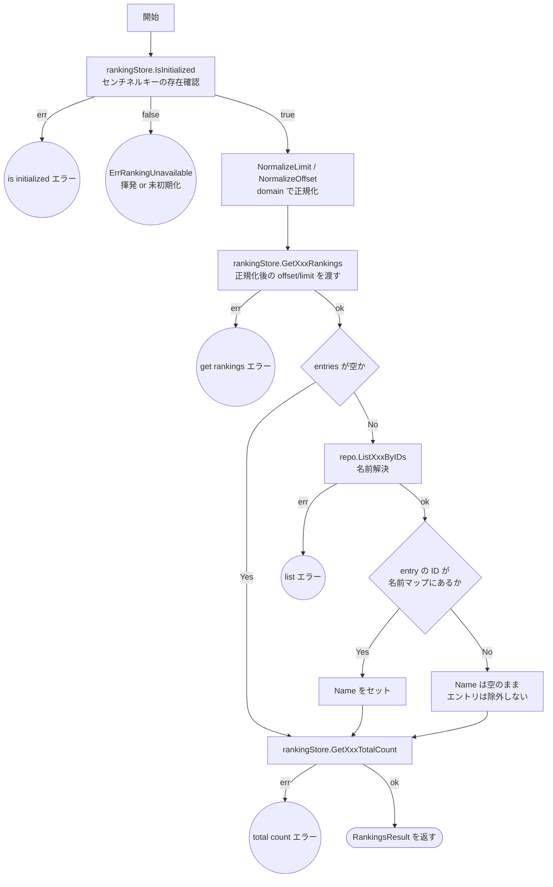
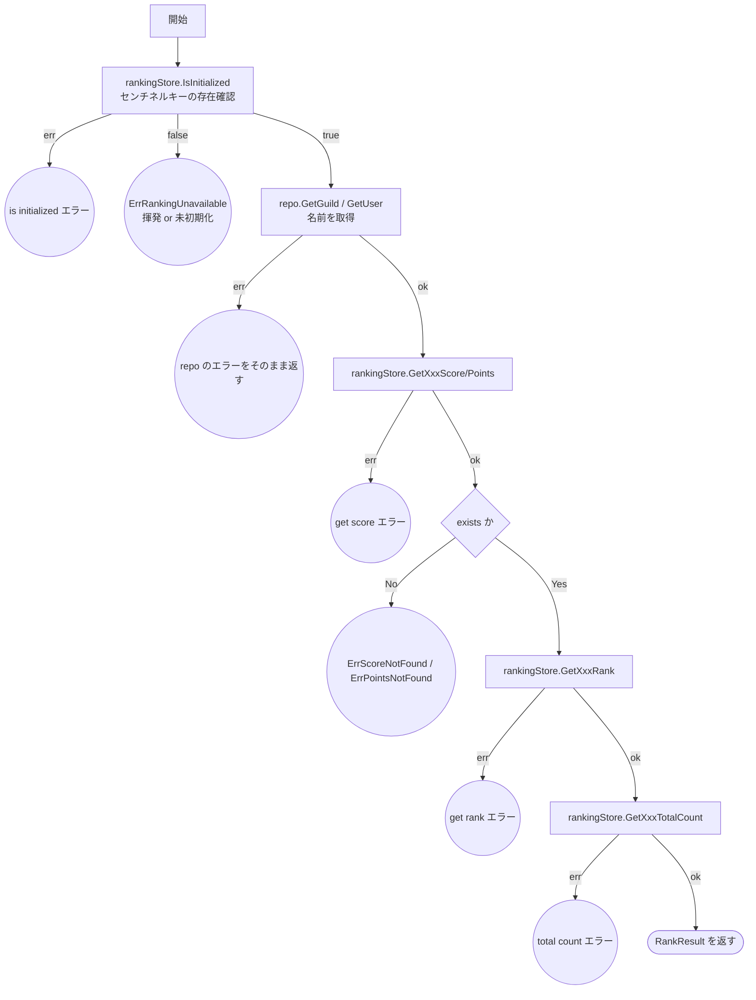
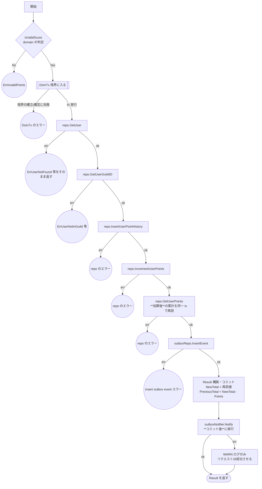

# ランキング機能のテスト設計

対象: [internal/usecase/ranking/usecase.go](../../internal/usecase/ranking/usecase.go)
テスト: [internal/usecase/ranking/usecase_test.go](../../internal/usecase/ranking/usecase_test.go)

運用ルールは [README.md](README.md)。

`internal/domain/ranking` は図を作らない。`IsValidScore` / `NormalizeLimit` / `NormalizeOffset` の
境界値の正本は [constants_test.go](../../internal/domain/ranking/constants_test.go) のケース配列。

> **本ファイルの前提**: 境界値は判定ロジックを実装している層（domain）に集約する。
> usecase 層は「下位層の判定結果を受けた分岐」だけを検証し、domain が既に担保した
> 境界値バリエーションを重ねてテストしない。

---

## 0. 読み取り経路の前提: ランキングの初期化検知

Redis の ZSet が揮発（ノード障害・フェイルオーバ・人為ミス）すると、
`ZREVRANGE` は**エラーではなく空配列**を、`ZSCORE` は `redis.Nil` を返す。
そのまま返すと一覧は「200 OK で空」、順位は「404 points not found」になり、
**揮発を正常なレスポンスとして返してしまう**。

さらに揮発後は outbox-worker の `ZINCRBY` が 0 から加算を再開するため、
時間が経つほど「揮発以降の増分だけで育った、それらしく見える嘘のランキング」になる。
空である時間は短く、放置するほど検知が難しくなる。

これを防ぐため、`RankingSyncer` が再構築の完了時にセンチネルキー
`ranking:meta:initialized`（[domain/ranking/constants.go](../../internal/domain/ranking/constants.go)）を立て、
**読み取り系の 4 メソッドは処理の先頭でその存在を確認する**。
無ければ `ErrRankingUnavailable` を返し、driver 層が 503 に変換する
（[http-ranking.md](http-ranking.md) §4）。

**設計上の要点**:

- センチネルキーに **TTL を付けない**。期限切れが偽陽性（揮発していないのに 503）になる
- キーは ZSet と同じ Redis に置く。**揮発すれば必ず一緒に消える**ので偽陰性が生じない
- 判定は**読み取りのたびに毎回**行う。一度成功した結果をプロセス内にキャッシュすると、
  キャッシュ期間中は揮発しても嘘を返し続け、この仕組みの目的を損なう
- **`AddUserPoints`（書き込み）はこの判定の対象外**。書き込み経路は Redis を一切触らず
  MySQL にしか書かないため、揮発中でも記録は正しく残る。ここを 503 にすると、
  復旧すれば失われずに済んだ加算を落とすことになる
- 揮発中も worker は `ZINCRBY` を続けて嘘の値を育てるが、読み取りが 503 で塞がっている
  あいだは露出しない。`SyncAll` が MySQL の値で **SET 上書き**するので復旧時に是正される

## 1. 読み取り系: `GetGuildRankings` / `GetUserRankings`

2 メソッドは構造が同一（ギルド版とユーザー版）。**同じ図・同じケース構成を持つ**。
片方にだけケースがある状態にしない（対称性）。

**`H` の No 側について**: ランキングの正本は Redis の ZSet、名前の正本は MySQL であり、
両者はずれうる（ユーザー/ギルド削除、ZSet 揮発後の再構築中など）。
このとき**エントリを黙って落とすと順位と件数が食い違う**ため、Name を空のまま返す設計にしている。
図に現れない `if _, ok := ...` の分岐だが、ずれたときの振る舞いを決める分岐なのでケースを立てる。

### テスト仕様表（`GetGuildRankings` / `GetUserRankings` 共通）

<!-- testcases: internal/usecase/ranking/usecase_test.go#TestUsecase_GetRankings -->

| # | 条件 | 図のパス | 期待結果 | 検証すべき呼び出し |
| --- | --- | --- | --- | --- |
| 1 | `IsInitialized` がエラー | `A→I→E4` | エラーを返す | **後続が一切呼ばれない** |
| 2 | 未初期化（揮発） | `A→I→E5` | `ErrRankingUnavailable` | 同上。**空配列を 200 で返さない** |
| 3 | store の取得がエラー | `A→I→B→C→E1` | エラーを返す | 名前解決も total count も呼ばれない |
| 4 | `entries` が空 | `A→I→B→C→D→F→Z` | 空の `Rankings`、`TotalCount` は返る | **`ListXxxByIDs` が呼ばれない** |
| 5 | 名前解決がエラー | `…→D→G→E2` | エラーを返す | total count が呼ばれない |
| 6 | total count がエラー | `…→G→H→H2→F→E3` | エラーを返す | — |
| 7 | 正常系: 名前がマージされる | `…→H→H2→F→Z` | `Rankings` の各要素に Name が入る | `ListXxxByIDs` に entries の ID 配列が渡る |
| 8 | 正規化した値が store に渡る | 7 と同一 | 正常終了 | **`GetXxxRankings` に正規化後の offset/limit が渡る** |
| 9 | 名前マップに ID が無い | `…→H→H3→F→Z` | 該当エントリの `Name` は空文字。**件数は減らない** | — |

**ケース 2 と 4 を分けている理由**: どちらも「ランキングが空」に見えるが、
**2 は異常（揮発）、4 は正常（まだ誰も加点していない）**。この 2 つを区別できることが
センチネルキーを置く目的そのものなので、統合しない。

**ケース 8 について**: `limit=0 → DefaultRankingLimit`、`limit>Max → Max に丸め`、`offset<0 → 0`
といった正規化の**値**の検証は domain の責務。ここで検証するのは
「usecase が正規化を通した結果を store へ渡している」という**結線**だけなので、1 ケースで足りる。

---

## 2. 単一順位取得: `GetGuildRank` / `GetUserRank`

こちらも 2 メソッドで構造が同一。

### テスト仕様表（`GetGuildRank` / `GetUserRank` 共通）

<!-- testcases: internal/usecase/ranking/usecase_test.go#TestUsecase_GetRank -->

| # | 条件 | 図のパス | 期待結果 | 検証すべき呼び出し |
| --- | --- | --- | --- | --- |
| 1 | `IsInitialized` がエラー | `A→I→E6` | エラーを返す | **repo も store も呼ばれない** |
| 2 | 未初期化（揮発） | `A→I→E7` | `ErrRankingUnavailable` | 同上。**404 を返さない** |
| 3 | `repo.GetXxx` がエラー | `A→I→B→E1` | repo のエラーを変換せず返す | store が一切呼ばれない |
| 4 | スコア/ポイント取得がエラー | `A→I→B→C→E2` | エラーを返す | rank / total count が呼ばれない |
| 5 | スコア/ポイント未登録（`exists=false`） | `…→C→D→E3` | `ErrScoreNotFound` / `ErrPointsNotFound` | 同上 |
| 6 | rank 取得がエラー | `…→D→F→E4` | エラーを返す | total count が呼ばれない |
| 7 | total count がエラー | `…→F→G→E5` | エラーを返す | — |
| 8 | 正常系 | `…→G→Z` | 名前・スコア・順位・総数がすべて入る | — |

**ケース 2 と 5 を分けている理由**: 揮発した ZSet では `ZSCORE` が `redis.Nil` を返すため、
初期化検知が無いとケース 5（`ErrPointsNotFound` → 404）に落ちる。
**「まだ加点していない個人」と「ランキング全体の消失」が同じ 404 になる**のが
この対策以前の問題そのものなので、両者を別ケースとして固定する。

---

## 3. `AddUserPoints`

ポイント加算。MySQL の更新（個人・ギルド・履歴）と Redis 反映用 outbox イベント登録を
**同一トランザクション内**で原子的に実行する。Redis 反映は outbox-worker が非同期に行うため、
このメソッドは順位を返さない。

**設計上の要点**（テストで守る不変条件）:

- **初期化検知（§0）の対象外**。このメソッドは Redis を一切触らず MySQL にしか書かないため、
  ZSet が揮発していても記録は正しく残る。ここを 503 にすると、復旧すれば失われずに
  済んだ加算を落とすことになる。図に `IsInitialized` のノードが無いのは意図的
- `IsValidScore` の判定は `DoInTx` の**外**。不正入力でトランザクションを張らない
- ギルド集計（`IncrementGuildScore` / `InsertGuildScoreHistory`）は
  この tx で**行わない**。ホット行（1ギルド=1行）の排他ロックを同期リクエスト経路から
  除去するため outbox-worker へ非同期化した（[outbox-worker.md](outbox-worker.md)）。
  同期レスポンスも `GuildID` のみを返し、ギルドの previous/new total は返さない
- `Notify` は**コミット後**に呼ぶ。コミット前だと worker が空振りする
- `Notify` の失敗はリクエストを失敗させない。worker のポーリングがフォールバックになる
- **累計値は加算の「後」に読む**（`N`）。加算前に読んだ値へアプリ側で加算すると、
  同一ユーザーへの同時リクエストが同じ `previous_total` を読み、双方が同じ
  `new_total` を返す（MySQL の値は `points = points + ?` なので正しいまま、
  **レスポンスだけが誤る**）。加算後に同一 tx で読み直せば、後発のトランザクションは
  先行のコミット結果を含んだ値を得る。`PreviousTotal` は `NewTotal - Points` で導出する
- `N` は `ErrPointsNotFound` を**正常扱いしない**。`IncrementUserPoints` は
  `INSERT ... ON DUPLICATE KEY UPDATE` なので、成功直後に行が存在しないのは異常であり、
  そのままエラーとして返す（初回ユーザーもこの時点では必ず行がある）

### テスト仕様表

<!-- testcases: internal/usecase/ranking/usecase_test.go#TestUsecase_AddUserPoints -->

| # | 条件 | 図のパス | 期待結果 | 検証すべき呼び出し |
| --- | --- | --- | --- | --- |
| 1 | `IsValidScore` が false | `A→B→E1` | `ErrInvalidPoints` | **`DoInTx` が呼ばれない** |
| 2 | `GetUser` がエラー（ユーザー不在） | `A→B→C→D→E3` | repo のエラーをそのまま返す | 以降の repo が呼ばれない |
| 3 | `GetUserGuildID` がエラー（ギルド未所属） | `…→D→F→E4` | `ErrUserNotInGuild` | 同上 |
| 4 | `InsertUserPointHistory` がエラー | `…→F→K→E5` | エラーを返す | 同上 |
| 5 | `IncrementUserPoints` がエラー | `…→K→M→E6` | エラーを返す | 同上 |
| 6 | 加算後の `GetUserPoints` がエラー | `…→M→N→E7` | エラーを返す | `InsertEvent` が呼ばれない |
| 7 | `InsertEvent` がエラー | `…→N→O→E8` | エラーを返す | `Notify` が呼ばれない |
| 8 | 正常系 | `…→O→P→Q→Z` | `NewTotal` は再読値、`PreviousTotal` は `NewTotal - Points` | outbox に `RankingScoreAdded` が積まれる／`Notify` が呼ばれる／**ギルド集計の repo が呼ばれない** |
| 9 | `Notify` が失敗 | `…→Q→R→Z` | **リクエストは成功する**（エラーを返さない） | WARN ログが出る |

**`DoInTx` 自体のエラー（`E2`）について**: トランザクション境界の契約は
[transaction-boundary.md](transaction-boundary.md) が `Transactor` 自身のテストで担保する。
usecase 側は境界をモックしてよく、契約の検証を重複させない。
ただし「不正入力で境界に入らないこと」（ケース 1）は usecase 固有の責務なので、ここで検証する。

**「初回ユーザー」のケースが無い理由**: 累計を加算後に読む設計では、初回ユーザーも
既存ユーザーも `…→M→N→O→…` という**同一のパス**を通る（`IncrementUserPoints` の
upsert により、`N` の時点では必ず行が存在する）。同一パスのケースは統合するという
[README §3](README.md) の方針に従い、ケース 8 に一本化した。

**同時実行による誤りは、この表では検知できない**: ケース 8 が守るのは「再読した値を
`NewTotal` に使う」という結線までで、「同一トランザクション内の再読が自身の書き込みを
見る」という InnoDB の性質はモックでは検証できない。ここは実 DB でしか確かめられない。
なお [points.js](../../loadtest/points.js) は `randUserID()` で対象を全ユーザーに散らすため、
同一ユーザーの同時加算はほぼ起きない。この経路を実地で踏むには対象ユーザーを絞る必要がある。
<!-- ssot-assert: present-grep 'randUserID' loadtest/points.js -->

**なぜギルド側に同じ問題が無いか**: ギルドスコアの previous/new total は
[guild-score-async.md](../plans/guild-score-async.md) の設計でレスポンスから削除済みで、
そもそも同期経路が値を返さない。読み直しが要るのは個人ポイントだけ。

---

## 4. 本設計文書の作成で見つかった問題

`usecase` 層の文カバレッジは 100% であり、**この 4 件はいずれも数値では検知できない**ものだった。

| 種別 | 内容 | 対応 |
| --- | --- | --- |
| **層をまたぐ責務の重複** | `GetGuildRankings` に `limit=0 → 既定値`／`limit>Max → 丸め`／`offset<0 → 0` の 3 ケースがあった。これは `NormalizeLimit` / `NormalizeOffset` の境界値であり、[constants_test.go](../../internal/domain/ranking/constants_test.go) が既に 11 ケースで網羅している。usecase で検証すべきは「正規化を通した値を store へ渡している」という結線だけ | 表のケース 6（1 件）へ統合 |
| **対称性の欠如** | 上記 3 ケースは `GetGuildRankings` にだけあり、同一構造の `GetUserRankings` には 1 件も無かった。**片方だけにケースがある**状態 | 両者を同じケース構成に揃える |
| **層をまたぐ責務の重複** | `AddUserPoints` の「負数で `ErrInvalidPoints`」「最大値超過で `ErrInvalidPoints`」は同一パス（`A→B→E1`）。`IsValidScore` の境界は domain が 5 ケースで網羅済み | 表のケース 1 へ統合 |
| **同一パスの重複** | `AddUserPoints` の「境界値: `Points=MaxScore` でも加算成功」は正常系（ケース 8）と同一パス。`MaxScore` が有効値であることは domain の責務 | ケース 8 へ統合 |
| **テーブル駆動の形** | 5 つのテーブルすべてが `setup func(t, ctrl) ranking.Usecase` を持ち、モックの組み立て手順をテーブル側に書いていた | テーブルをデータのみにし、組み立てはランナーへ集約 |

**教訓**: gacha（Phase 4）では「テストが足りない」穴が出たが、ranking では逆に
**「下位層が担保済みの境界値を上位層で重ねてテストしている」過剰**が出た。
どちらもカバレッジ数値では見えない。層別の責務分担は図と表で突き合わせるしかない。

---

## 5. 図とテストの再突き合わせで見つかった問題

本文書とテストコードを改めて突き合わせた際に見つかったもの。いずれも文カバレッジ 100% のまま見逃されていた。

| 種別 | 内容 | 対応 |
| --- | --- | --- |
| **パスの欠落** | 名前解決の結果に entry の ID が含まれない分岐（`if _, ok := ...` の No 側）が、図・表・テストのいずれにも無かった。Redis の ZSet と MySQL がずれたときの振る舞いが未定義のまま | 図に `H` の分岐を追加し、表のケース 7 とテストを追加 |
| **検証の欠落** | ケース 10 の「検証すべき呼び出し」に **WARN ログが出る**とあるのに、テストは「エラーを返さない」ことしか見ていなかった。ログは「通知失敗を握り潰していない」ことの唯一の観測点なので、出ていないと検証が成立しない | このケースだけログ捕捉用の logger に差し替えて `assert` を追加 |
