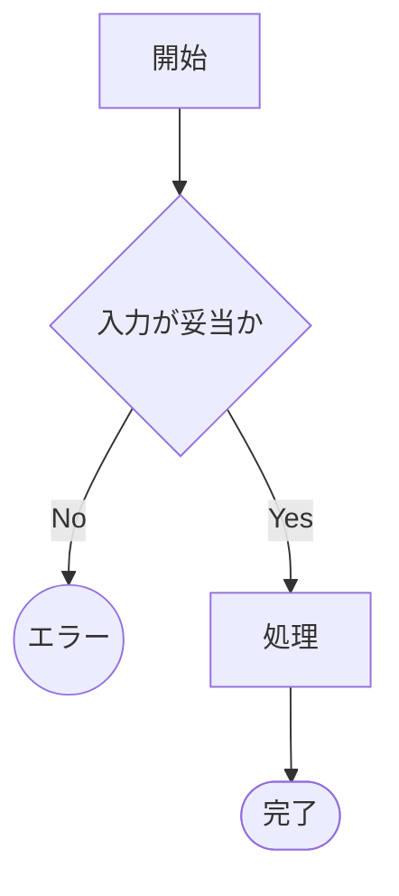

# ケースの並びが表と違う

```mermaid
flowchart TD
    A[開始] --> B{入力が妥当か}
    B -- No --> E1((エラー))
    B -- Yes --> C[処理]
    C --> Z([完了])
```

<!-- testcases: internal/sample/sample_test.go#TestOrder -->

| # | 条件 | 図のパス | 期待結果 |
| --- | --- | --- | --- |
| 1 | 入力が不正 | `A→B→E1` | エラー |
| 2 | 正常系 | `…→C→Z` | 完了 |
