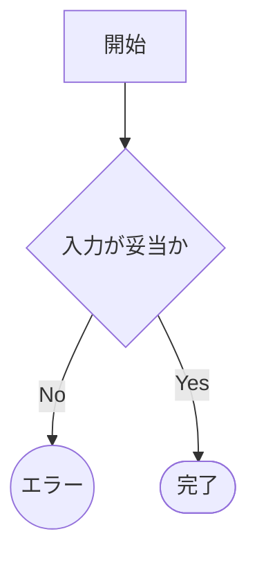

# 表のパスが図に無い辺を通っている

```mermaid
flowchart TD
    A[開始] --> B{入力が妥当か}
    B -- No --> E1((エラー))
    B -- Yes --> Z([完了])
```

<!-- testcases: internal/sample/sample_test.go#TestEdge -->

| # | 条件 | 図のパス | 期待結果 |
| --- | --- | --- | --- |
| 1 | 図に無い辺 | `A→Z` | 完了 |
