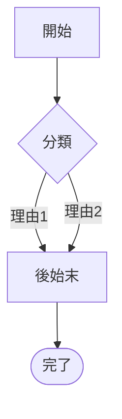

# 同じ辺が複数のラベルで書かれている図

```mermaid
flowchart TD
    A[開始] --> B{分類}
    B -- 理由1 --> C[後始末]
    B -- 理由2 --> C
    C --> Z([完了])
```

<!-- testcases: internal/sample/dup_test.go#TestDup -->

| # | 条件 | 図のパス | 期待結果 |
| --- | --- | --- | --- |
| 1 | 理由1 で後始末へ | `A→B` | 完了 |
