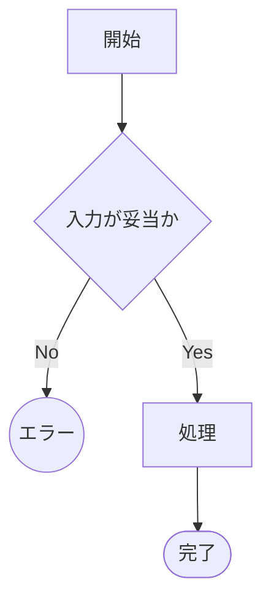

# フィクスチャ: 表とテストが一致している状態

対象: doccheck のテスト。実在の機能ではない。

<!-- testcases: internal/sample/sample_test.go#TestSample+TestSampleContract -->

| # | 条件 | 図のパス | 期待結果 |
| --- | --- | --- | --- |
| 1 | 入力が不正 | `A→B→E1` | エラー |
| 2 | 正常系 | `…→C→Z` | 完了 |
| 3 | 契約（パス指定なしの行） | | 構造が一致 |

## 1マーカーが複数ケースを覆う形

<!-- testcases: internal/sample/sample_test.go#TestSampleOneMarkerTwoCases -->

| # | 条件 | 図のパス | 期待結果 |
| --- | --- | --- | --- |
| 1 | 入力が不正 | `A→B→E1` | エラー |

## 関数名で対応づける形

<!-- testcases-funcs: internal/sample/sample_test.go -->

| # | シナリオ | 期待される契約 | 対応テスト |
| --- | --- | --- | --- |
| 1 | 関数名で参照する | 実在すること | `TestSampleFuncsMode` |
| 2 | サブテストまで参照する | 実在すること | `TestSampleFuncsMode/サブテスト名` |
| 3 | 直前と同じテストを指す | — | 同上 |
| 4 | テストが無いことが分かっている穴 | — | **未対応** |

## 対象外を宣言する形

<!-- testcases-skip: '検査ロジックのフィクスチャ。対応するテストを持たない' -->

| # | 条件 | 期待結果 |
| --- | --- | --- |
| 1 | skip 宣言のある表 | 突合しない |

## `#` 列を持たない表（仕様表ではない）

| 環境 | 起動 |
| --- | --- |
| ローカル | 手動 |
