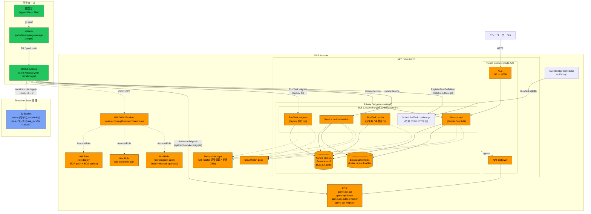
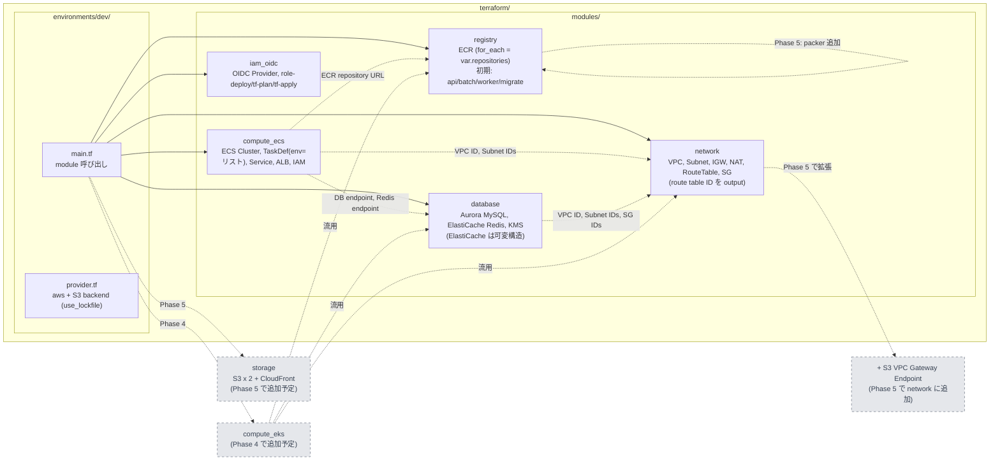
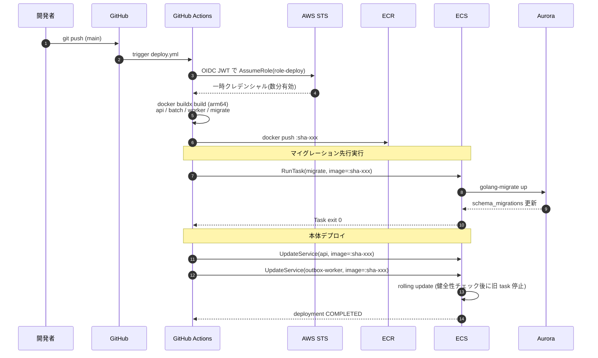

# AWS インフラ構成図（Phase 2 完了時点）

本ドキュメントは ROADMAP フェーズ2 で構築する AWS インフラの構成・モジュール分割・デプロイフローを mermaid で可視化したもの。

## 全体構成図



## Terraform モジュール構成



## コンテナ実行時セキュリティ

`compute_ecs` の全 TaskDef（api / outbox-worker / batch / migrate）は、コンテナ侵害時の影響範囲を狭めるデプスディフェンス（多層防御）として以下を共通適用する。設定は `locals.container_security` に集約し、各 `container_definitions` へ `merge()` で合成しているため、追加漏れと値の不整合を防いでいる。

| 設定 | 値 | 効果 / 前提 |
|---|---|---|
| `readonlyRootFilesystem` | `true` | ルートFSを読み取り専用化し、侵害後のツール書き込み・永続化を阻止。アプリ（distroless static / migrate）はローカル書き込みをしないため writable volume は不要。将来 temp 書き込みが必要になった場合は Fargate のエフェメラル `volume` + `mountPoints` で書込先を限定的に開ける（tmpfs は Fargate 非対応） |
| `linuxParameters.capabilities.drop` | `["ALL"]` | 全 Linux capability を剥奪。コンテナは `nonroot` 実行かつ待受は 8080(>1024) のため `NET_BIND_SERVICE` 等の追加は不要。Fargate は `drop` を完全サポート |

イメージ側も `gcr.io/distroless/static-debian12:nonroot`（api/batch/outbox-worker）で非 root・最小構成を担保している（migrate のみ alpine ベース）。

## DB 接続情報の注入（DSN secret）

アプリ（api/outbox-worker/batch）は `configs/config.go` が単一の `MYSQL_DSN`（go-sql-driver 形式 `user:pass@tcp(host:3306)/db?parseTime=true&loc=Local`）を読み、migrate は `MIGRATE_DSN`（golang-migrate URL 形式 `mysql://...?multiStatements=true`）を読む。いずれもパスワードを含む合成文字列だが、**ECS は Secrets Manager の値を単独の env としてしか注入できず、env 文字列への補間ができない**ため、task def 側で `host:user:pass:db` から DSN を組み立てることはできない。

そこで Aurora のパスワードを生成している `database` モジュールが、完全な DSN を組み立てて Secrets Manager に格納する（`${name_prefix}/aurora/dsn`、JSON で `app` / `migrate` の2キーを同梱）。task def は `valueFrom = "<dsn_secret_arn>:app::"`（api/worker/batch → `MYSQL_DSN`）/ `:migrate::`（migrate → `MIGRATE_DSN`）で JSON キー抽出注入する。app と migrate で DSN 形式・クエリ（`parseTime` vs `multiStatements`）が異なるため2キーに分けている。ECS task execution role には当該 secret の `GetSecretValue` と暗号化 CMK の `kms:Decrypt` のみを許可する。

## イメージタグの扱い（terraform と CI の役割分担）

**ECR は `image_tag_mutability = "IMMUTABLE"`**（`modules/registry`）。同じタグへの再 push は
`ImageTagAlreadyExistsException` で失敗するため、`latest` のような可変タグは運用に使えない。
`deploy.yml` が push するのはコミット SHA 由来の `sha-<12桁>` タグだけ。

その結果、イメージ参照は次の二層構造になる。

| 層 | 何を持つか | イメージ参照 |
|---|---|---|
| terraform（`compute_ecs`） | TaskDefinition の**形**（cpu/memory/env/secrets/ログ設定/セキュリティ） | `var.image_tags[...]`（既定 `latest`）。**配線用のプレースホルダで、この revision は起動できない** |
| `deploy.yml` | 実際に動く**イメージのバージョン** | `sha-<12桁>` タグで TaskDefinition を register し直した revision |

`deploy.yml` は4種すべてを sha タグで登録し直す。api / outbox-worker は登録後に
`update-service`、migrate は登録後に `RunTask`、batch / outbox-gc は**登録のみ**行う
（起動主体がそれぞれ手動と EventBridge Scheduler のため）。

この構造にしている理由は、CI から terraform へ `-var` でタグを渡す方式が
`terraform.yml`（タグを知らないまま plan/apply する）と両立しないため。渡す方式にすると
terraform 側が毎回 `latest` へ戻す差分を出し、`deploy.yml` の precheck が要求する
「plan が no-op」を永久に満たせなくなる。

**帰結として次の順序依存がある**（承知のうえで受け入れている）。

- outbox-gc の EventBridge Scheduler は **revision を含まない TaskDefinition ARN** を参照し、
  実行時に最新 ACTIVE revision を解決する。通常は `deploy.yml` が登録した sha revision が最新
- terraform 側で outbox-gc の TaskDefinition の設定（cpu / memory / env 等）を変更して
  apply すると、`latest` を参照するプレースホルダ revision が最新 ACTIVE になる。
  `latest` は存在しないため、**次のスケジュール実行だけがイメージ pull で失敗する**
- 通常は `terraform.yml` の apply → `deploy.yml` の順に流れて解消する。apply だけで止めると
  窓が残るので、TaskDefinition を触る変更のあとは deploy を1回流すこと
- 失敗はタスクの stopped reason と CloudWatch Logs に出る（黙って壊れはしない）

ECR ライフサイクルは tagged を直近 30 件保持する（`image_retention_count`）。デプロイ頻度が
上がって古い sha タグが expire すると、その revision を指したままの起動は pull に失敗する。
毎デプロイで登録し直すため通常は問題にならない。

## 後続フェーズへの前方互換（Phase 2 設計に組み込む配慮）

| 後続フェーズの追加要件 | Phase 2 設計での配慮 |
|---|---|
| **§フェーズ3**: Redis を cache/ranking 2系統に分離（`REDIS_CACHE_ADDR` / `REDIS_RANKING_ADDR`） | ECS TaskDef の env を**リスト構造**で記述し、後から `REDIS_RANKING_ADDR` を追加しても破壊変更にならない形にする。`database` モジュールの ElastiCache も**リスト/可変構造**で定義し、2台目を増やせる構造に |
| **§フェーズ4**: EKS 比較 / App Runner 候補 | `network` / `database` / `registry` を `compute_ecs` から疎結合に保ち、`compute_eks` を別モジュールで追加可能にする。VPC/Subnet は `compute_ecs` が所有しない |
| **§フェーズ5**: マスタデータ配信（S3 + CloudFront、S3 VPC Gateway Endpoint） | `network` モジュールが **route table ID を output として expose**。Phase 5 で `aws_vpc_endpoint`（S3 Gateway, 無料）を**後付け**できる形に。実装は Phase 5 と同 PR で行う（先取りしない） |
| **§フェーズ5**: パッカー用 ECR 追加 | `registry` モジュールは `for_each = var.repositories` でリポジトリ集合を扱い、Phase 5 で `packer` を1行追加できる形に |

## デプロイフロー（時系列）



## CI/CD ワークフローの安全装置

`.github/workflows/` の `ci.yml` / `terraform.yml` / `deploy.yml` には以下の安全装置を組み込んでいる。

| 安全装置 | 内容 | 防ぐ事象 |
|---|---|---|
| **CI ゲート** | `deploy.yml` は `workflow_run` トリガで `ci.yml` の成功完了時のみ起動する | テスト未通過のコードが本番デプロイされる |
| **環境有無ゲート** | `terraform.yml` / `deploy.yml` の全ジョブはリポジトリ変数 `INFRA_ENABLED == 'true'` のときだけ実行する（下記【運用ルール】参照） | AWS 環境が無い間、OIDC assume の失敗で CI の赤が常態化しレビューのシグナルが死ぬ |
| **concurrency 共有** | `terraform.yml` と `deploy.yml` は同一 concurrency グループ（`infra-deploy-${ref}`）。先着が走り他方は待機 | インフラ変更とアプリデプロイが同時に ECS を書き換える競合 |
| **Terraform ドリフト検査** | `deploy.yml` の `precheck` ジョブが `terraform plan` を実行し、未適用差分（no-op 以外の全リソース変更）が1件でもあればデプロイを停止 | terraform 側の未適用変更（タスク定義の env/secrets、ALB リスナー、SG ルール等）のまま「新コード × 旧インフラ」でデプロイされる |
| **マイグレーション先行** | `deploy.yml` は ECS サービス更新前に migrate タスクを RunTask し、exit code≠0 で停止 | スキーマ不整合のままアプリが起動する |
| **ECS ウェイター timeout** | `deploy.yml` の `aws ecs wait`（migrate `tasks-stopped` 600s / `services-stable` 900s）を `timeout` でラップし、超過時にジョブを fail | migrate タスクや ECS デプロイのハングで CI ジョブが AWS デフォルト上限（最大約40分）まで長時間ブロックされる |

`precheck` は `tf_plan` IAM ロールを流用する。`tf_plan` には `ReadOnlyAccess` を基本付与しているが、同マネージドポリシーは機密保護のため `secretsmanager:GetSecretValue` / `kms:Decrypt` を含まない。plan の refresh で CMK 暗号化された Aurora マスター Secret（`aws_secretsmanager_secret_version`）を読む必要があるため、**当該 Secret と暗号化 CMK に限定して** この2アクションのみインラインで補っている（権限拡張は対象リソース限定のスコープに留める）。

`tf_plan` の信頼ポリシー（assume 条件）は OIDC sub クレームを `StringEquals` で `repo:${owner}/${repo}:pull_request`（terraform.yml の `plan`）と `repo:${owner}/${repo}:ref:refs/heads/main`（deploy.yml の `precheck` / main 上の dispatch）の2値のみに限定する。以前は `StringLike` + `repo:${owner}/${repo}:*` で全 ref を許可しており、リポジトリ内の任意ブランチ・PR・environment コンテキスト（細工された任意ワークフロー含む）が同ロールを assume して Aurora 認証情報を読み取れる状態だった。これを塞ぐためワイルドカードを排した（`deploy` / `tf_apply` は元から `StringEquals` 限定）。なお非 main ブランチからの `workflow_dispatch` による手動 plan は assume 不可となるため、plan は PR か main 文脈で実行する。

`tf_apply` は `PowerUserAccess` + `IAMFullAccess`（実質 admin 相当）を付与しており、IAMFull により「admin 権限を持つ別 role を作って assume する」等の**権限昇格**が原理上可能になる。assume を `environment:production-apply` に限定し、GitHub Environment の承認（required reviewers）を歯止めとしているが、この承認設定はリポジトリの IaC では検知できない GitHub 側設定であるため、唯一の歯止めが Terraform 管理外にある状態だった。これを補うため `tf_apply` ロールに **permissions boundary**（`${name_prefix}-tf-apply-boundary`）を付与する。boundary は実効権限の上限であり、Terraform 運用に必要な広範な権限（`Allow *`）は残しつつ、(1) boundary を継承しない IAM エンティティの作成、(2) boundary の付替・剥奪、(3) boundary ポリシー自身の改変、を `Deny` で封じる。これにより GitHub 側設定に依存せず、コード（IaC）で昇格経路を遮断する。GitHub Environment 側の保護（承認者・wait timer）は引き続き併用すること。

### 【運用ルール】AWS 環境が無い間は terraform / deploy を止める

`terraform.yml` と `deploy.yml` の全ジョブは、リポジトリ変数 `INFRA_ENABLED` が `true` のときだけ実行する（未設定なら全ジョブ skip）。

AWS 環境が未構築（state が空、または全 destroy 済み）の状態では、CI が assume する OIDC provider と `tf_plan` / `tf_apply` / `deploy` ロールがそもそも存在しない。この状態で両ワークフローを回すと、terraform に到達する前の `Configure AWS credentials` が `Could not assume role with OIDC` で必ず失敗する。PR ごと・main マージごとに赤が出続け、**CI がレビューのシグナルとして機能しなくなる**（本当の失敗と区別できなくなる）ため、明示的なフラグで止める。

AWS 側を実際に照会して自動判定する案は採らない。判定に必要な AWS 認証がまさに失敗している対象であり、鶏と卵になる。

| 操作 | コマンド |
|---|---|
| 有効化（環境をフル apply した後） | `gh variable set INFRA_ENABLED --body true` |
| 無効化（環境を destroy した後） | `gh variable delete INFRA_ENABLED` |
| 現在値の確認 | `gh variable list` |

スキップ中も `make tf/check`（`fmt -check` + `validate`）はローカルで有効で、terraform コードの構文・整形の検証はこちらが担う。**環境をフル apply したら `INFRA_ENABLED` の設定を忘れないこと**。忘れるとインフラ変更が CI で apply されないまま、`deploy.yml` のドリフト検査も走らない状態になる。

なお `INFRA_ENABLED` を GitHub のブランチ保護で required status check に指定していると、skip されたジョブが待機扱いでマージをブロックする可能性がある。止めている間は `terraform plan` を required から外す。

### 【運用ルール】新規 IAM ロールを追加する変更は初回だけ人手で apply する

boundary の `DenyCreateWithoutBoundary` は「boundary を継承しない `iam:CreateRole`」を拒否する。**拒否対象は `iam:CreateRole` だけで、既に存在するロールの更新・利用は妨げない。** そのため定常運用（既存リソースの変更）は CI の apply で完結するが、**terraform に IAM ロールを1つでも新規追加した変更は `tf_apply` ロールでは apply できない**。

`compute_ecs` の `task` / `task_execution` / `scheduler`、`iam_oidc` の `deploy` / `tf_plan` はいずれも boundary を設定していないため、この制約の対象になる。

放置すると影響は追加した機能に留まらない。`terraform.yml` の apply が `CreateRole` で失敗 → `terraform plan` が差分を返し続ける → `deploy.yml` の precheck（差分ゼロを要求）が停止 → **`api` / `outbox-worker` を含むデプロイ全体が止まる**。

したがって新規 IAM ロールを含む変更は、**マージ後に一度だけ人の AWS 認証情報でローカル apply する**。

```bash
make tf/init
# -target にはルートから見た完全なリソースアドレスを渡す（モジュール内のリソースは module.<モジュール名>. を前置する）
terraform -chdir=terraform/environments/dev apply -target=module.<モジュール名>.aws_iam_role.<新規ロール>
# 以降は CI の apply が通常どおり流れる
```

**適用されるのは環境が構築済みの場合だけ。** state が空（未構築 or destroy 済み）の状態では、そもそも CI が assume する OIDC provider と `tf_plan` / `tf_apply` ロール自体が存在せず CI は動かない。この場合は `-target` を使わず、初回のフル apply（`terraform -chdir=terraform/environments/dev apply`）を人手で回す。その中で全 IAM ロールがまとめて作られ、以降が本ルールの対象になる。

`module.` の前置を忘れて `-target=aws_iam_role.<新規ロール>` と書くと、ルートモジュールに該当リソースが無いため **何も作らずに正常終了する**（`Warning: Resource targeting is in effect` と「変更なし」が出るだけでエラーにならない）。適用後は `terraform plan` で当該ロールの差分が消えたことを必ず確認する。アドレスは `terraform -chdir=terraform/environments/dev state list | grep iam_role` で確認できる。

**boundary ARN を `compute_ecs` へ引き回す案は採らない。** `environments/dev/main.tf` で `module.iam_oidc` が `ecs_cluster_arn = module.compute_ecs.cluster_arn` を受け取っており依存は compute_ecs → iam_oidc の向きなので、boundary ARN を逆向きに渡すとモジュール間で循環参照になる。解消するには boundary ポリシーを `iam_oidc` の外（環境ルートか専用モジュール）へ切り出す再編が要る。IAM ロールの追加頻度は低く、上記の1コマンドで足りるため、再編のコストに見合わないと判断した。追加頻度が上がったらこの判断を見直す。

## 凡例

- **オレンジ系**: AWS リソース
- **青系**: Terraform state（S3、ロックは use_lockfile）
- **緑系**: CI/CD（GitHub）
- **点線**: 認証・参照・依存
- **破線枠（グレー）**: 後続フェーズで追加予定（Phase 4: EKS / Phase 5: storage・S3 VPC Endpoint・packer ECR）

## 対象外（意図的に実装しない）

- **AWS WAF / Shield**（GCP 参考構成の Cloud Armor に相当する層）: 本プロジェクトのエンドユーザーは k6（負荷試験ツール）であり、ALB 前段に WAF を置くとレートベースルール等が k6 リクエストを弾いてフェーズ3 の負荷試験結果が歪む。攻撃耐性の検証は k6 シナリオ側に寄せる方針のため、**今後も導入しない**。詳細は [ROADMAP.md](../ROADMAP.md) フェーズ2「対象外」を参照。
- **NAT Gateway の AZ 冗長化**: 本プロジェクトは負荷試験用のテストサービスであり、本番相当の高可用性運用は目的としない。コスト優先のため NAT Gateway は **1 台に集約**し（`azs[0]` の public subnet に配置）、AZ 障害時の egress 冗長性は捨てる。そのため `azs[0]` が障害を起こすと、生存 AZ の ECS タスクも外向き通信（ECR pull 等）ができなくなる。**本番想定では NAT を AZ ごとに 1 台ずつ配置**し、各 private route table を同一 AZ の NAT に紐付けて完全冗長にすること。なお Subnet / ALB / ECS / Aurora は 2 AZ に分散済みで SPOF を排除した設計自体は維持しており、負荷試験トラフィックは ALB → ECS → Aurora/Redis の VPC 内で完結し NAT を経由しないため、この割り切りが負荷試験結果に影響することはない。

## 関連ドキュメント

- [ROADMAP.md](../ROADMAP.md) — プロジェクト全体ロードマップ
- [AGENTS.md](../AGENTS.md) — コーディング規約
