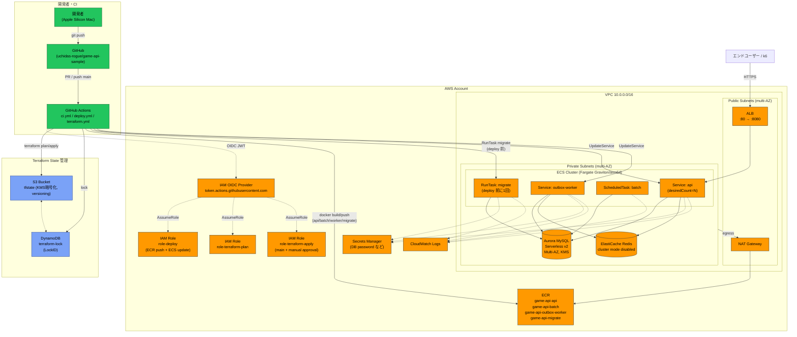
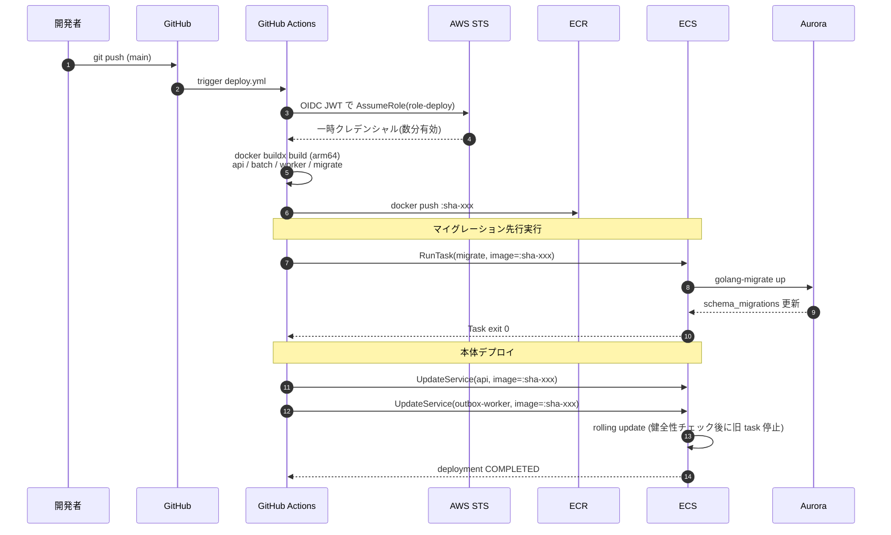

# AWS インフラ構成図（Phase 2 完了時点）

本ドキュメントは ROADMAP フェーズ2 で構築する AWS インフラの構成・モジュール分割・デプロイフローを mermaid で可視化したもの。

## 全体構成図

## Terraform モジュール構成

## 後続フェーズへの前方互換（Phase 2 設計に組み込む配慮）

| 後続フェーズの追加要件 | Phase 2 設計での配慮 |
|---|---|
| **§フェーズ3**: Redis を cache/ranking 2系統に分離（`REDIS_CACHE_ADDR` / `REDIS_RANKING_ADDR`） | ECS TaskDef の env を**リスト構造**で記述し、後から `REDIS_RANKING_ADDR` を追加しても破壊変更にならない形にする。`database` モジュールの ElastiCache も**リスト/可変構造**で定義し、2台目を増やせる構造に |
| **§フェーズ4**: EKS 比較 / App Runner 候補 | `network` / `database` / `registry` を `compute_ecs` から疎結合に保ち、`compute_eks` を別モジュールで追加可能にする。VPC/Subnet は `compute_ecs` が所有しない |
| **§フェーズ5**: マスタデータ配信（S3 + CloudFront、S3 VPC Gateway Endpoint） | `network` モジュールが **route table ID を output として expose**。Phase 5 で `aws_vpc_endpoint`（S3 Gateway, 無料）を**後付け**できる形に。実装は Phase 5 と同 PR で行う（先取りしない） |
| **§フェーズ5**: パッカー用 ECR 追加 | `registry` モジュールは `for_each = var.repositories` でリポジトリ集合を扱い、Phase 5 で `packer` を1行追加できる形に |

## デプロイフロー（時系列）

## 凡例

- **オレンジ系**: AWS リソース
- **青系**: Terraform state（S3 + DynamoDB）
- **緑系**: CI/CD（GitHub）
- **点線**: 認証・参照・依存
- **破線枠（グレー）**: 後続フェーズで追加予定（Phase 4: EKS / Phase 5: storage・S3 VPC Endpoint・packer ECR）

## 対象外（意図的に実装しない）

- **AWS WAF / Shield**（GCP 参考構成の Cloud Armor に相当する層）: 本プロジェクトのエンドユーザーは k6（負荷試験ツール）であり、ALB 前段に WAF を置くとレートベースルール等が k6 リクエストを弾いてフェーズ3 の負荷試験結果が歪む。攻撃耐性の検証は k6 シナリオ側に寄せる方針のため、**今後も導入しない**。詳細は [ROADMAP.md](../ROADMAP.md) フェーズ2「対象外」を参照。

## 関連ドキュメント

- [ROADMAP.md](../ROADMAP.md) — プロジェクト全体ロードマップ
- [AGENTS.md](../AGENTS.md) — コーディング規約
