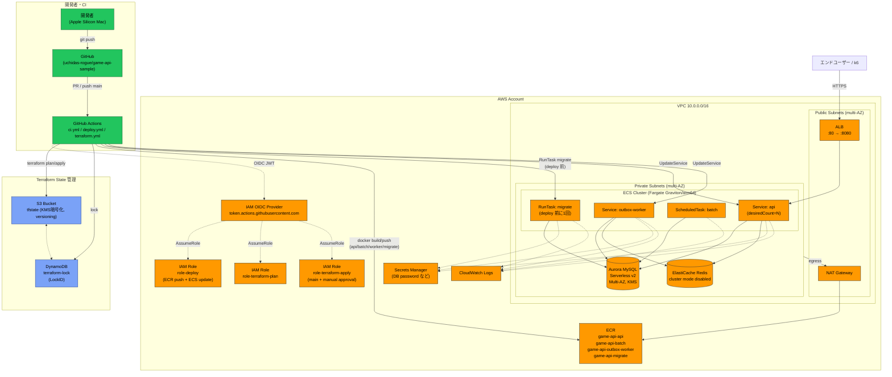
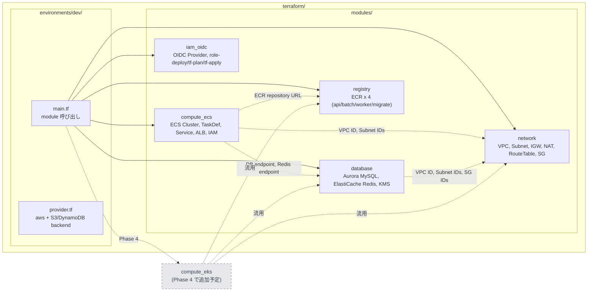
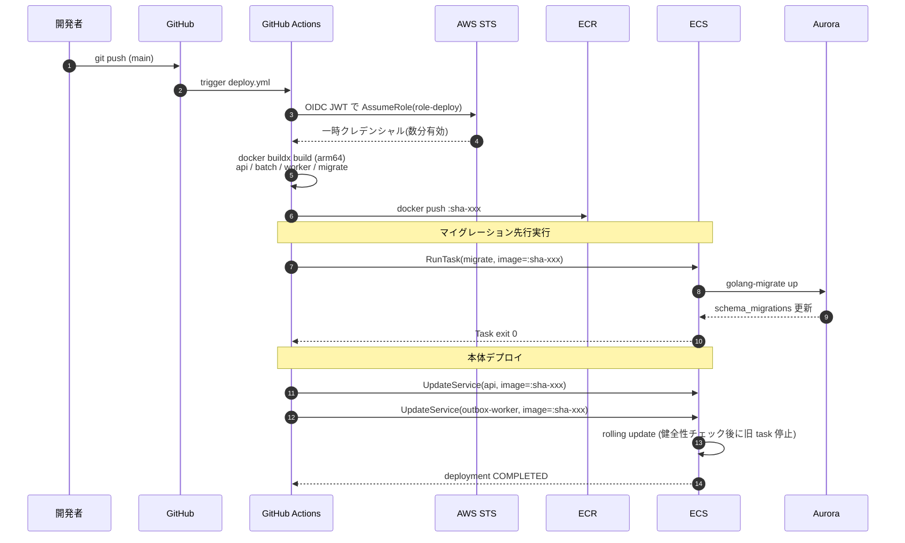

# AWS インフラ構成図（Phase 2 完了時点）

本ドキュメントは ROADMAP フェーズ2 で構築する AWS インフラの構成・モジュール分割・デプロイフローを mermaid で可視化したもの。

## 全体構成図

## Terraform モジュール構成

## デプロイフロー（時系列）

## 凡例

- **オレンジ系**: AWS リソース
- **青系**: Terraform state（S3 + DynamoDB）
- **緑系**: CI/CD（GitHub）
- **点線**: 認証・参照・依存
- **破線枠**: Phase 4 で追加予定（EKS）

## 対象外（意図的に実装しない）

- **AWS WAF / Shield**（GCP 参考構成の Cloud Armor に相当する層）: 本プロジェクトのエンドユーザーは k6（負荷試験ツール）であり、ALB 前段に WAF を置くとレートベースルール等が k6 リクエストを弾いてフェーズ3 の負荷試験結果が歪む。攻撃耐性の検証は k6 シナリオ側に寄せる方針のため、**今後も導入しない**。詳細は [ROADMAP.md](../ROADMAP.md) フェーズ2「対象外」を参照。

## 関連ドキュメント

- [ROADMAP.md](../ROADMAP.md) — プロジェクト全体ロードマップ
- [AGENTS.md](../AGENTS.md) — コーディング規約
