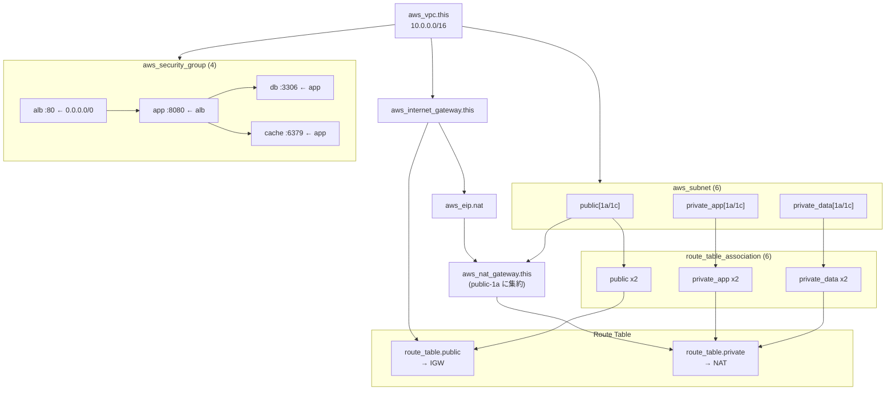
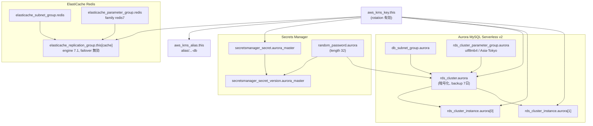
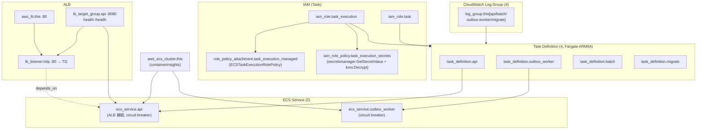
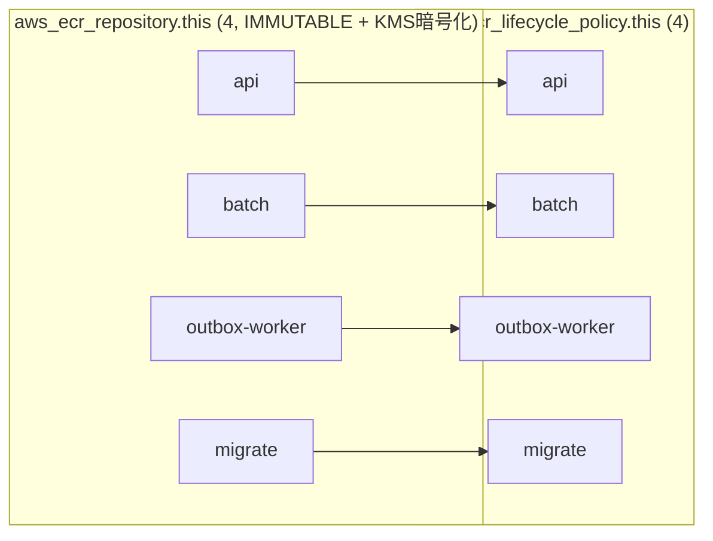
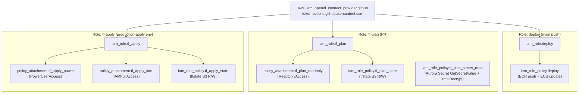
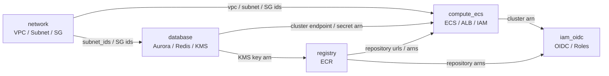

# Terraform plan 作成リソース一覧（mermaid）

`terraform plan` が `will be created` と報告した **71 リソース**を、モジュール別・依存関係付きで可視化したもの。
すべて新規作成（`+ create`）の状態。

## モジュール別リソース数

| モジュール | リソース数 | 主な内容 |
|---|---|---|
| `network` | 22 | VPC / Subnet x6 / IGW / EIP / NAT / RT x2 / RTAssoc x6 / SG x4 |
| `database` | 13 | Aurora MySQL / ElastiCache Redis / KMS / Secrets |
| `compute_ecs` | 18 | ECS Cluster / TaskDef x4 / Service x2 / ALB / IAM |
| `registry` | 8 | ECR Repository x4 / Lifecycle Policy x4 |
| `iam_oidc` | 10 | OIDC Provider / IAM Role x3 / Policy 群 |
| 合計 | **71** | SG ingress/egress は SG リソースにインライン定義（別リソース化されない） |

## network モジュール（VPC 基盤）

## database モジュール（Aurora / Redis）

## compute_ecs モジュール（ECS / ALB / IAM）

> `batch` / `migrate` は Service を持たず RunTask 起動（plan には TaskDef のみ作成される）。

## registry モジュール（ECR）

## iam_oidc モジュール（GitHub Actions 認証）

## モジュール間の参照（plan 全体の依存構造）

## 凡例

- すべてのリソースは `terraform plan` 上で **新規作成（`+ create`）** 状態。
- 実線矢印: リソース間の依存（作成順序の前後関係）。
- 点線 `depends_on`: 明示的な依存指定。
- `[...]`: `for_each` / `count` によるインスタンス（例: `subnet.public[1a]`）。

## 関連ドキュメント

- [terraform/ARCHITECTURE.md](../terraform/ARCHITECTURE.md) — 構成図・モジュール分割・デプロイフロー
